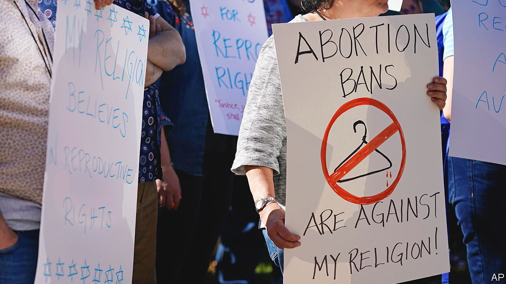

###### Pro-choice religious exemptions

# Some progressives are arguing for a religious right to abortion 

##### The Supreme Court’s deference to faith-based objectors has buoyed their claims 

 

> Nov 16th 2023 

The Book of Exodus contains a section about liability. It is a bit outdated, enumerating damages if someone’s bull gores another person’s slave. But one parable is relevant to abortion debates today, since it elucidates how Judaism understands the unborn. If a pregnant woman is hit and suffers a miscarriage, the perpetrator must pay a fine. If she dies, however, the penalty is death. The tale is said to differentiate between the value of a fetus and a person. Other Jewish texts also hold that life doesn’t begin at conception.

The justification for outlawing abortion is to protect fetal life; some states’ bans say this explicitly. Yet that rationale rests on a religious belief about when life begins. What about people whose faith maintains that it starts later? Indeed Jewish law authorises, and even requires, an abortion if a mother’s health—physical or mental—is jeopardised. Jews disagree about what degree of risk warrants the procedure. But the general principle is that her well-being takes priority.

In Indiana and Kentucky, several Jewish women are seeking religious exemptions from their states’ abortion bans in court. The restrictions, they say, make it impossible to get an abortion when their faith might mandate one. The lawsuit in Indiana is joined by a Muslim and a woman who describes herself as a non-theistic believer in the sanctity of bodily autonomy. It is the further along of the two cases: on December 6th the Indiana Court of Appeals, which sits one rung below the state’s highest court, will take it up. Similar challenges have been brought by religious leaders in Florida and Missouri.

The religious case for abortion might surprise many. After  guaranteed the right in 1973, religious activity on the issue became synonymous with anti-choice Catholics and evangelicals. But before , liberal Protestants and Jews had long agitated for reproductive choice as a matter of conscience. Some understood it as a moral obligation in certain cases given the responsibility of parenthood; they argued that the interests of the already-born superseded those of “potential life”. In 1967 a group of ministers and rabbis set up a referral and counselling network called the Clergy Consultation Service on Abortion; within six years it had assisted nearly half a million women. The Indiana chapter said it aimed to “help women through what some have called ‘their deepest crisis’”.

The plaintiffs in Indiana and Kentucky cite the Religious Freedom Restoration Act (RFRA), which empowers religious objectors to seek exemption from a law if it “substantially burdens” the exercise of their faith. Two dozen states, including Indiana and Kentucky, as well as the federal government, have a RFRA on the books. To fend off a RFRA claim, the government must show that its application of the law is the “least restrictive” way to ensure a “compelling” state interest (ie, protecting fetal life).

The plaintiffs have a strong case, not least because of the disagreement about when life begins and whether one is at stake from conception. Even setting aside that minefield, the Supreme Court has made it much easier for religious objectors to prevail in recent years. The court has said that the government undermines its case for withholding religious exemptions by granting secular ones. All abortion bans allow the procedure if a mother’s life is at risk; Indiana lets victims of rape or incest have it. Neither Indiana nor Kentucky stops IVF clinics from discarding unused fertilised embryos. Those are big carve-outs, says Elizabeth Sepper, a law professor at the University of Texas at Austin: “If states cared about their interest in protecting fetal life, they would pursue it in all the relevant cases, and they’re not.”

The Supreme Court’s deference to religious objectors over the past decade has principally served conservative Christians, such as plaintiffs who did not want to offer insurance coverage for contraception, or bake wedding cakes for gay couples. But progressives are religious too, and they have had some luck with religious-liberty claims in lower courts. In 2019 an activist was acquitted of illegally aiding unauthorised migrants in the Arizona desert, an act that he said was . Abortion providers may well make RFRA claims on the basis that their faith obliges them to perform the procedure for patients who need or ask for an abortion. Doctors in states that have restricted transgender health care could conceivably say the same.

Some conservatives were against the federal RFRA before it passed in 1993. They were suspicious that pro-choice progressives would harness the law. The US Conference of Catholic Bishops lobbied against it. Eventually the anti-abortion camp came around, and states enacted their own versions. In fact Indiana’s was signed into law by its governor at the time, an anti-abortion evangelical named Mike Pence. He may soon have regrets.■


