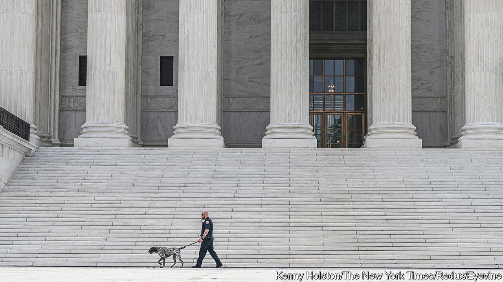

###### Code switch

# The Supreme Court’s code of conduct is a good first step 

##### But the justices may find they need to go further 

 

> Nov 15th 2023 

FOR 50 years all but nine of America’s around 2,000 federal judges have been subject to a code of conduct laying out ethical guidelines for jurists’ behaviour on and off the bench. On November 13th the exceptions—the justices of the Supreme Court—announced that they had decided to join their lower-court peers. 

The new rules do not arrive in a vacuum. Calls for the court to clean up its act have followed investigative reports from  and other publications uncovering several justices’ ethical lapses. Justice Clarence Thomas, the main target of those articles, failed to declare decades of luxury travel on the tab of Harlan Crow, a generous donor to conservative causes. Mr Crow also bought a home Justice Thomas owned in Georgia and footed the tuition bill for his grandnephew’s private school. 

A Senate committee found last month that another friend of Justice Thomas apparently forgave “a substantial portion” of a $267,230 loan financing the justice’s Prevost Marathon motor coach (which he has referred to as his “land yacht”). This too was not declared. And although his wife Virginia lobbied President Donald Trump’s chief of staff to help overturn the 2020 election outcome, Justice Thomas opted not to recuse himself from cases challenging the election results and involving Mr Trump’s role in the riot at the Capitol on January 6th 2021.

Without alluding to any of this—or to Justice Samuel Alito’s fishing trip to Alaska, paid for by a right-wing billionaire who later brought business before the court, or to any other colleagues’ apparent conflicts—the justices all signed on to a code of conduct. (Justices Alito and Thomas contend they did nothing wrong.) The document, the court wrote, is “substantially derived” from the code that applies to other federal judges. Justices should “uphold the integrity and independence of the judiciary” and “avoid impropriety and the appearance of impropriety”. They are to “perform the duties of office fairly, impartially and diligently” and may undertake only appropriate “extrajudicial activities”.

In five pages of commentary accompanying the code, the court acknowledged that some canons are “broadly worded general principles informing conduct”—not “specific rules”—and require justices to exercise “judgment” and “discretion”. The document also notes that, since the Supreme Court is a “unique institutional setting”, the existing code cannot be adopted without tweaks. For example, justices must recuse themselves from cases in which they have a financial interest or “personal bias or prejudice”. But unlike judges who can be easily replaced, justices have no such substitutes and have a “duty to sit” whenever possible. “Much can be lost”, the code says, “when even one justice does not participate in a particular case.”

Another revision may have been made to avoid impugning justices who have enjoyed the largesse of wealthy donors. Whereas the code for other federal judges bars them from “convey[ing] the impression” that someone is “in a special position to influence the judge”, the Supreme Court’s rules qualify this phrase with “knowingly”. As long as a justice is unaware that his actions are raising eyebrows—by creating the impression, say, that he is under the influence of an ideological benefactor—he or she remains in compliance with the new code. 

There is a bigger hitch: no one other than the justices themselves gets to decide when the code has been breached or how violations will be handled. By contrast, reform measures pending in Congress would allow citizens to complain about justices going rogue and to have their claims reviewed by panels of lower-court judges. 

Still, the justices’ move is a step in the right direction and demonstrates some responsiveness to public perceptions that not all is well at One First Street. And the code closes on an encouraging note that may pave the way for further self-improvement if the justices wish to examine and emulate the “best practices…of other federal and state courts”. Until then, though, America’s highest judges will have to keep a closer eye on themselves. ■


