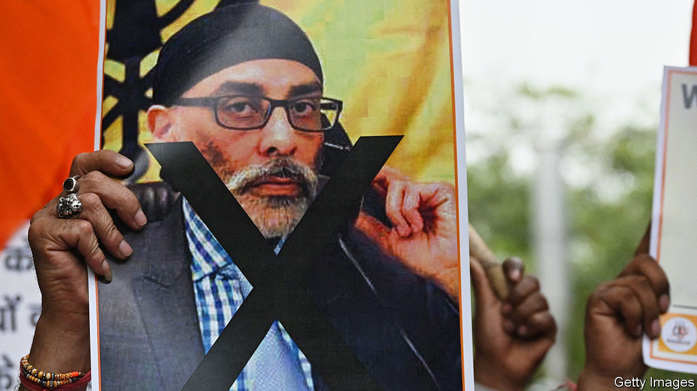

###### Et tu, India?

# Did America thwart an Indian assassination plot? 

##### Canada is not alone in worrying about Indian killers 

 

> Nov 22nd 2023 

JUSTIN TRUDEAU, Canada’s prime minister, sparked a furore on September 18th when he announced in Parliament that India was suspected of assassinating a Sikh separatist and Canadian citizen, Hardeep Singh Nijjar, in Vancouver in June. It may not have been the only such case. On November 22nd the  reported that America had foiled an Indian plot to kill another separatist, Gurpatwant Singh Pannun, a dual American-Canadian citizen, in New York.

India’s government has long accused Canada of a lax attitude towards those who want to establish a Sikh state, known as , in northern India. Canadian Khalistanis blew up an Indian airliner in 1985. Sikh extremists in America were considered a lesser problem, though Mr Pannun, whom India designated as a terrorist three years ago, publishes fiery videos from his wood-panelled office. On November 4th he issued veiled threats against an Air India flight.

The  reported that American officials had issued a “warning” to India over the alleged threat to Mr Pannun. The Justice Department is mulling unsealing a related indictment in a New York district court, though at least one plotter is said to have left America.

The allegations of an  surprised many familiar with India’s spy agency, the Research &amp; Analysis Wing (RAW), whose station chief was kicked out of Ottawa in September. RAW was suspected of having killed enemies in Pakistan, but not in the West. Yet American and European officials express concern over what they describe as increasingly aggressive tactics by Indian spooks towards the Sikh diaspora.

Mr Trudeau’s accusation drew a livid response from Indian officials, think-tankers and journalists. They accused the prime minister of pandering to Canadian Sikhs and being isolated within the Five Eyes, a spy pact that also includes America, Australia, Britain and New Zealand. America cannot be so easily rubbished.

It has been a “blistering year of US-India engagement”, boasted an American official this month, referring to many areas of defence and intelligence co-operation. This dispute could complicate, though not derail, that progress. America’s warning to India is thought to have come after a visit by Narendra Modi, India’s prime minister, to Washington in June. Antony Blinken and Lloyd Austin, America’s secretaries of state and defence, have since visited Delhi, and Subrahmanyam Jaishankar, India’s foreign minister, Washington. None will have relished discussing Mr Pannun.■


