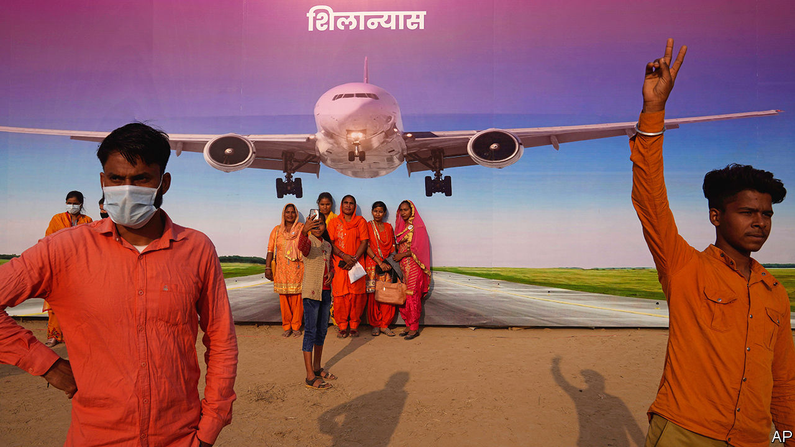
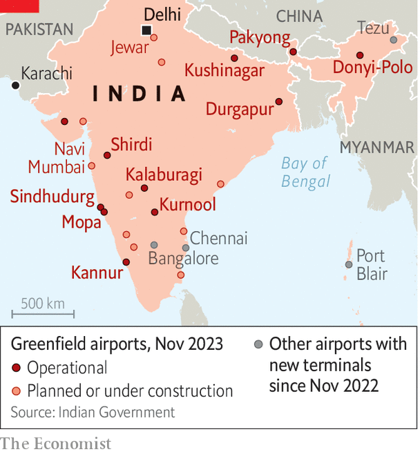

###### Taking wing

# India is seeing a massive aviation boom 

##### New airports, hundreds of aircraft and millions of new passengers are on their way 

 

> Nov 23rd 2023 

THE VENOMOUS snakes that infest the new airport rising near Mumbai, India’s commercial capital, are only a minor inconvenience compared with what has already been overcome at the site. Some 8,000 workers, labouring around the clock, have blasted away 55m cubic metres of rock, diverted a river and drained swamps. Seven local villages have been acquired and 3,113 families moved. Work on the airport began in 2021 and is due to be completed by late 2024. That is fast by global standards and in India unprecedented.

The country’s entire aviation industry is growing at an astonishing clip. Four new airports and four new terminals have opened in the past 12 months. That gives India 149 operational civil airports, twice the number it had a decade ago. Nine additional airports have been approved and many more are planned. In Jewar, 75km from Delhi, a second airport for the capital is also mushrooming. Officials envisage 15 dual-airport cities by 2040. There is talk of a possible third airport for Mumbai.

Domestic passenger numbers rose from 98m in 2012-13 to 202m in 2019-20. Already the third-biggest domestic aviation market by volume, India is projected to be the third-largest overall by 2026, according to the International Air Transport Association, an industry body. It is likely to see more than 500m passengers by 2030, predicts CAPA India, a consultancy. Airbus, an aerospace firm, thinks the domestic market will by 2042 be more than five times the size it was in 2019. The government wants to create aviation hubs akin to Dubai. 

The new airports, part of a broader infrastructure push by the government of Narendra Modi, are expected to support India’s 6%-plus annual growth rate. Increased aviation tends to boost growth, according to a paper in  a journal. And India is a vast country, with patchy road and rail links and far-spaced industrial and business centres. Delhi is 1,750km (1,090 miles) from the industrial hub of Chennai. “All you need is an airport,” says Aditya Mongia of Kotak, a bank. 

India’s aviation industry has long been emblematic of the country’s economic state. It was founded by a pioneering industrialist, J.R.D. Tata, who was the first Indian to obtain a pilot’s licence and used it in 1932 to fly his airline’s maiden flight, from Karachi to Bombay (as Mumbai was then called). In 1953 his Tata Air Service, by then rebranded Air India, was nationalised and the industry became a prime example of the lethargy, low standards and state monopolies that characterised India’s mixed economy. After the country started liberalising its economy in the 1990s, private airlines proliferated; most—including half-forgotten names such as Modiluft, Damania and East West airlines—had gone bust by the end of the decade. A bigger boom followed in the 2000s, followed by an epic bust, putting paid to Kingfisher Airlines, Jet Airways and others. Today’s boom looks more sustainable.

The industry is still dogged by old problems. On November 8th newspapers carried stories about the miserable punctuality record of SpiceJet, a low-cost carrier; on violations of rules for compensation delays by Air India (back in Tata Group hands after its privatisation last year); and on groundings of dozens of Indigo aircraft because of safety worries. There is a national pilot shortage and regulatory enforcement needs strengthening. Even so, for two reasons this expansion seems durable.

The first reason is a lot of government support for it. The Modi administration is privatising older airports as well as building new ones. Its restructuring and sale of Air India has helped turn a loss-making millstone into a national champion. Under Tata management, the airline has 470 new aircraft on order, with an option for another 370. The government has also loosened a requirement that new airlines must fly for five years before being allowed to operate abroad. It is pushing states to lower taxes on aviation fuel, from as high as 29% down to the low single digits.

A state-subsidised regional connectivity scheme has boosted air links to smaller cities, connecting 72 unserved or underserved airports with 459 routes. The government “has embraced the reality that aviation is not a luxury form of travel”, says Salil Gupte, who heads Boeing in India. Jyotiraditya Scindia, the civil-aviation minister, describes the government’s aviation policy as a form of “democratisation”.

 


The second reason for optimism is soaring demand. Discretionary spending rose from 13% of household consumption in 2000 to 24% in 2020, and could rise to 33% by 2030, according to Macquarie, a bank. There has been “dramatic growth in recent years as per capita income has increased”, says Campbell Wilson, Air India’s boss. There is a lot more potential growth in store. Air travel is increasingly able to compete on price with first- and second-class long-distance rail. And only 2-3% of Indians have flown, reckons Mr Scindia. Indians make 0.1 trips per person a year; the corresponding figure for Americans is 2.1 and for Chinese 0.5, according to Airbus, which expects that Indian number to triple by 2031. 

Air India is not the only airline betting on huge future growth. In June Indigo, India’s biggest airline by market share, ordered 500 new planes, the biggest aircraft order ever made. Akasa, which started operations only last year, has 56 aircraft on order and plans to book at least another 100 by the end of the year. “We wouldn’t be ordering new aircraft only on the basis of exciting and wonderful demand,” says Vinay Dube, Akasa’s CEO. “We’re ordering aircraft because we also believe we have the infrastructure capabilities to fly them.”

The airlines’ ambition is also apparent in their travel plans. This year Indigo added routes to Africa, Central Asia and the Caucasus. Akasa plans to start serving the Middle East, South-East Asia, east Africa and Central Asia. Air India’s order included 70 wide-body aircraft capable of long distances. This makes the government’s hopes for an international hub seem feasible.

Indigo already connects travellers flying between South-East and Central Asia. Air India plans to challenge Emirates and Singapore Airlines—so-called “superconnectors”—for long-haul one-stop connections between East Asia, Europe and North America. “If we want to be aviation giants, we should measure ourselves against some of the largest airlines in the world,” says Pieter Elbers, CEO of Indigo. “We should compete with them.”■


