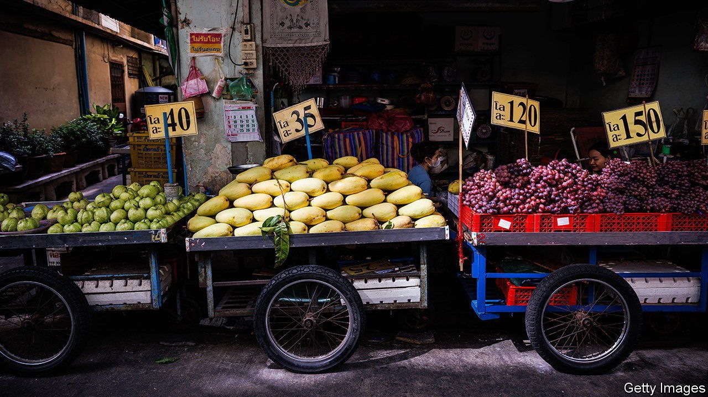

###### Money for nothing

# Thailand’s new government is handing out cash 

##### But many Thais mostly want a different government 

 

> Nov 23rd 2023 

It has been a wild year in Thai politics. After a group of young democrats won more seats than any other political party in an election in May, they were blocked from forming a government by the army establishment that had ruled Thailand for over a decade by rigging the constitution in its favour. Then, the generals teamed up with Pheu Thai, the party of their former rival Thaksin Shinawatra, who was ousted as prime minister in an army coup in 2006 and later fled the country. 

As the dust settles, the priorities of the new government, which is led by Srettha Thavisin, a former property tycoon, are clear. It has ignored what the majority of Thais voted for: democratic reform of a country long controlled by a monarcho-military cabal. Instead, Mr Srettha’s first few months in office have been defined by populist economic policies. He has cut electricity prices and suspended farmers’ debts. Most controversially, he is pressing ahead with Pheu Thai’s main campaign promise: a digital wallet scheme to hand out 10,000 baht ($285) each to around 50m Thais, to be spent at businesses located near their registered address. The government plans to launch this stimulus package of around $14bn, roughly 3% of Thailand’s GDP, in May next year. 

The policies have Mr Thaksin’s fingerprints all over them. After Pheu Thai cut a deal with the army in August, the former prime minister returned to Bangkok, ending a 15-year-long, self-imposed exile. Thailand’s king promptly reduced the eight-year prison sentence that Mr Thaksin faced for a corruption conviction to a year; he is serving it in the luxury wing of a hospital. His time in office, from 2001 to 2006, was defined by similarly populist policies, including a debt moratorium for farmers and loans to every village. His daughter, Paetongtarn Shinawatra, is the leader of Pheu Thai. In October, Mr Srettha joked that the country had two prime ministers: himself and Ms Paetongtarn.

A former governor of the Bank of Thailand, the country’s central bank, Veerathai Santiprabhob, castigates the digital wallet scheme as the latest in a series of spendthrift and distortionary policies. Over 100 former central bankers and economists, including Mr Veerathai, signed a petition opposing the stimulus package, arguing that the costs of the scheme outweighed its benefits. Sethaput Suthiwartnarueput, the current central-bank governor, said the government should prioritise investment over stimulating consumption. 

Private consumption grew by 8.1% year-on-year in the third quarter of 2023, even as the economy grew by 1.5%, the slowest rate this year. This caused the National Economic and Social Development Council (NESDC), Thailand’s state planning agency, to cut its growth forecast for 2023 to 2.5%. In recent years, Thailand’s growth has lagged its neighbours’, beset by economic mismanagement under the previous military government, which failed to tackle systemic challenges such as rising income inequality and an ageing population. 

Problems abound in Thailand’s existing cash-transfer programmes. In 2017 the military government introduced unconditional handouts to the poor. Each month, welfare card holders receive 200-300 baht. According to the NESDC, half of Thailand’s poor do not receive this monthly handout and 90% of those who do are not under the national poverty line.

Move Forward, the country’s main opposition party, also opposes the digital wallet plan. It wants the government instead to address Thailand’s structural woes, especially by breaking up the monopolies that dominate many industries. Given that Pheu Thai depends on establishment backing, this is almost unimaginable. But Pheu Thai did, at least, invite Move Forward to propose an alternative stimulus package, says Sirikanya Tansakul, head of Move Forward’s economic team. She suggested the government make smaller investments to boost local economies, such as by improving the quality of Thailand’s tap water. The government told her cash giveaways were sexier. ■

