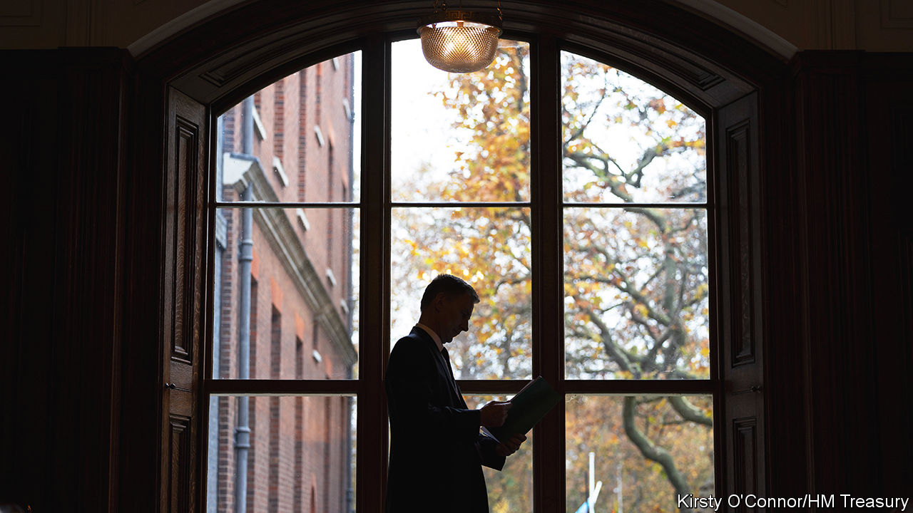

###### Mixed picture

# Britain’s chancellor offers tax cuts and fiscal trickery 

##### A pre-election giveaway from Jeremy Hunt 

 

> Nov 22nd 2023 

Delivering his autumn statement on November 22nd, Jeremy Hunt, the chancellor of the exchequer (pictured), argued that Britain’s economy has . Declaring victory in the , he unveiled a fiscal loosening worth £18bn ($22.5bn), or 0.7% of GDP, mostly comprising cuts to business and personal taxation. According to Mr Hunt lower inflation has given him the space to cut taxes. In reality that space has come from higher, not lower, inflation and from .

 


The most material change in the new forecasts from the Office for Budget Responsibility (OBR), the government’s fiscal watchdog, was a large upward revision to expected inflation over the coming years (see chart). At the budget in March the OBR expected inflation to be just 0.5% by the end of 2024. They have now pencilled in a rate of 2.8%. Like the Bank of England, then, although the OBR does believe that British inflation has peaked, it expects it to remain higher for longer. 

Faster price and wage growth feed through into higher-than-expected tax receipts for the government, but they represent an actual improvement in the government’s budgetary position only if you assume that higher inflation will have few consequences when it comes to government spending. That is the assumption the chancellor has made. Departmental spending totals have been left unchanged, implying deep real-terms cuts in public spending in the coming five years to fund a tax giveaway now.

The centrepiece of that giveaway, with a price tag around half that of the total package, was a tax cut on corporate investment. Full expensing, which allows firms immediately to deduct all of their spending on machinery, plant and computer equipment from their taxable profits, was  at the budget in March but had been due to expire in 2026. It will now become permanent. 

The single largest business tax cut in modern British history represents a sensible, pro-growth step towards increasing private capital spending. In the short run the measure is actually likely to lower business investment as firms feel less need to bring planned spending forward to benefit from a temporary tax break. But over the longer term it should reduce the cost of capital for British firms and raise investment. The OBR reckons it will raise the capital stock by 0.2% by 2028-29. 

This measure was part of a larger package of supply-side reforms that varied from the trivial to the substantial. Perhaps the most meaningful, beyond the change to expensing, was a new effort to tackle Britain’s particular problem of . The work-capability assessment test, which governs Britons’ access to incapacity benefits, will be tweaked and new conditionality imposed on some benefit recipients. This should raise employment levels over the medium term. 

Reforms to the  developments are another step in the right direction. Business groups praised a freeze on business rates, a type of property tax, for small firms and simplification of the method for claiming R&amp;D tax relief. In total the OBR reckons that the chancellor’s battery of 110 pro-growth measures could increase the level of GDP by 0.3% by 2028. As important, a bipartisan consensus has now developed between the Conservative government and the opposition Labour Party on the importance of growth. This is political competition of the healthy kind. 

Other bits of the autumn statement are less healthy. Mr Hunt’s second eye-catching move was a two-percentage-point cut in employee national-insurance contributions (NICS), a payroll tax. For median earners that will amount to a tax cut of around £450 a year. With an eye on a possible general election in May, it will take effect in January 2024 rather than at the start of the next financial year in April. 

It is hard to regard this as anything other than a pre-election giveaway, and an especially strange one given that Rishi Sunak, when he was chancellor two years ago, wanted a rise in NICS. The savings from lower NICS are anyway dwarfed by the impact on taxpayers of a freeze on income-tax thresholds put in place in 2021. Even after Mr Hunt’s tax cuts, the overall tax burden is set to rise as a share of GDP each year over the five-year forecast period to levels not seen since the 1940s.

The fiscal space for these giveaways comes principally from deep implied cuts to public services. The OBR calculates that the numbers underpinning the autumn statement entail a £19.1bn real-terms cut in public spending. Outside the protected departments of health, education and defence that would mean the kind of spending cuts last seen in the early 2010s, but with far less fat to cut than there was back then. The public-sector capital budget will also fall in real terms in the years ahead, offsetting some of the hoped-for rise in private investment. 

Even after plugging these implausible spending cuts into the forecasts, the chancellor’s room for fiscal manoeuvre is small—just £13bn to meet his fiscal target of getting the debt-to-GDP ratio to fall by the end of the five-year forecast period. That number is premised, among other things, on the assumption that fuel duty, which has been frozen since 2011, will rise by 5p plus inflation. Another freeze, which is what everyone expects, would take away 43% of Mr Hunt’s wriggle-room. 

As for the politics, not even a £450 tax cut for the median voter is likely to generate much of a feel-good factor. The OBR revised down its forecast for growth in 2024 from 1.8% in March to just 0.7%. Real disposable household income is expected to fall by 0.9% and house prices by 4.7%. Higher and more persistent inflation gave Mr Hunt the room to announce one useful tax cut and indulge in lots of fiscal trickery. It does not mean less pain for voters. ■ 


