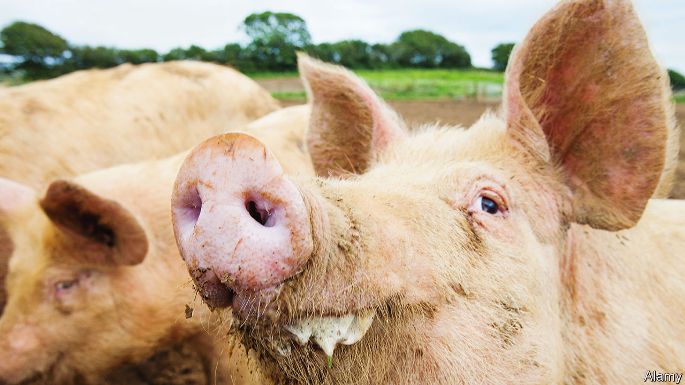

###### Saving your bacon

# Britain’s native farm animals can be rarer than giant pandas 

##### To survive, some must be eaten 

 

> Nov 21st 2023 

BRITAIN’S ONE-PIG policy was a success. In 1955 the government endorsed an “improved bacon pig” to help revive the ailing pork industry. A few breeds competed for the role but the portly Large White, which piles on weight quickly and does well indoors, prevailed. Today, an even-plumper descendant of the Large White feeds industrial pig farms up and down the land. 

The dominance of the Large White spelled disaster for other swine. Dorset Gold Tips and Lincolnshire Curly Coats went extinct. Others are clinging on by their trotters. The Middle White, a smaller sibling of the Large White, is five times rarer than the giant panda. Only 56 sows had litters of registered piglets in 2022. 

Such rarity is not unusual among Britain’s native farm animals. The logic of industrialisation and efficiency means that a few breeds thrive and others suffer. Around 80% of Britain’s native livestock are at risk of being lost for ever. Populations of breeding females are often tiny: 63 Hampshire sows; 22 Vaynol cows; 13 Old English nanny-goats. The survivors live on a handful of farms.

But their fortunes may be looking up, as a result of diet, day-trippers and demands for diversity. For rare-breed numbers to rise, they need to be eaten again. Chefs seem excited: they rave over the “nutty, grassy, blue-cheese notes” of Longhorn beef and “fat dripping off everything” as they cook Middle White pork. Heston Blumenthal, a restaurateur, declared Longhorn steak the best in Britain in 2006; his fans feasted so merrily that numbers almost doubled by 2012. 

Other bits of rare breeds can also have monetary value. James Rebanks, a Lake District shepherd, weaves tweed from the wool of Herdwick sheep. Their magnificent horns are made into walking sticks and buttons. Smart farmers are turning native breeds into brands, notes Christopher Price, head of the Rare Breeds Survival Trust (RBST), a charity. 

That attracts day-trippers. The Chillingham Wild Cattle Association, a charity in Northumberland, offers private tours of its herd. Neil Storer gets half his profits from visitors to Baylham House Farm in Suffolk, where he breeds White Park cattle, which have been kept in Britain for more than 2,000 years. On the Knepp Estate, a 1,400-hectare wilderness project in Sussex, Longhorn cattle and Tamworth pigs graze freely. Agricultural policy ought in time to encourage further rewilding: the government is haltingly winding down per-hectare subsidies and paying more for public benefits such as conserving native livestock.

Genetic diversity is one reason why such conservation is valued. Herds of identical pigs may be efficient but they are vulnerable to disease: if one animal gets infected, the whole population can be lost. China’s farmers were reminded of that in 2019 when African swine fever killed 180m pigs (a quarter of the world’s population). The RBST has created a gene bank, a giant freezer of semen and embryos, to preserve most native breeds as a safeguard against future disease. With luck, it won’t be needed. ■


