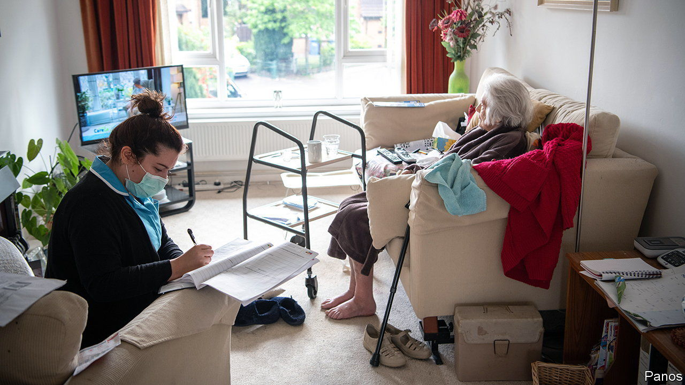
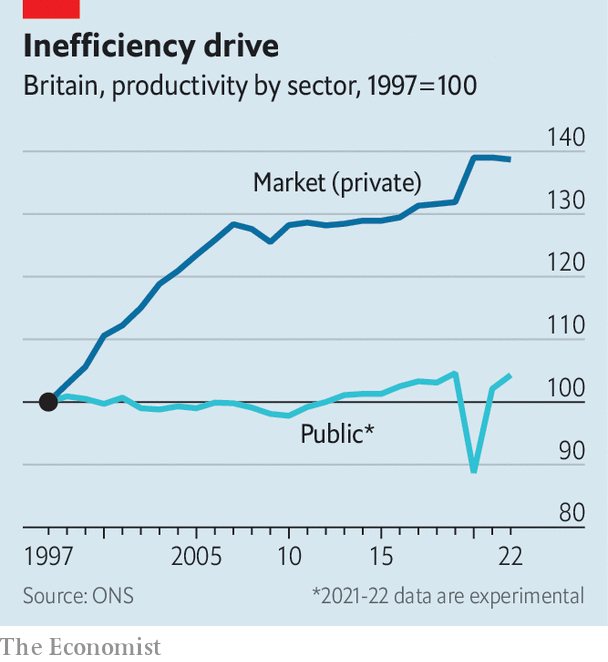

###### Flat-lining

# Jeremy Hunt wants to improve Britain’s public-sector productivity 

##### AI and hybrid working might help, but how quickly? 

 

> Nov 20th 2023 

For more than a decade economists have been debating Britain’s “”, an alliterative way of noting that British productivity growth has been peculiarly weak since 2008. The problem is especially chronic in public services (see chart), where productivity grew by just 0.2% a year on average between 1997 and 2019, according to new data released by the Office for National Statistics (ONS).

 


There are plenty of reasons to expect productivity growth to be weaker in the public sector than in what the ONS calls the “market” sector (broadly, the private sector). The activities that the state engages in are disproportionately labour-intensive. Private firms always have the option to quit low-productivity lines of business; the state cannot decide that it is getting out of, say, criminal justice. That leaves the public sector particularly exposed to “Baumol’s cost disease”, a phenomenon first identified by William Baumol, an American economist, in the 1960s. The need to recruit and retain staff who have the option to work in more productive, better-paid industries causes wages to rise by more than underlying productivity, pushing up costs.

Jeremy Hunt, the chancellor, has made it a priority to improve this grim record. A review of the problem was announced in June; it featured again in the  on November 22nd. For Mr Hunt, improving public-sector productivity is not only a worthwhile aim in itself but also offers a way to square the circle of weak public finances, Britons’ dissatisfaction with public services and the desire for pre-election tax cuts. Improving productivity tends to be a slow process, however. The standard solutions focus on  or increasing the stock of capital available to each worker. That takes time, and money upfront. 

One particular affliction of the public sector since 2010 has been a shortage of administrators. With budgets squeezed by a decade of tight spending, the onus has been on cutting back-office staff and protecting services. This has in turn led to supposedly front-line staff spending ever more time on form-filling. A government report found that some public servants are spending up to one day a week on admin. 

The government is hoping that better technology can fill the gap left by fewer support staff. A review of police productivity, released on November 20th, claimed that a combination of new technology and reduced bureaucracy could free up over 38m policing hours per year. The government reckons that it can cut the admin burden on teachers by five hours a week over the next three years. But excited talk about artificial intelligence jostles with the reality of glitching government IT systems; many public-sector workers are sceptical that better tech can substitute for people.

There is one area where changes can be made quickly. Home-working has taken a firmer hold in the civil service, where over a third of staff have a hybrid workweek, than in private-sector firms, where the proportion is more like a quarter. Treasury officials reckon that these public servants typically spend more days at home each week than hybrid workers in the private sector. Although research suggests that  does not generally dent productivity, it may hurt performance in jobs with lots of face-to-face work or with high turnover. The government may push civil servants to be in the office more often. 

Even so, don’t expect surging efficiency. Improving the productivity of the public services is a vital task. Like most such tasks it is not conducive to easy fixes.■


