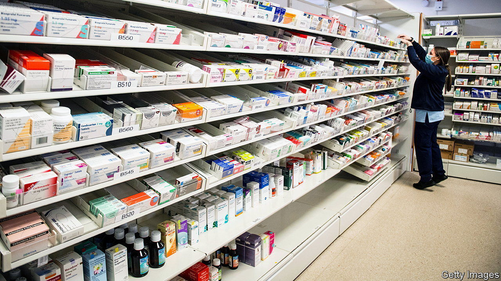

###### The price is finally right

# The National Health Service has a new drugs deal 

##### Patients and pharma firms will be relieved. But it is not yet clear who benefits most 

 

> Nov 23rd 2023 

TWO DAYS, TWO deals for the National Health Service (NHS). On November 21st the NHS announced that it had awarded a contract worth up to £330m ($414m) to Palantir, a controversial American firm, to help it  and thereby, it hopes, to improve care for millions. This followed the announcement a day earlier of a new drugs deal, after months of wrangling with the British government, which funds the service, and the Association of the British Pharmaceutical Industry (ABPI), representing drugmakers. 

The deals show two different faces of the NHS. The Palantir agreement, a contract dogged by privacy concerns, is designed to alleviate some of the service’s maddening IT inefficiencies. The new pharma deal, which continues to secure Britain some of the lowest drug prices in the rich world, is a reminder of the NHS’s negotiating power. 

Britain has two main ways of controlling its pharmaceutical spending. One is through a mechanism to evaluate the cost-effectiveness of new medicines, which incentivises firms to discount their products to be considered for approval. The other is through something called the voluntary scheme for branded medicines pricing and access, handily abbreviated to VPAS. More than 90% of eligible pharma firms belong to this scheme. 

Under the existing VPAS, which expires at the end of this year, the total sales growth of branded medicines could not exceed more than 2% a year; any additional revenue above the cap was returned to the NHS. For a while, this rebate rate remained relatively stable, hovering around 7% of total sales revenue from branded medicines. Recently, however, things have started to get out of whack; in 2023, 26.5% of firms’ total sales revenue, or £3.3bn, was clawed back. Some firms have threatened to withdraw medicines from the market.

The new deal, a five-year agreement, is an easier pill for many in the industry to swallow. The main change is that it doubles the allowed sales growth of branded drugs to 4% by 2027. Accordingly, VPAS has been rebranded as VPAG, with the “G” a nod to increased growth. Though falling far short of the ABPI’s own proposals, the deal actually seems “quite generous”, says Olivier Wouters, an assistant professor at the London School of Economics who studies pharmaceutical markets. 

It also does more to encourage innovation. Drugs are already exempt from the clawback for the first three years after they are authorised. Under the new deal, more generous terms will be extended to medicines that have been available for more than three years but are still relative newcomers. A higher rebate rate will apply to older drugs; the precise amount will reflect how far their prices have fallen over time. 

Pharma firms are still crunching the numbers on what it all means for them. Initial reactions have varied. “For us it’s a good thing,” says one pharma boss whose firm largely makes innovative therapies—the ABPI projects that the rebate rate for younger medicines will fall to around 7% by 2028. Eli Lilly, an American firm which left VPAS very publicly earlier this year, is now hinting that it might rejoin the scheme. Others whose portfolios skew towards older medicines are less happy. For them the ABPI reckons that rebate rates may end up between 10% and 35%.

The NHS cannot ignore rising prices. Despite the VPAS cap, exemptions mean that its spending on branded medicines has been growing by more than 5% per year since 2018, excluding money spent on covid-19 vaccines and treatments. Hospitals alone spent £9.1bn on prescribing medicines in 2022, 35% more than in 2018. Much of this rise stems from a few exorbitant treatments for cancer and respiratory diseases. As Britons age and therapies become more customised, striking the balance between cost control and providing the best treatment is only going to get harder. ■


