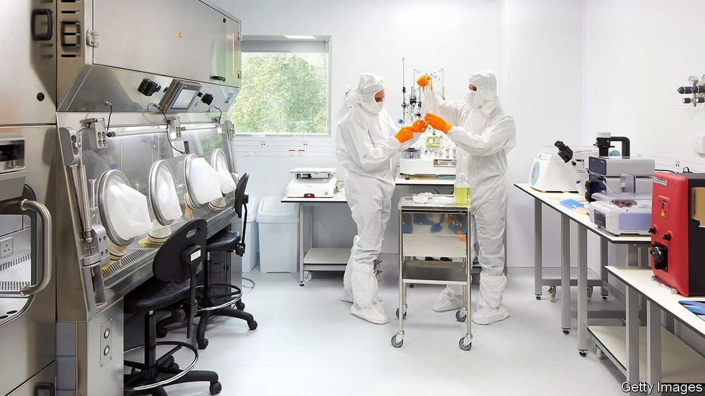

###### Personal therapy

# The world’s first pathway for individually designed drugs 

##### Britain commits to finding a regulatory route for customised genetic medicines 

 

> Nov 22nd 2023 

The headlines about the autumn statement from Jeremy Hunt, the chancellor, this week focused on tax and spending. But tucked away in the written documents was news that could hone the cutting-edge of medicine. The Medicines and Health-care products Regulatory Agency (MHRA) is working with Genomics England, Oxford University and Mila’s Miracle Foundation, a charity, to develop a regulatory pathway to allow one-off drugs to be designed and approved for use in individual patients in less than a year. 

Medicines currently travel a well-worn route to market comprising two or three phases of trials in large groups of patients. But this approach is impossible for the vast majority of genetic disorders, which are often vanishingly rare or even unique. The technology to  for people with such conditions exists but the regulatory route they must take is rocky. 

In America this pathway is known as “compassionate use”. In 2018 Mila, a girl with Batten’s disease, a condition affecting the nervous system, became the first person to receive a personalised medicine known as . But the process took a year; although the treatment helped Mila, it arguably came too late to save her life. Only a few patients have followed suit. Campaigners, including Mila’s mother, Julia Vitarello, have been pushing regulators to go faster. The MHRA and its partners will be the first to try.

The goal of the Rare Therapies Launch Pad is to generate evidence for a new regulatory pathway. In doing so it will also offer customised drugs to between ten and 15 children with fatal genetic brain diseases. The technology that will be used involves “anti-sense oligonucleotides”; these molecules can be customised to block the production of a faulty protein. The project consortium will find specific patients, figure out the steps involved in treating them and then identify which ones the MHRA would need to focus on in a standardised approval process. If successful, the pilot would create a pathway that gives customised drugs a legal basis for sale and use.

Ms Vitarello, who had lobbied America’s Food and Drug Administration to try something similar, says her country has been “too conservative” and that Britain is the “right place at the right time to do this”. That is partly because the MHRA is keen to make use of its . Earlier this year the government gave the MHRA £10m ($12.5m) to speed up approvals of cutting-edge medicines. On November 16th it was the first to approve a treatment based on CRISPR, a gene-editing technology. 

Another problem lies in finding patients early enough in life to treat them, says Parker Moss of Genomics England. Here, too, Britain has an advantage. Genomics England already helps the National Health Service identify rare genetic diseases in children. Its ability to find such patients will only grow when, at the end of this year, it is due to launch its broader . 

Whether the pilot project will be able to work quickly enough to benefit the individual children it identifies is unclear. Matthew Wood, a professor of neuroscience at Oxford University, cautions it will still take at least a year to develop the customised drugs. But Dr Wood says that within a decade such customised drugs could be produced in less than a month. Newborn sequencing will also routinely identify patients at birth. First, though, the regulators have to find a way to move faster. ■


