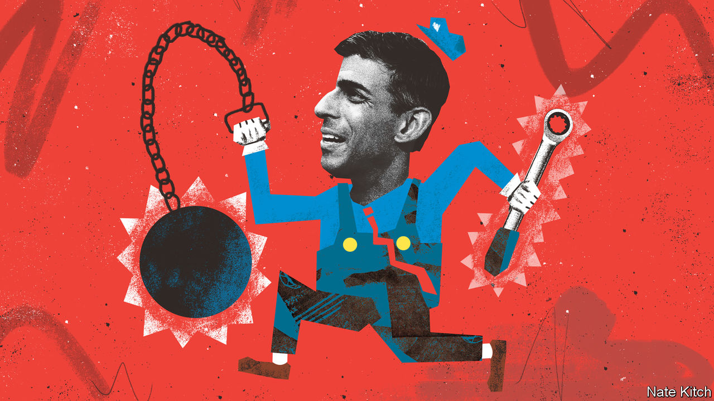

###### Bagehot

# What kind of legacy does Rishi Sunak want to leave behind? 

##### Outgoing British governments can bequeath a total mess or embed their preferences 

 

> Nov 23rd 2023 

In British politics, last impressions count. Governments are remembered as much for how they leave office as for how they arrived. With a , both Rishi Sunak, the prime minister, and Jeremy Hunt, the chancellor, know that they are probably doomed. Running an outgoing government mixes immense responsibility with immense temptations. Cynical ministers merely make life harder for incoming governments; canny ones embed their preferences so their politics long outlives them. The choice is a simple one: to wreck or to ratchet. 

Messrs Sunak and Hunt have a range of examples to copy. After all, each tactic has a long history. Wrecking can come in many forms. Gordon Brown, a former Labour prime minister, mangled the tax system on his way out in 2010. Labour managed 13 years in power without increasing the highest rate of tax to 50%. The party introduced it a month before they left office. At the same time Mr Brown withdrew the personal allowance from high-earners, leaving those who earned over £100,000 with a 60% marginal rate. When the Tories reduced the rate, to a level still higher than it had been for most of New Labour’s term, the Conservatives were pilloried. The distortionary 60% rate remains. 

Spending plans are a favoured weapon of the wrecker. Ken Clarke, the Tory chancellor under Sir John Major, is hailed for leaving behind a “Rolls-Royce” economy in 1997. But he still laid a trap for  incoming Labour government in the form of absurdly tight spending plans, to which he cheerfully admitted later he had no intention of sticking. Labour walked into the trap, in the name of credibility. As a result cash-starved public services remained starved for half of Labour’s first term; when the cash did come, it arrived as a flood rather than a careful irrigation. It was an effective act of wrecking. 

Ratchets are just as common. Rather than merely clog up the tax system with absurdities, the last Labour government also passed substantial legislation in its dying days. The Equality Act, which toughened up social rights in Britain, was a long-standing goal of Labour. Yet it was approved in Parliament only on the very day Mr Brown called an election, making it the final piece of legislation that Labour passed. Conservative right-wingers griped about it at the time, comparing it to something out of the Soviet Union. Yet after 13 years of Tory rule, it is still there. 

Even seemingly inconsequential prime ministers can generate a legacy in their final moments. Theresa May achieved little in her three years in Downing Street. Yet in 2019 she was responsible for arguably the single most important law in a generation. Mrs May had already pledged to resign after trying and failing to pass her version of Brexit. Her party was polling at an apocalyptic average of about 20% (ie, roughly the same as now). Yet after , Britain bound itself to reaching net-zero carbon emissions by 2050. An outgoing administration can shape a nation for a generation. 

For much of Mr Sunak’s final year in power, the prime minister has been too keen on wrecking. Scrapping the northern leg of hs2, a high-speed rail line, is the most obvious example. Cutting the leg between Birmingham and Manchester supposedly freed up nearly £40bn ($50bn) of capital spending to be splashed elsewhere; in reality, this funding will probably evaporate. Officials are pushing on with flogging land bought for the cancelled leg; job losses loom. It is still possible for Labour to build hs2—but it would be a slower and more expensive process because of Mr Sunak. 

Acts of wrecking can be small but telling. When the National Health Service (NHS) begged the government for an extra £1bn to cover the costs of strikes, the government refused. The result was an age-old story: the nhs raided its it and capital budget to cover the shortfall. The short-term problems will be alleviated; the long-term problems will grow. But from the Tories’ point of view, it has made the problem harder—and more costly—for Labour to fix. 

In the  on November 22nd, Mr Hunt aped Lord Clarke by putting forward preposterous spending plans for the years after the election. Inflation has swelled the tax take. But the government refuses to admit that inflation will also lead to higher costs across public services. The Office for Budget Responsibility, which is obliged to take government plans at face value, suggests this would knock £20bn off departmental spending power. A serious government would admit this is implausible and stop engaging in absurd accounting. A cynical government would use it as a budgetary landmine, poorly hidden under the doormat of 11 Downing Street for its next occupant to tread on. Mr Hunt and Mr Sunak have chosen the doormat. 

Yet on the same day Mr Hunt also demonstrated that ratchets are still possible. Allowing firms to write off investment against their tax bill is a far-sighted policy that will help Britain in the long run. At £11bn, it is an expensive policy with few immediate political benefits (compared with the cut in employees’ national-insurance contributions that Mr Hunt also unveiled). But it is a welcome change for a pro-business party that, too often, hurts business. Rachel Reeves, Labour’s shadow chancellor, will not unpick it if she takes power. In short, it is a ratchet. If it works, Britain will be better off and the Tories can take the credit.

Remember me? 

Come 2024, with the general election looming, Mr Sunak and Mr Hunt will face further temptations. Promises of irresponsible tax cuts could be added to already impossible spending plans. The temptations Mr Hunt wisely avoided—axing inheritance tax, say, or cutting the basic rate of income tax—will become even more enticing. The Conservative Party has little control over its destiny: only a colossal screw-up by Labour will stop it entering government. But Mr Sunak and Mr Hunt can still shape their legacy. A few more ratchets, and much less wrecking, would be welcome. ■


