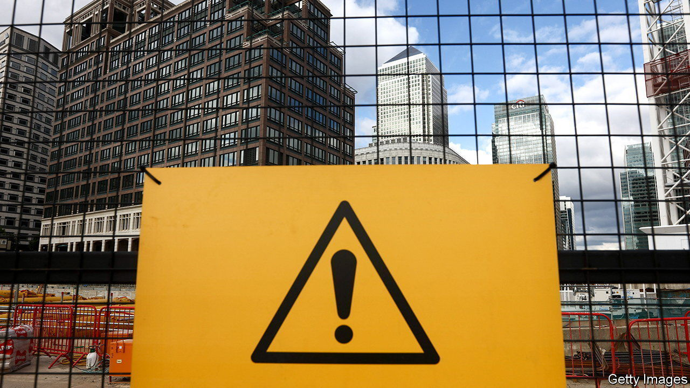
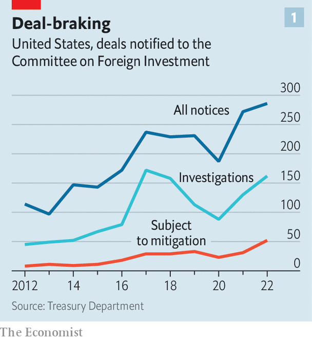

###### Investment screaming

# Every country wants its own investment-screening regime 

##### Pity the world’s dealmakers 

 

> Nov 23rd 2023 

SINGAPORE BECAME the latest country to erect barriers to investment in the name of national security on November 3rd. It plans to review, and potentially block, investments in entities “critical to Singapore’s national-security interests”. That should come as little surprise to dealmakers from the free-trading city-state who have watched the proliferation of similar policies abroad. Last year Singaporean firms filed more notices with the Committee on Foreign Investment in the United States (CFIUS), America’s powerful inbound-investment watchdog, than investors from any other country. That includes China, whose globetrotting companies have been the primary target of efforts to beef up existing investment-screening regimes and adopt new ones. A report from the OECD, a club of mostly rich countries, calls this protectionist turn “historically unprecedented”.

Companies of all nationalities must now navigate a complex patchwork of broad rules and opaque decision-making much more novel than the antitrust regimes which have historically caused them grief. Plenty are getting caught. On November 20th Safran, a French engine-maker, said the Italian government had exercised its “golden power” to oppose the firm’s acquisition of an Italian subsidiary of Collins Aerospace, an American firm. Safran’s biggest shareholder is the French government, which last month scuppered an attempt by Flowserve, an American industrial firm, to purchase Velan, a Canadian business that helps kit out its submarines. 

Investment watchdogs are working overtime even in the midst of a dealmaking drought. Start with CFIUS. Foreign investment flowing into America fell by half last year compared with the year before, yet CFIUS reviewed a record 286 notices from companies hoping to have their deals rubber-stamped. That is hardly surprising given the committee’s expanding brief. In September 2022 President Joe Biden directed it to focus its attention on the security of supply chains and technological leadership. Foreign ownership of real estate is also increasingly in the cross-hairs—two months ago eight military installations were added to a list of sensitive properties where purchasing nearby land can be subject to CFIUS approval (many states have also tightened their own property-ownership rules).

 


CFIUS is not just busier, but tougher, too. When it does approve a deal, it is more often doing so with strings attached (see chart 1). Mitigation agreements can involve a company agreeing to anything from controlling who has access to certain technology to excluding sensitive assets from a deal entirely. Better staffing and a greater focus on the “vulnerability” of firms when assessing national-security risks mean CFIUS is now more likely to impose conditions, says Aimen Mir, a lawyer who previously oversaw the body. 

Some younger watchdogs have been busier still. Britain’s investment-screening regime, which came into force in January 2022, reviewed a whopping 866 transactions in its first full reporting year to March. Some are also even keener to impose conditions—France’s regulator did so for over half of the deals it examined. 

 


After a period of furious rulemaking, screening mechanisms will mature. That could involve lawmakers honing their policies and tweaking their long lists of “sensitive” sectors. British lawmakers are now doing just that. On November 13th the government announced a wide-ranging review of its investment policy. In some areas, it is undoubtedly worth a trim. Last year 93% of deals reviewed were waved through within a month, implying that few transactions which triggered the requirement to notify officials posed any real national-security threats. Investments by Chinese firms contributed a far larger share of detailed “call-in” reviews than of initial filings (see chart 2).

Britain’s government says the review will make rules business-friendlier. In a green and pleasant echo of America’s “small yard and high fence”, it promises a “small garden, high fence”. It could exempt transactions which involve no real change to corporate control. Fiercer debates may erupt over the British regime’s list of 17 sensitive sectors in which deals trigger mandatory filings. For every item the government is considering axing from the rule book—by refining the definitions of sectors including artificial intelligence and defence, for example—it might add more elsewhere. The vague category of “suppliers to the emergency services” could be expanded to include subcontractors.

The EU is considering changes to its investment-screening regulations, too. Since 2020 the European Commission has strongly encouraged member states to adopt their own regimes. It has also established a system for countries to share information about their reviews. Today 21 of the bloc’s 27 members have a regime of their own. Laggards are catching up: Sweden’s broad new policy will come into force in December and Ireland is expected to follow with its own shortly after. In aggregate, EU member states received more than 1,400 notices from dealmakers last year.

Further reforms are likely to raise fundamental questions about the relationship between economic policy and national security in the EU. The commission is already concerned that different governments enforce prohibitions on different types of investment and conduct their business at varying speeds. In July the European Court of Justice, the EU’s highest court, ruled that a decision by Hungarian authorities to block a deal breached freedom of establishment within the bloc, even though the unlucky buyer was owned by a non-European company. 

It is possible that rules in various European countries may grow more similar over time. But any attempt by the commission to force greater harmonisation is likely to be strongly resisted by individual countries. In Europe, like everywhere else, the rules are likely to remain a mess. ■


