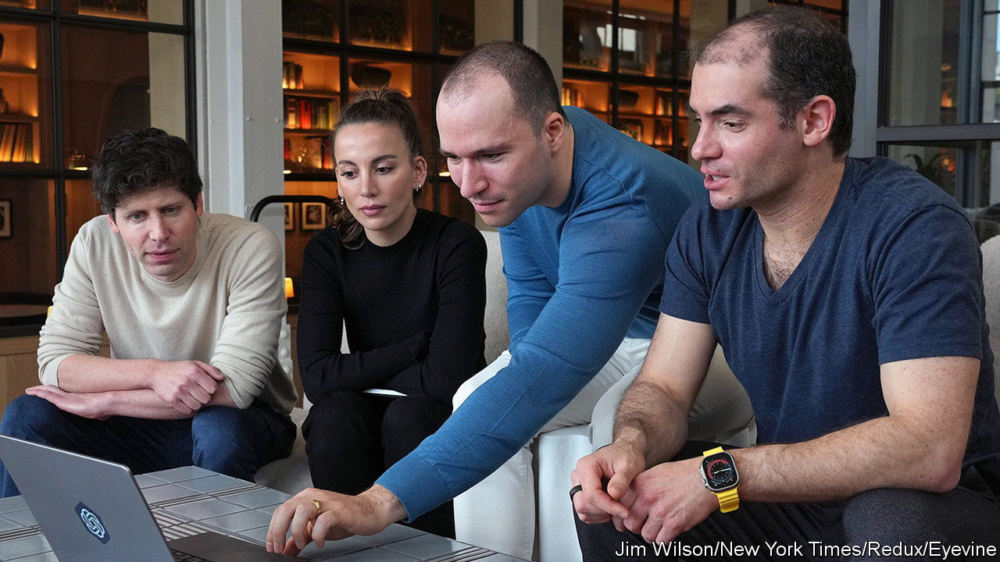

###### Non-profit motives

# Inside OpenAI’s weird governance structure 

##### Why investors had no say in Sam Altman’s sacking 

 

> Nov 21st 2023 

“WHICH WOULD you have more confidence in? Getting your  from a non-profit, or a for-profit company that is entirely controlled by one human being?” asked Brad Smith, president of Microsoft, at a conference in Paris on November 10th. That was Mr Smith’s way of praising OpenAI, the startup behind ChatGPT, and knocking companies like Meta, Mark Zuckerberg’s social-media giant. Events of the past week, which began on November 17th with OpenAI’s board , Sam Altman, and ended four days later with his return to the startup he co-founded, have made the non-profit setups look rather less attractive. They have also thrown a spotlight on AI darlings’ unusual governance arrangements. 

OpenAI is not the only firm in its industry with an odd structure. Anthropic, created by rebels from OpenAI, and Inflection AI (whose co-founder, Mustafa Suleyman, is a board member of  parent company) were formed as public-benefit corporations, which balance investor returns with social good. Anthropic also has a “long-term benefit trust” with power to elect new directors to a gradually expanding board. Even so, OpenAI is an outlier. 


The firm was founded as a non-profit in 2015 by Mr Altman and a group of Silicon Valley investors and entrepreneurs including Elon Musk, the billionaire behind Tesla, X (formerly Twitter) and SpaceX. The group collectively pledged $1bn towards OpenAI’s goal of building artificial general intelligence (AGI), which would outperform humans on most intellectual tasks. 

After a few years OpenAI realised that in order to attain its goal, it needed cash to pay for expensive computing capacity and top-notch talent—not least because it claims that just $130m or so of the original $1bn pledge materialised. So in 2019 it created a for-profit subsidiary. Profits for investors in this venture were capped at 100 times their investment (though thanks to a rule change this cap will rise by 20% a year starting in 2025). Any profits above the cap flow to the parent non-profit. The company also reserves the right to reinvest all profits back into the firm until its goal of creating AGI is achieved. And once that is done, the resulting AGI is not meant to generate a financial return; OpenAI’s licensing terms with Microsoft, for example, cover only “pre-AGI” technology. 

If and when AGI has been attained is determined by the board of directors. Instead of representing OpenAI’s financial backers, the norm at most companies, OpenAI’s charter tasks directors with representing the interests of “humanity”. Until the events of the past week, humanity’s representatives comprised three of OpenAI’s co-founders (Mr Altman, Greg Brockman and Ilya Sutskever) and three independent members (Adam D’Angelo, co-founder of Quora; Tasha McCauley, a tech entrepreneur; and Helen Toner of Georgetown University). They wielded wide-ranging powers granted to the board by OpenAI’s bylaws. This includes the right to add or remove board members, if a majority of directors concur. Most important, the board remains answerable only to itself.

This structure was designed to ensure that OpenAI could resist outside pressure from investors, who might prefer a quick profit now to safe AGI for humankind later. In the wake of the Altman fiasco, that now seems unworkable. Of the old guard, all but Mr D’Angelo have gone. Instead, he is joined by Bret Taylor, former co-CEO of Salesforce, a big software firm, and Larry Summers, a former treasury secretary. The plan is to bring in six more heavy-hitters, including a representative of Microsoft and, possibly, Mr Altman. They are likely to be more attuned to investors’ interests. Yet without deeper reforms to OpenAI’s governance, the new lot will retain the same unchecked powers. “The structure defies corporate physics,” says an AI investor. Sooner or later it will need shoring up. ■


