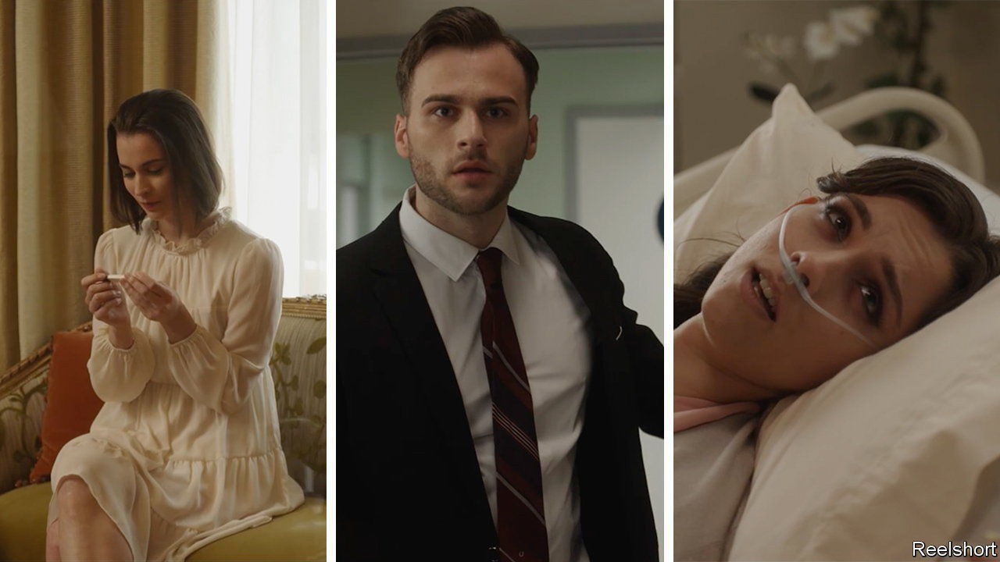

###### Soap power

# ReelShort is the latest Chinese export to conquer America 

##### A producer of soapy micro-series is a surprise hit 

 

> Nov 23rd 2023 

A show called “Never Divorce a Secret Billionaire Heiress” dives head first into a seedy melee of passion and betrayal. Within the first 30 seconds of the micro-series, which consists of 55 two-minute episodes, a woman named Joyce is forced to give her husband’s lover a blood transfusion in order to save the mistress’s life. The first ten minutes depict coerced marriages, inheritance battles and sundry infidelities. The storyline is choppy and nearly impossible to follow. To say the acting is hammy would be generous. 

American viewers can tune in to dozens of similar rapid-fire dramas, with titles such as “The Double Life of My Billionaire Husband” and “Son-in-Law’s Revenge”, on an app called ReelShort. If it all seems a bit foreign, then that is because it is. ReelShort is owned by COL Group, a digital publisher based in Beijing. Some of its shows are adapted by Chinese teams at COL’s Californian subsidiary, Crazy Maple Studio, from Chinese scripts that were first written and produced for audiences in China.

That does not stop Americans from lapping them up. On November 11th ReelShort briefly surpassed TikTok to become the most popular entertainment app in Apple’s American App Store. According to Sensor Tower, a data firm, it has been downloaded almost 2m times in the past month. COL’s market value has more than doubled since the start of November, to 22bn yuan ($3bn).

Apps that trace their roots to China have become wildly popular in America in recent years. The cheap products sold by Shein and Temu have found deep markets in America, as have video clips created by TikTok’s mostly Western users. ReelShort builds on earlier Crazy Maple apps, such as Chapters (a story-game launched in 2017, which lets readers choose their own adventure) and Kiss (which offers a wide selection of romance and mystery stories, and now ranks 14th in the App Store’s books category). The trend contradicts the idea that Chinese cultural products do not translate well for Western audiences. 

ReelShort has followed a path trodden by other Chinese apps in America. For a start, it uses a business model that first succeeded in China. During the covid-19 pandemic, when cinemas were closed, many big film studios began instead to produce micro-series. Local apps such as Miyou Short Drama and the state-backed Hema Theatre offer viewers many episodes of a series free of charge and then ask them to pay often as little as one yuan to watch further instalments. Viewers, most of whom are blue-collar workers, often end up forking over the equivalent of a cinema ticket to complete the series, says Malik Naibi of Duke 65, a social-media marketing agency. ReelShort has brought this concept, and the storylines for some of its Chinese shows, to its target audience in America: middle-aged women. 

Second, like other Chinese-linked apps that are popular in America, ReelShort does not advertise its Chinese roots. The Crazy Maple website makes no mention of China. Similarly, Temu, which is owned by PDD, one of China’s biggest e-commerce groups, describes itself as being “founded in Boston”. TikTok, whose owner, ByteDance, is based in Beijing, and Shein, which was founded in China and relies on Chinese garment-makers, have both moved their headquarters to Singapore.

The apps have something else in common—they have all targeted foreign markets in part to get around challenges in China. Although Shein and Temu sought their luck abroad from their inception, that may be in part because the domestic market has been looking weak. TikTok is a way for ByteDance to hedge against periodic value-destroying tech crackdowns by the communist authorities (though it has run into other problems in America, where some politicians are calling for a ban owing to its Chinese ties). 

COL’s bet on America, too, may be a response to problems at home. By the end of February Chinese censors had purged the web of 1.4m micro-series episodes and shut down 2,420 mini-shows deemed to be explicit or vulgar. America has no government censors—and explicit vulgarity may be a selling-point. ■


