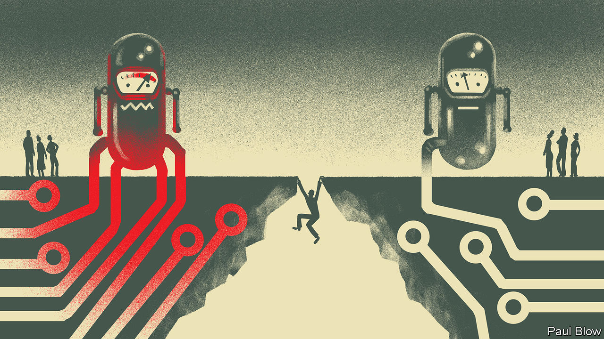
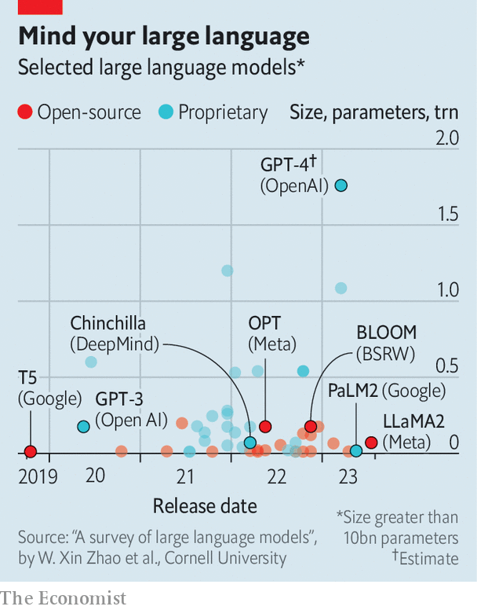

###### OpenAI v CloseAI

# Sam Altman’s return marks a new phase for OpenAI 

##### The industry seems set to move from academic idealism to commercial pragmatism 

 

> Nov 23rd 2023 

EVEN BY TECH’S fast-moving standards, the past week in the world of artificial intelligence (AI) was head-spinning. On November 17th the board of OpenAI booted out Sam Altman, the ChatGPT-maker’s boss. By November 20th Mr Altman had been offered refuge at Microsoft, the startup’s biggest backer. The same day nearly all of OpenAI’s 770 employees signed a letter threatening to quit unless the board members who dismissed Mr Altman reinstate him and resign. On November 21st Mr Altman was back in his old job. Heads have, then, spun back more or less to where they started. Or have they?

In fact, the OpenAI saga marks the start of a new, more grown-up phase for the AI industry. For OpenAI, Mr Altman’s triumphant return may supercharge its ambitions. For Microsoft, which stood by Mr Altman in his hour of need, the episode may result in greater sway over AI’s hottest startup. For AI companies everywhere it may herald a broader shift away from academic idealism and towards greater commercial pragmatism. And for the technology’s users, it may, with luck, usher in more competition and more choice.

To understand all these implications, start with what happened. OpenAI’s board fired Mr Altman for not being “consistently candid in his communications’‘. One factor that may have influenced the decision was disagreement over whether OpenAI had struck the right balance between the speed and safety of its products. Insiders say that OpenAI had made a breakthrough that enabled models to get better at solving problems without additional data. This spooked Ilya Sutskever, a co-founder and board member. Helen Toner, a board member affiliated with Georgetown University, had published an academic article that laid out what she saw as flaws in OpenAI’s approach to AI safety. On November 21st the  reported that Mr Altman, worried about the negative press, had moved to oust Ms Toner. There were also concerns over Mr Altman’s side-projects, including a planned AI-semiconductor venture that sent him to the Persian Gulf to court billions in Saudi money. 

In the end it was Ms Toner and three other board members that ousted him instead. The sixth director, Greg Brockman, was also stripped of his board seat and then quit in solidarity with Mr Altman. The two of them found succour at Microsoft, which said it would create a new in-house AI lab which they would run. Microsoft also pledged to hire the rest of OpenAI’s team. Whether or not this was ever a serious plan may never be known. But it lent Mr Altman huge bargaining power when negotiating his return to OpenAI. On November 20th, as those negotiations were under way, Satya Nadella, the tech giant’s chief executive, declared that “Irrespective of where Sam is, he’s working with Microsoft.”

The deal struck by Mr Altman and those who ousted him will transform OpenAI, starting with the board. Ms Toner and Mr Sutskever are out. So is Tasha McCauley, a tech entrepreneur. All three backed Mr Altman’s dismissal. Mr Brockman and, for the time being, Mr Altman will not be returning. Of the pre-chaos six only Adam D’Angelo, the founder of Quora, a question-and-answer site, stays on. He will be joined by heavyweights, starting with Bret Taylor, a former co-CEO of Salesforce, another big software firm, and Larry Summers of Harvard University, who served as Bill Clinton’s treasury secretary. The , an online publication, has reported that the new board will aim to expand to nine members; Microsoft is expected to get a seat and Mr Altman may get his back. 

The new directors are likely to make , which is structured as a for-profit entity within a non-profit one, more business-minded. Mr Taylor and Mr Summers are well-regarded figures with plenty of boardroom experience. Their views on AI safety are not known. But they may be more receptive than Ms Toner and Ms McCauley to Mr Altman’s empire-building ambitions. The same already seems to be true of OpenAI’s workforce. One employee reports that the startup’s staff, which “trauma-bonded” during the upheaval, will become even more loyal to Mr Altman and, possibly, readier to pursue his commercial vision. Work on the firm’s most powerful model yet, GPT-5, which appeared to have slowed for a few months, will now probably go full speed ahead.

The sour taste left by the imbroglio may nevertheless linger. It was not, in the words of a prominent AI investor, a “confidence-inducing event”. That is putting it mildly. On the morning of November 17th OpenAI was poised to close a tender offer led by Thrive Capital, a venture-capital firm, that would value the startup at $86bn. The offer was suspended. Though it is reportedly back on, investors in the secondary market for startup shares remain cautious. Worse, if Mr Altman and Mr Sutskever do not reconcile, OpenAI could lose one of the world’s most respected AI minds.

Microsoft’s fortunes look more secure. Whereas OpenAI’s brand has taken a hit, Microsoft’s has not. The software giant probably prefers having OpenAI at arm’s length rather than Mr Altman and his boffins close to its chest. By temperament, Mr Altman and Mr Brockman are not a natural fit for one of the world’s biggest companies; many observers doubted that either would have stayed at Microsoft for long. 

Recreating OpenAI in-house would also have slowed the progress of the technology in the short term, argues Mark Moerdler of Bernstein, a broker. Many OpenAI employees said in private that they would rather move to a different firm than Microsoft, even though they signed the petition threatening to follow Mr Altman there. Mr Nadella did not seem terribly disappointed with the outcome. Microsoft’s share price, which dipped by 2% on the news of Mr Altman’s sacking, has clawed back all those losses. On November 22nd its market value reached an all-time high of $2.8trn.

 


What about the rest of the AI industry? OpenAI is the undisputed leader in the AI race (see chart). A survey by Retool, a startup, found that 80% of software developers said that they used OpenAI’s models more often than those of rival model-makers. ChatGPT, a chatty app whose launch one year ago turned OpenAI into a household name, receives 60% of web traffic to the top 50 websites for such “generative” AI. In October the firm was earning revenues at an annualised rate of $1.3bn. 

Even if OpenAI moves faster under new leadership, it will face more competition. An AI-focused venture capitalist likens the moment to the implosion earlier this year of Silicon Valley Bank, which taught many startups not to put all their eggs in one basket. As the Altman drama was unfolding, more than 100 OpenAI customers contacted Anthropic, a rival model-maker, according to the , an online publication. Some tapped Cohere, another startup, and the cloud unit of Google, which has invested in Anthropic. The cloud arm of Amazon, another Anthropic-backer, set up a team to work with switchers. 

The events at OpenAI are a dramatic manifestation of a wider divide in Silicon Valley. On one side are the “doomers”, who believe that, left unchecked, AI poses an existential risk to humanity and hence advocate stricter regulations. Opposing them are “boomers”, who play down fears of an ai apocalypse and stress its potential to turbocharge progress. The split reflects in part philosophical differences. Many in the doomer camp are influenced by “effective altruism”, a movement worried that Ai might wipe out humanity. Boomers espouse a worldview called “effective accelerationism”, which counters that the development of AI should be speeded up. 

Mr Altman seemed to have sympathy with both groups, publicly calling for “guardrails” to make ai safe while pushing Openai to develop more powerful models and launching new tools, such as an app store for users to build their own chatbots. Today he looks decidedly more boomerish, as do the majority of OpenAI’s workers who wanted him back. The doomers are on the back foot. 

That will worry politicians, who are scrambling to show that they take the risks seriously. In July President Joe Biden’s administration nudged seven leading model-makers, including Google, Meta, Microsoft and Openai, to make “voluntary commitments” to have their ai products inspected by experts before releasing them to the public. On November 1st the British government got a similar group to sign another non-binding agreement that allowed regulators to test their ais for trustworthiness and harmful capabilities, such as endangering national security. 

Days earlier Mr Biden issued an executive order with more bite. It compels any ai firm building models above a certain size—defined by the computing power required—to notify the government and share its safety-testing results. As boomers gain the upper hand in Silicon Valley, the White House’s model-inspectors should expect to have their hands full. ■


