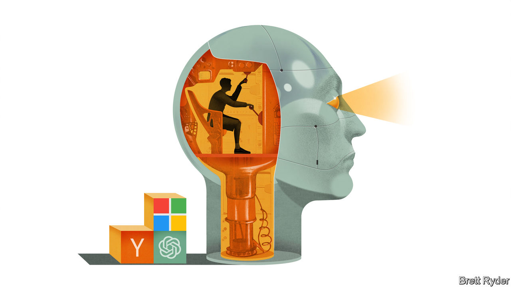

###### Schumpeter

# The many contradictions of Sam Altman 

##### Is the boss of OpenAI a genius or an opportunist? 

 

> Nov 22nd 2023 

Call it the “Burning Man” theory of tech. Every so often, the hopes and dreams of a technological visionary are almost torched by those who surround them. In 1985 Steve Jobs was fired from Apple, the company he fathered, and did not return for 11 years. In 2000 Elon Musk’s co-founders ousted him as CEO of X.com, the firm that went on to become PayPal, a digital-payments platform. In 2008 Jack Dorsey’s fellow creators of Twitter ended his short reign as chief executive of the social-media app. On November 17th Sam Altman looked like he would become the Bay Area’s next burnt effigy, ousted from OpenAI, the artificial-intelligence (AI) firm he co-founded in 2015, by a board that accused him of lacking candour. But on November 21st, after four days in which he, his employees and OpenAI’s investors, such as Microsoft, wrangled feverishly for his reinstatement, he was back in control of the firm. “Wow it even took Jesus three days,” one wag tweeted in the midst of the drama. Instead of Mr Altman, three of the four board members who gave him the boot are toast.

It is not the first time in his 38 years on Earth that Mr Altman has been at the centre of such an imbroglio. He is a man of such supreme self-confidence that people tend to treat him as either genius or opportunist—the latter usually in private. Like Jobs, he has a messianic ability to inspire people, even if he doesn’t have the iPhone creator’s God-like eye for design. Like Mr Musk, he has ironclad faith in his vision for the future, even if he lacks the Tesla boss’s legendary engineering skills. Like Mr Dorsey, he has shipped a product, ChatGPT, that has become a worldwide topic of conversation—and consternation. 

Yet along the way he has irked people. This started at Y Combinator (YC), a hothouse for entrepreneurs, which he led from 2014 until he was pushed out in 2019 for scaling it up too fast and getting distracted by side hustles such as OpenAI. At OpenAI, he fell out with Mr Musk, another co-founder, and some influential AI researchers who left in a huff. The latest evidence comes from the four board members who clumsily sought to fire him. The specific reasons for their decision remain unclear. But it would not be a surprise if Mr Altman’s unbridled ambition played a role.

If there is one constant in Mr Altman’s life, it is a missionary zeal that even by Silicon Valley standards is striking. Some entrepreneurs are motivated by fame and fortune. His goal appears to be techno-omnipotence. Paul Graham, co-founder of YC, said of Mr Altman, then still in his early 20s: “You could parachute him into an island full of cannibals and come back in five years and he’d be the king.” 

Forget the island. The world is now his domain. In 2021 he penned a Utopian manifesto called “Moore’s Law for Everything”, predicting that the AI revolution (which he was leading) would shower benefits on Earth—creating phenomenal wealth, changing the nature of work, reducing poverty. He is an ardent proponent of nuclear fusion, arguing that coupled with ChatGPT-like “generative” AI, falling costs of knowledge and energy will create a “beautiful exponential curve”. This is heady stuff, all the more so given the need to strike a careful balance between speed and safety when rolling out such world-changing technologies. Where Mr Altman sits on that spectrum is hard to gauge.

Mr Altman is a man of contradictions. In 2016, when he still led YC, Peter Thiel, a billionaire venture capitalist, described him to the  as “not particularly religious but…culturally very Jewish—an optimist yet a survivalist” (back then Mr Altman had a bolthole in Big Sur, stocked with guns and gold, in preparation for rogue AIs, pandemics and other disasters). As for his enduring optimism, it rang out clearly during an interview he recorded just two days before OpenAI’s boardroom coup, which he did not see coming. “What differentiates me [from] most of the AI companies is I think AI is good,” he told “Hard Fork”, a podcast. “I don’t secretly hate what I do all day. I think it’s going to be awesome.”

He has sought to have it both ways when it comes to OpenAI’s governance, too. Mr Altman devised the wacky corporate structure at the heart of the latest drama. OpenAI was founded as a non-profit, in order to push the frontiers of AI to a point where computers can out-think people, yet without sacrificing human pre-eminence. But it also needed money. For that it established a for-profit subsidiary that offered investors capped rewards but no say in the running of the company. Mr Altman, who owns no shares in OpenAI, has defended the model. In March he told one interviewer that putting such technologies into the hands of a company that sought to create unlimited value left him “a little afraid”. 

And yet he also appears to chafe against its constraints. As he did at YC, he has pursued side projects, including seeking investors to make generative-AI devices and semiconductors, which could potentially be hugely lucrative. The old board is being replaced by a new one that may turn out to be less wedded to OpenAI’s safety-above-all-else charter. The incoming chairman, Bret Taylor, used to run Salesforce, a software giant. On his watch the startup could come to resemble a more conventional, fast-scaling tech company. Mr Altman will probably be happy with that, too.

Mercury rising 

If that happens, OpenAI may become an even hotter ticket. With the latest version of its AI model, GPT-5, and other products on the way, it is ahead of the pack. Mr Altman has a unique knack for raising money and recruiting talented individuals, and his task would be all the easier with a more normal corporate structure. But his ambiguities, especially over where to strike the balance between speed and safety, are a lesson. Though Mr Altman has been welcomed into the world’s corridors of power to provide guidance on AI regulation, his own convictions are still not set in stone. That is all the more reason for governments to set the tone on AI safety, not mercurial tech visionaries. ■


