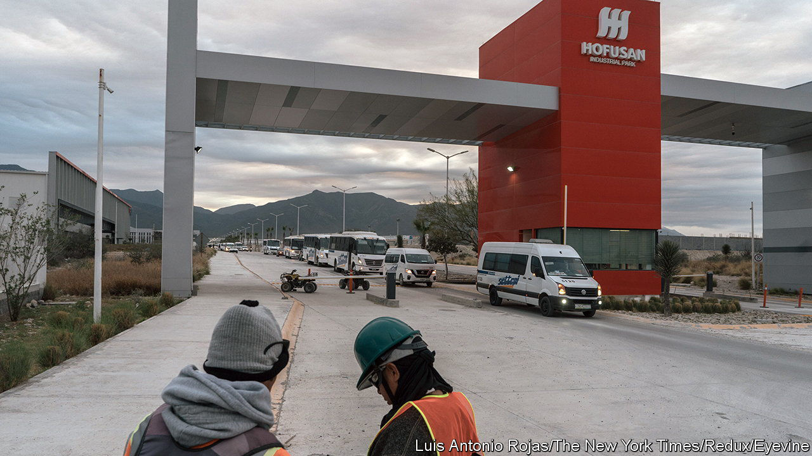
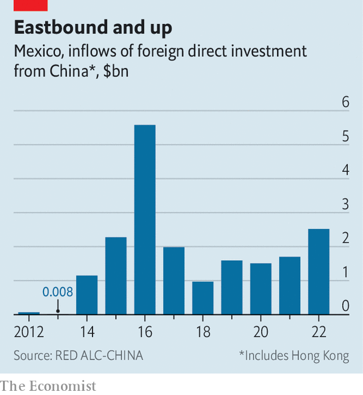

###### The southern strategy

# Why Chinese companies are flocking to Mexico 

##### The country offers a back door to the United States 

 

> Nov 23rd 2023 

Chinese investments have been pouring into Mexico lately. Last month alone brought two notable ones. The government of Nuevo León, a northern state bordering the United States, announced that China’s Lingong Machinery Group, which makes diggers and other construction equipment, would build a factory that it estimates will generate $5bn dollars in investment. The same day Trina Solar, a solar-panel manufacturer, said it would invest up to $1bn in the state. Both companies and their corporate compatriots can now find a home away from home at Hofusan, a Chinese-Mexican industrial park in Nuevo León. 

Chinese companies’ heightened interest in Mexico dates to 2018 when Donald Trump, America’s president at the time, launched a trade war that included raising tariffs on imports from China. His successor, Joe Biden, has kept the tariffs in place. Mr Biden’s own America-first policies, such as the Inflation Reduction Act, are encouraging companies to consider “nearshoring” in North America, in large part to thwart China. The pandemic and the snarl-ups in supply chains it caused also pushed manufacturers to move closer to the American market. And setting up in Mexico has begun to look cheaper, as wages and other costs in China rise. 

Mexico has tried to lure Chinese money before. The Mexico-China Chamber of Commerce and Technology organised events in 2008 to encourage the flow of capital but they were unsuccessful, says the chamber’s César Fragoz; back then China had no need to use Mexico as a way into America, which had yet to turn its back on Chinese companies. “The irony is that the first to react positively to an explicit policy against China are Chinese firms,” says Enrique Dussel Peters of the Centre for Chinese-Mexican Studies at UNAM, a university in Mexico City.

China gets a back door into America because Mexico is part of a free-trade agreement with the United States and Canada. Depending on what components they use, Chinese companies based in Mexico cannot enjoy all the benefits of the trading bloc, whose rules dictate what percentage of a product must originate in North America. But, Mr Dussel Peters notes, the average American tariff on imports from Mexico in 2021 was 0.2%, far lower than on those from China. 

 


Accurate statistics are hard to come by but, according to some estimates, Chinese foreign direct investment in Mexico increased from a total of $500m in 2000-04 to $2.5bn in 2022 alone. That is below a peak of nearly $6bn in 2016, but more than twice the figure in 2018—and rising (see chart). The nature of these investments differs from how China spends its money in the rest of Latin America. In countries such as Brazil and Chile most Chinese investments are in raw materials or infrastructure, often courtesy of Chinese state-backed companies. In Mexico, Chinese investment is in services and manufacturing, including of electronics, cars and home appliances. 

In the 1990s and 2000s Mexican exports to America lost out to Chinese competition. Now Chinese investments are helping Mexico’s exporters. In September Mexico overtook China for the first time since the early 2000s to become the leading exporter of goods to the United States. Net trade with China generated 6.8m jobs in Latin America between 1995 and 2021, compared with 6.7m for the region’s exchange with the United States. Chinese investors are also less particular about environmental and human rights. And they have learned to deal with the challenges of working in Mexico, such as insecurity and poor infrastructure.

A growing Chinese presence in Mexico could backfire if it raises tensions with the United States. Most Chinese manufacturing and assembly in Mexico seems to be aimed at exports, observes Mr Dussel Peters—especially to America. This is alarming some lawmakers across the border. In a recent letter to Katherine Tai, the US Trade Representative, four members of Congress warned of Chinese carmakers in Mexico trying to take “advantage of preferential access to the US market through our free-trade agreements and circumvent any [China-specific] tariffs”. If China is too successful in skirting tariffs it may find its back door as well as the front entrance slammed shut. ■


