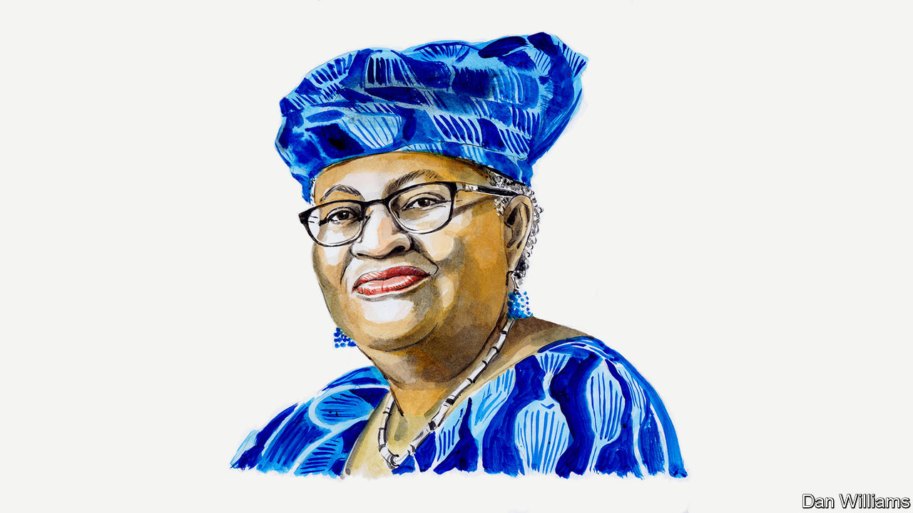

###### COP28: climate action and trade

# Ngozi Okonjo-Iweala says open trade is crucial for decarbonisation 

##### Trade amplifies environmental policy action, argues the head of the World Trade Organisation 

 

> Nov 21st 2023 

LATER THIS month leaders and officials from around the world will gather in Dubai for the COP28 climate-change summit. High on their agenda will be closing the gap between global climate goals and progress towards them. A recent “global stocktake” report from the UN found that global greenhouse-gas emissions are still rising, and that national pledges to cut these collectively fall far short of what is needed to keep average global temperatures within 2°C of pre-industrial levels, as set out in the 2015 Paris agreement, let alone the more ambitious 1.5°C objective.

Delivering deeper emissions cuts will be difficult, even amid record-breaking heat and various government initiatives calling for stepped-up climate action and financing. The International Energy Agency estimates the world can still get there with a massive, policy-driven increase in clean-energy capacity and energy efficiency that will cut demand for fossil fuels by 25% by 2030 and by 80% by 2050, while creating tens of millions of new jobs. This will require global clean-energy spending to rise from $1.8trn this year to $4.5trn annually (in 2022 dollars) by the early 2030s.

But this low-carbon push faces strong headwinds. Higher-for-longer interest rates have raised the cost of capital, weighing on investments towards climate and other sustainable-development goals. Slowing economic growth in developing countries—in many of which output remains well below pre-pandemic trends—is another constraint on governments’ spending capacity.

Against this backdrop, countries need to use every tool available to deliver a just transition to a clean energy future. Trade policy is one of these, and it is one of the most under-appreciated levers available for driving emissions reductions. But awareness is growing. COP28 will feature a first-ever “trade day”, with a focus on how trade and trade policy can move the world closer to net zero.

Open trade is an indispensable means of pushing clean-energy technologies at speed and scale. In addition, trade is a strong force for increasing what Mark Carney, a former central banker and current UN climate-finance envoy, calls “carbon value for money”—that is, for maximising emissions reduction per dollar spent.

Trade has been a big factor in the strongest cause for climate optimism today: the plummeting costs that have made wind and solar energy increasingly competitive with coal and gas. Research from MIT suggests that about 40% of the recent decline in solar-power costs can be attributed to scale economies, and WTO economists have concluded that this is made possible in part by international trade and cross-border supply chains. One study estimates that if trade in solar photovoltaic modules had been more restrictive over the preceding decade, prices in 2020 would have been 54% higher in China and 107% higher in America. Prices in 2030 would be 20-30% higher than in a scenario with globalised supply chains. Higher prices for renewables would mean less deployment.

Recent research shows, moreover, that trade amplifies the impact of environmental policy action. For instance, if countries with a lot of clean energy can produce more energy-intensive goods and services while importing energy-light products from countries with less of it, and vice versa, global emissions will fall substantially more than they would have in the absence of that trade. In other words, just as individuals and countries can reap economic gains by specialising in what they are relatively good at, the world can reap environmental gains if countries specialise in activities they are relatively green at. 

At COP28, the WTO will release a set of “Trade Policy Tools for Climate Action”, offering countries a range of ideas to consider as they ramp up their NDCs—Nationally Determined Contributions—to climate-change action. These include repurposing environmentally harmful subsidies; rebalancing tariff policies that often place higher import duties on low-carbon products than on carbon-intensive goods; using the $13trn in annual government procurement spending to jumpstart markets for emissions-reducing goods and services; co-operating on carbon pricing and green subsidies to minimise negative spillovers and trade tensions; and making food systems more secure and sustainable.

Most of the items on this menu are steps countries can take individually. But realising the full potential of trade and trade policy to drive climate-change mitigation and adaptation requires countries to work together. With geostrategic rifts widening across the world, we risk going in the opposite direction.

Turning away from open global markets would reduce the scale economies and competitive pressures that have lowered the cost of decarbonisation. Trade fragmentation would decrease incentives for the technological innovation we still need. Less trade would slow the spread of new ideas, best policy practices and business strategies for solving the climate challenge. The path towards net zero would become slower and costlier. 

In addition, WTO analysis suggests that if the world economy succumbs to protectionist pressures and splits into two isolated blocs, long-term global economic output will fall by at least 5%. Poor countries would suffer the biggest welfare losses, with devastating implications for poverty reduction as well as for their ability to adapt to climate change and invest in the green transition. 

That is why, at COP28, governments should use trade as a tool as they step up climate ambition and financing for developing countries. And in February, when trade ministers from the WTO’s 164 members gather in Abu Dhabi for our 13th Ministerial Conference, they can strengthen the WTO, recommit to open, rules-based commerce and bolster the system’s capacity to promote climate progress.■


