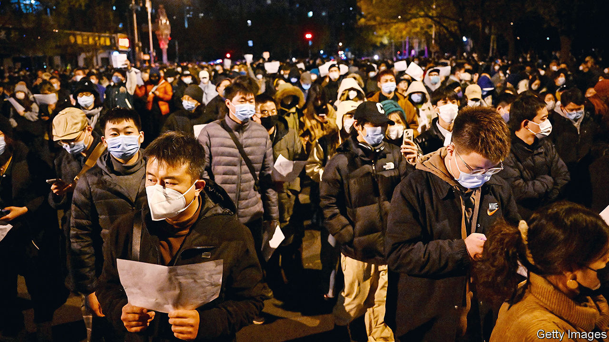

###### When China shook

# A year on from the white-paper protests, China looks much different 

##### A participant considers their impact 

 

> Nov 23rd 2023 

It was a year ago this month that China experienced the biggest wave of unrest since the Tiananmen Square protests of 1989. Thousands of people, mostly students and youngsters, gathered in cities across China to show their displeasure with the government’s exceptionally harsh covid-19 controls. The public was fed up with the constant testing, the brutal lockdowns and the restrictions on movement. Some of the demonstrators chanted slogans. A few called for Xi Jinping, China’s leader, to step down. Many held up blank pieces of paper, a wry critique of China’s stifling censorship regime. The events thus became know as the “white-paper protests”.

They were effective—or appeared to be. Within weeks the government abruptly changed course, ending its “zero-covid” policy. It may have been an accumulation of pressure, not least economic, that forced the government’s hand. Chinese officials would never acknowledge the demonstrations as a turning point, lest they encourage more like them. But reports suggest that the country’s leaders did have the protesters in mind, along with other considerations, when they began lifting restrictions in early December of last year.

One person who is sure that the demonstrations had an effect is Huang Yicheng. The 26-year-old student joined a protest in Shanghai. He points to the government’s haphazard dismantling of zero-covid infrastructure and its failure to stockpile basic fever medication as evidence that, until last November, it had not been planning to change its policy. Regardless, the authorities have shown little mercy to the protesters. Using facial-recognition technology and mobile-phone data they identified, interrogated and arrested some of them.

Mr Huang himself was detained, along with others, on the night of the protest in Shanghai. He managed to exploit a moment of chaos to escape the bus where he was being held. Earlier this year he made his way to Germany, where he is attending university. But he remains worried about his parents back in Shanghai. They have been harassed and threatened by the police, he says. Security officials told his mother that he could face seven to ten years in prison if he were to return to China. 

Little wonder then that Mr Huang is not optimistic about China’s near-term future. He laments its lack of freedoms and the government’s crackdown on civil society. The pandemic, he says, was a kind of a test for the country. In the first two years China passed, controlling the virus better than most countries. But in 2022 it failed in a way that, he argues, revealed the flaws in a one-party system where Mr Xi reigns supreme.

Over the longer term, though, Mr Huang is more optimistic. “Even the desert has a little bit of grass,” he says. “China is a desert and the white-paper movement is that little piece of grass.” He believes that in 20 or 30 years people will come to understand its importance. ■


