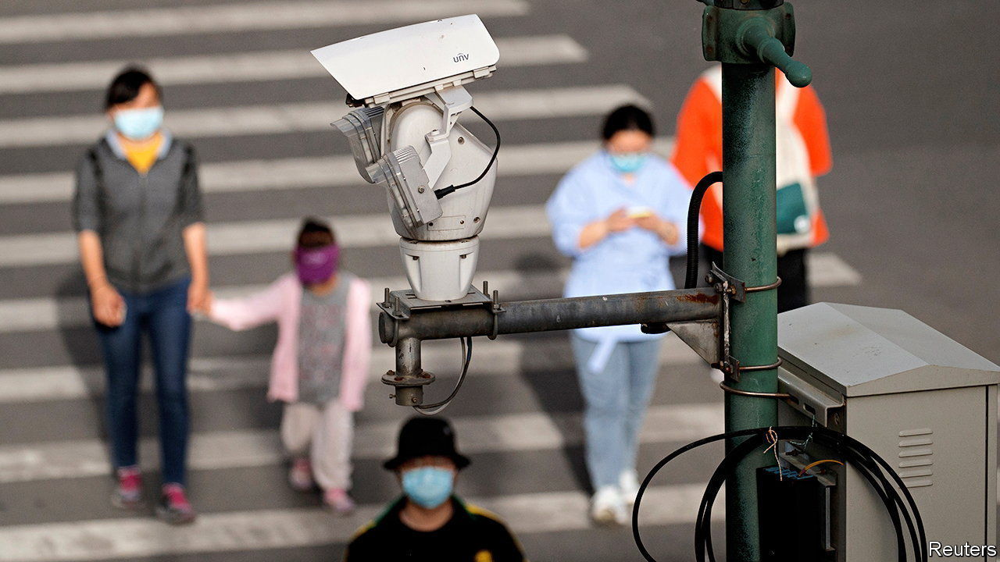
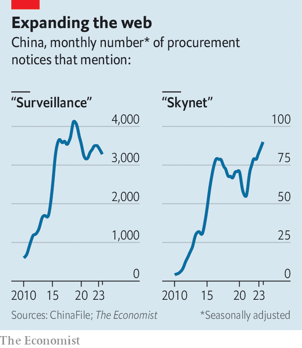

###### Eyes everywhere

# China’s enormous surveillance state is still growing 

##### Its citizens don’t seem to mind 

 

> Nov 23rd 2023 

The sleepy county of Kaijiang, on the eastern fringes of Sichuan province, is hardly a hotbed of unrest. The authorities there seem intent on keeping it that way. They are hoping to upgrade the county’s portion of China’s “Skynet” surveillance system. According to a procurement notice from August, officials in Kaijiang want cameras that “support detection of more than 60 faces simultaneously”. The local system should be fast enough to analyse up to 100 faces per second and have the capacity to store up to 1.8bn images (Kaijiang has a population of 410,000). There must be “no blind spots”, says the document.

Officials argue that such measures protect the public. China’s abundance of CCTV cameras, many equipped with facial-recognition technology, “leave criminals with nowhere to hide”, boasts the , a Communist Party mouthpiece. Chinese people report feeling safe from violent crime, so there is merit to these claims. But the cameras also protect the party. Dissidents and demonstrators can be tracked as easily as burglars. Step out of line and the government will probably know.

Measuring the size and growth of China’s surveillance state is hard, owing to the government’s secrecy, but analysts are trying. A team led by Martin Beraja of the Massachusetts Institute of Technology collected 3m public-sector procurement contracts issued between 2013 and 2019. Using their data, we tallied up the number of surveillance cameras bought by the authorities in 139 cities. Data are missing for some important places, such as the regions of Tibet and Xinjiang, where CCTV cameras are ubiquitous. That helps explain why there were only 8.5m surveillance cameras in the contracts. The , in 2017, said Skynet had 20m cameras. Others have put the number in the hundreds of millions.

 


As big as it already is, China’s surveillance network appears to be growing. ChinaFile, an online magazine published by the Asia Society, a think-tank in New York, has gathered tenders issued by the Chinese government. They provided us with ones that included the word “Skynet” or “surveillance”. The number of tenders that mentioned either term spiked between 2010 and 2017. The pace slowed during the covid-19 pandemic, but has since picked up again (see chart).

Surveillance in China is not limited to cameras. A wide range of activities, from buying train tickets and SIM cards to hailing a DiDi (China’s version of Uber), require citizens to use their identity cards—and, therefore, make them susceptible to tracking. A state ID is also required to sign up for WeChat, the messaging app used by nearly everyone and which is policed by the authorities. During the pandemic, state surveillance rose to a whole new level, with citizens required to download an app that tracked and restricted their movements. Though it was meant to curb the spread of covid, the app was used by authorities in the city of Zhengzhou to stop protesters from assembling.

Many places in the West are also studded with surveillance cameras, while private firms track the virtual movements of app users. But Westerners tend to view these things with more suspicion than the Chinese. In fact, the Chinese public appears to be broadly supportive of government monitoring. A survey of 3,000 people in 2018 found that 82% favoured CCTV surveillance. Even state snooping on emails and internet usage received 61% support. 

It may be that Chinese people are basing their views on incomplete information. The government censors news, such as the story from Zhengzhou, that might cast its surveillance efforts in a negative light. A study from 2022 found that when university students were told about surveillance being used for political repression, support for it declined. The pandemic and the state’s draconian covid controls may have also soured the public’s mood towards monitoring. 

The government, meanwhile, is pushing ahead. On top of cameras, it has deployed phone-tracking devices and is collecting voice prints from the public. If support for such intrusiveness has dimmed, the state will have little trouble finding those who speak out against it. ■


