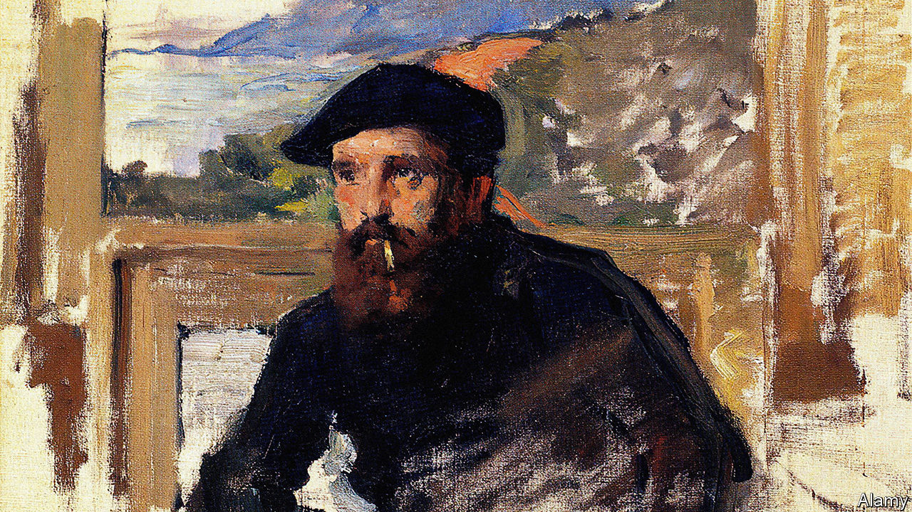

###### One for the Monet

# Claude Monet is celebrated in a colourful new biography 

##### Jackie Wullschläger reveals the tempestuous man behind the canvasses 

 

> Nov 23rd 2023 

 By Jackie Wullschläger

ONCE, when Claude Monet was painting the cliffs at Étretat, he became so absorbed he failed to notice a wave until it crashed into him. He had to crawl from the sea on all fours. But this incident did nothing to dampen his : it was the principal motif in over 1,000 of his paintings. It was there in his earliest known sketches from 1856 (when he was 15) and in his water-lilies series, created in the final years of his life and becoming more abstract as his eyesight failed.

Monet was a contradictory, difficult man. He abandoned his penniless muse, mistress and future wife, Camille, six weeks before she was due to give birth to his son, in order to visit other family and paint. But he was also capable of generosity and empathy. Friendships—most notably , France’s prime minister—endured for decades.

In Jackie Wullschläger, the chief art critic for the , Monet has found a sympathetic, skilled biographer. (Remarkably, this is the first account of the celebrated artist’s  and private life written in English.) Ms Wullschläger has a gift for seeing and sifting. Readers peek into the painter’s account books, rummage through his correspondence and sit uncomfortably by during his long courtship of Alice, who served as a nurse to Camille before she died and was married to Ernest Hoschedé, a buyer of Monet’s paintings. 

The biography most excels when it explains Monet’s art. “Impression, Sunrise” (1872-73), the painting that gave the  its name, is “a moment of breaking light and its reflections, ghostly boats cloaked in mist, dockyards implied by a few loose strokes”. Readers learn that the large canvas of “Women in the Garden” was painted only by Monet digging a ditch, which “assured his stability of viewpoint” far better than climbing a ladder. 

Ms Wullschläger lets Monet speak for himself. After a buyer purchases one “Haystack” painting for 2,500 francs ($500 at the time, around $17,000 in today’s money), Monet requests that: “If anyone asks, I’d be grateful if you would say” the price was double. Monet once fibbed to a journalist that he worked only  In fact, he usually finished his canvasses indoors and could spend months on a single work. (He tarried so long on one wintry landscape that he had to hire men to strip an oak of its foliage when he found himself still working on it in May.) 

The Monet who emerges is complicated. When young, he shamelessly begged friends and family for financial help, but years later he refused to let his stepdaughter marry Pierre Sisley on the grounds that the latter was “an impecunious painter”. Perhaps it is no surprise that his most lasting relationship—in art and in life—was with water, a mutable and sometimes fearsome element. ■


