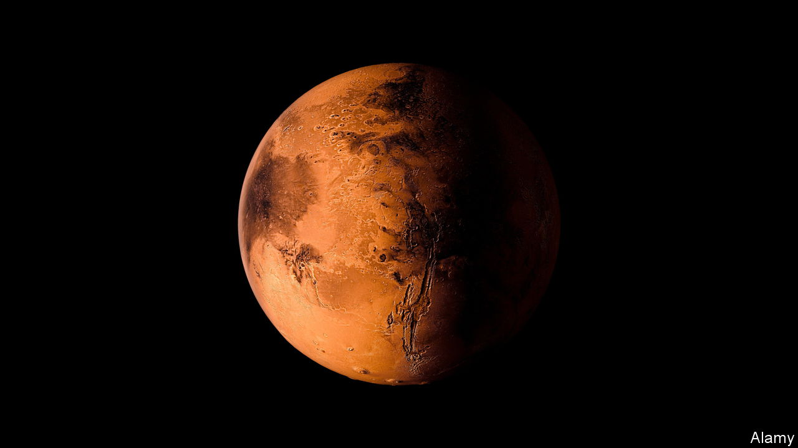

###### There’s no place like home

# The likelihood of living on Mars soon is as remote as Pluto 

##### Even if tech geeks do not want to hear that 

 

> Nov 22nd 2023 

 By Kelly Weinersmith and Zach Weinersmith. 

Some converts are zealous. Some are reluctant. Kelly and Zach Weinersmith are definitely in the second camp. Both, as they constantly remind the reader, are space geeks. But they are also rationalists (who happen to be married). They began writing their new book in the expectation that off-Earth settlements would soon be on the cards. Their rational appraisal, having finished it, is the opposite. Those, such as , who aspire to make  a two-planet species by  or somewhere else, are, they conclude, deluding themselves.

That opinion is not popular in the circles in which they move. But they argue their case cogently, contrasting the escapist fantasies of would-be planetary homesteaders with practicality. How, for example, would people feed themselves? Mars’s surface is covered with toxic perchlorates, making the planet’s “soil” hard to farm;’s has little carbon, life’s essential ingredient. Will space-dwellers be able to have babies? Both conception and birth may prove tricky in low gravity. 

Will there be a land grab for the few lunar mountain tops that enjoy perpetual sunshine and the equally rare crater bottoms that never see it (and so might harbour the precious resource of )? Who will control the air supply? (For a fictional take on how this can go wrong, watch “Total Recall”.) What will the currency be? Space-shuttle astronauts in the 1990s favoured packets of taco sauce.

Then there is the question of why anyone would want to go in the first place. Escaping an environmentally damaged Earth or even simply having an insurance policy against the chance of nuclear annihilation or an asteroid strike may sound attractive. But Mars is actually far more horrid than any fate likely to be awaiting humanity’s home planet—even, probably, the aftermath of a nuclear exchange. And the Moon is worse even than that.

Space may appeal to Mr Musk as a retirement destination (“I’d like to die on Mars, just not on impact” is a saying often attributed to him). But nursing homes for the hyper-rich are a niche market, not the sort of enterprise on which new countries are usually founded. As to the one proper business space-colonisation enthusiasts propose that has a chance of becoming real—the  for precious metals—this would mean pushing space rocks around in ways that might make an asteroid strike more rather than less likely. 

And there are even bigger difficulties than these. One is that, however much people might aspire to leave Earth’s cares behind and start afresh elsewhere, they cannot. Any successful space settlement will carry inescapable historical baggage, and will, at least to start with, be simply an extension of terrestrial geopolitics. The other difficulty is that people themselves are the problem, and they will continue to be a problem even if they are born and raised in other parts of the solar system.

The Weinersmiths are reluctant to rule out the settlement of space for ever. But they argue that if it is to be done, it should not be piecemeal, in the way now planned. Humanity should instead wait a century or two, garner knowledge, develop technology and accumulate sufficient resources to pull it off properly—and then quickly build a large, planned outpost in a sort of “big bang”. Good luck with that. Patience has never been humanity’s strong suit (it certainly does not seem to be Mr Musk’s). Neither has long-term planning. ■


