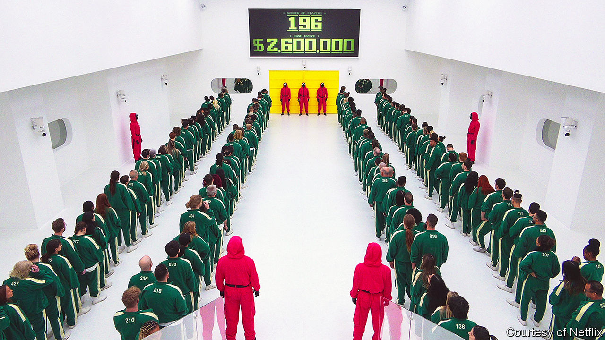

###### Red light, green light

# What “Squid Game: The Challenge” reveals about the state of TV 

##### Reality television is more important than you might think 

 

> Nov 21st 2023 

CONTESTANT 299 sobs and retches; his face turns crimson as he focuses on the fiendish task at hand. Using a needle, he and his fellow players must try to extricate an umbrella shape stamped into a circular piece of honeycomb. If it snaps, they are eliminated from the contest. 

The challenge may sound familiar: it featured in an episode of , a South Korean thriller of 2021. The show remains : in the first month after its release subscribers spent around 1.65bn hours watching it, equivalent to 190,000 years. 

In the fictional game, the penalty for failure was death. In “Squid Game: The Challenge”, a spin-off competition starring real people, “obviously we weren’t going to do that,” says Stephen Lambert, who co-produced the show. (Players are, however, strapped with ink packs that explode when they are knocked out, grimly mimicking a gunshot.) In this version, the stakes may not be life or death, but they are still hefty: 456 people from across the world vie to win nearly $4.6m. 

Mr Lambert describes it as “the largest, most ambitious unscripted show ever produced”. (“Unscripted” refers to game shows, as well as dating and true-crime programmes and some documentaries.) As in the original “Squid Game” drama, the way participants behave during challenges exposes a great deal about their nature. “How you play is who you are,” the tagline declares. But the show is revealing on another level, too, as it points to several trends in television.

First, a show on this scale is testimony to the pre-eminence of reality tv. The genre is ubiquitous partly because viewers like it: “American Idol”, “Jeopardy! Masters” and “Survivor” were among the most-watched programmes in America last year. Unlike prestige dramas, such programmes rarely require your full attention (see final ). But therein lies reality tv’s appeal. Shows challenge the contestants, but viewers not so much.

Television executives are keen on it, too, because it is cheap to make. An episode of a sumptuous drama can cost millions of dollars, whereas an episode of even a flagship game show can be made for less than $100,000. (“Squid Game: The Challenge” is an outlier, costing more than $1m per instalment.) 

In the first half of 2023 almost 70% of the shows commissioned globally were unscripted, according to Ampere Analysis, a research firm. In America, reality TV was given a boost by the () writers’ and actors’ strikes. During the shutdown, drama producers started developing reality fare instead. This type of entertainment has the benefit of not depending on famous writers, actors or showrunners, says Lucas Green of Banijay, a production company: “The format is king.”

Second, “Squid Game: The Challenge” is evidence of the current zeal for exploiting existing intellectual property. That has long been clear on the big screen, with a never-ending parade of familiar Jedi, superheroes and wizards, but it is becoming more evident on the small screen, too. Amazon recently released “007: Road to a Million”, a competition show yoked to the franchise, which features contestants travelling around the world acting like secret agents and trying to win a jackpot of £1m ($1.25m). 

If a show resonates in one country, it will traverse the globe, too. “Big Brother”, featuring strangers enjoying life under surveillance, has been produced in 67 markets. TV executives now scour the world for new IP. “Married at First Sight”, for example, in which people agree to wed strangers, started in Denmark. As well as being an , South Korea is one of the top incubators of reality tv. 

Hits can be reconfigured in different ways. “MasterChef” has nine spin-offs from the original cooking-competition show. No wonder Netflix sought to leverage the immense interest in “Squid Game”: on TikTok, the hashtag has 84.3bn views. 

Finally, the release of “Squid Game: The Challenge” in three batches points to streamers’ changing attitude towards parcelling out content. Entertainment bigwigs are fond of saying that staggered releases recreate the kind of “collective viewing experience” and water-cooler chatter lost in the digital age. But media companies are also trying to make their on-demand services more profitable. A steady drip of episodes, rather than a sudden deluge, can keep viewers subscribed for longer. Don’t you want to know if contestant 299 can go all the way? ■


