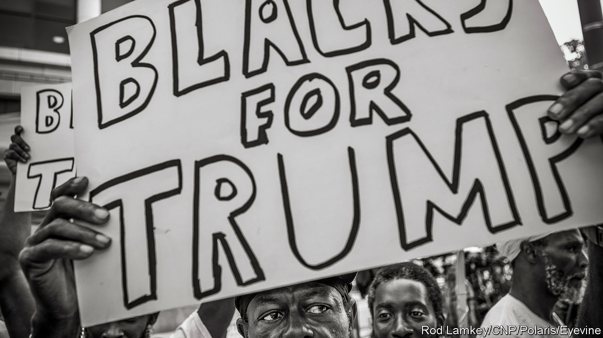

###### Poll position

# Why non-white voters are abandoning the Democratic Party 

##### America’s demographic changes are not playing out as anticipated 

 

> Nov 17th 2023 

 By Patrick Ruffini. 

By John Judis and Ruy Teixeira. 

TEN YEARS ago, as the Republican Party smarted from its second defeat by Barack Obama, a committee of grandees released an “autopsy” analysing what went wrong. One particular worry was the party’s inability to attract non-white voters who were—and still are—in a demographic upswing. The report’s assessment was unsparing and self-flagellating: the voters who described the party as “scary, narrow-minded and out of touch” and labelled it as full of “stuffy old men” had a point. 

The Republican Party’s problems winning over Hispanics meant that candidates ought to quash their nativist talk and “champion comprehensive immigration reform”, the report suggested. The party did not take its own advice. Its next nominee was, of course, Donald Trump, who said that Mexico was intentionally sending “criminals, drug dealers, rapists” to America and pledged to build a wall. His message has not moderated. In October Mr Trump accused illegal immigrants of “poisoning the blood of our country”. 

But the party realignment has not played out as experts expected.  and non-white voters, once steadfast Democratic supporters, are shifting to the Republican Party in droves. Between 2018 and 2022, Republican margins among the white working class, already large, grew by seven percentage points. Among the non-white working class, the swing was more than double that. 

Meanwhile, in those four years non-whites’ support for Democrats has flagged significantly—by six points among African-Americans, by 11 points  and by 19 points among Asians. Greater backing among college-educated whites, who are repelled by Mr Trump’s inflammatory outbursts about race, gender and immigrants, is the main way the Democratic Party has stayed competitive. 

Race was once the most important dividing line in American politics; now it is education. A great inversion is under way: Democrats, once the party of workers, are attracting the poor and the professional elite; Republicans, once the party of the country club, are appealing to the racially diverse working and middle class. How did this happen?

Two new books offer answers. “Where Have All the Democrats Gone?” is an effort by  and , left-leaning observers who are a celebrity duo in political-science circles. Their influential book from 2002, “The Emerging Democratic Majority”, argued that growing numbers of non-whites and Democrats’ rising strength among city-dwellers and those with university degrees set the stage for an enduring majority. When Mr Obama first won the presidency in 2008, the two men were hailed as seers. When  lost in 2016, they were castigated as false prophets. “We were dead wrong about the Democrats’ ability to hold on to the working-class whites,” they write. 

The defection has now spread to working-class voters of all colours. Mr Judis and Mr Teixeira blame “the cultural insularity and arrogance” of the Democratic Party, which began during Mrs Clinton’s presidential campaign. In their view, zealots of transgenderism, critical-race theory, climate eschatology and lack of immigration enforcement seized control of a party that was previously centred on the everyman.

Mr Judis and Mr Teixeira are old-school organised-labour Democrats, with little patience for the newfangled progressives who speak in the language of the faculty lounge. With the exception of abortion, the Democrats are simply out of touch with most Americans on cultural matters. The authors’ critique is of “a combination of neoliberal economics and social liberalism that has alienated working-class voters”. In this story, the demise of unions and rise of free trade sowed the seeds of voters’ discontent with Democrats. The gentrification of the party’s shadow institutions, including mainstream media outlets, meant that a strange ideology that gave primacy to oppression supplanted old-fashioned class consciousness. The working-class revolt commenced soon after. 

This is a critique so familiar that both major American parties now subscribe to it. And yet the theory may be incomplete. Economic explanations of voting behaviour look increasingly inadequate at a time when culture wars predominate. (Why else would working-class voters turn towards the party of tax cuts for the wealthy, while the rich and the near-rich are shifting to the party that champions progressive taxation?) President Joe Biden believes in massive doses of industrial policy, rules to boost goods made in America and support for . And yet he does not seem to have altered the ongoing realignment. The authors think this is because of his unpopular stances, such as endorsing “gender-affirming care” for trans children and teenagers.

“Party of the People” by Patrick Ruffini, a Republican pollster and data maven, brilliantly dissects the changes within the disparate voting blocs in America, combining rich data analysis with vignettes from American history. Democrats misunderstood Hispanics, cringingly insisting on rebranding the ethnic group as “Latinx” and mistakenly assuming their most pressing concern was a pathway to citizenship for illegal migrants. Polls show that Hispanics are almost as likely to support border security as other Americans. Second- and third-generation Hispanics are more likely to be Republican, mirroring a rightward shift that was seen with white Catholics, once the fuel of the Democratic city machines, over the past century. 

Although African-Americans remain more steadfast Democrats than their Hispanic and Asian counterparts, the Republican Party could make inroads with them. Already, 21% of young black men vote for Republicans, though black women remain almost unanimously in favour of Democrats. (No one is quite sure what explains this gender divide.) 

Because voters are stubborn creatures, few things cause big shifts in public opinion. The uproar over civil rights in the 1960s was one catalyst for realignment, pushing black voters to the Democratic Party and white southern Democrats towards the Republican Party. The advent of populism now appears to be another realignment rather than a mere transient shock that will go away after Mr Trump. (In Europe a similar political sorting along educational lines is taking place, too.) 

Whether the movement of the working classes, white and not white, towards the Republicans persists could determine who wins the presidency in 2024. Some are optimistic for Mr Biden, pointing to the continued drift of the educated towards the Democratic Party. But for every American adult who graduated from college, there are two who did not. It is not an ideal trade for Democrats, who are learning that demography is not destiny. ■


