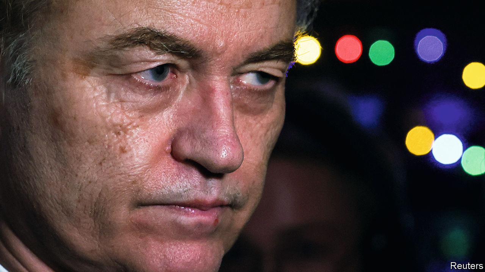

###### Right turn

# Geert Wilders’s election win leaves the Dutch in an awful quandary 

##### Will the cordon sanitaire against the far right hold? 

 

> Nov 23rd 2023 

ON NOVEMBER 22nd voters awarded a whopping 37 of the 150 seats in the Dutch parliament to the anti-Muslim, anti-immigration, anti-EU Party for Freedom (PVV), led by Geert Wilders. It was a bombshell, putting the PVV far ahead of any other outfit, and it leaves the Netherlands in a quandary. For years, most major parties have ruled out a coalition with Mr Wilders. But the results make it nearly impossible to form a government without him. The Netherlands, whose politicians were among the first to turn to anti-Muslim populism in the early 2000s, may now get its first populist prime minister.

The size of the PVV’s victory came as a shock to everyone in Dutch politics, including Mr Wilders. In a cheering crowd of party members at a small bar in Scheveningen, a seaside neighbourhood of The Hague where his support is strong, he proclaimed that he intends to be part of the next government, whether as prime minister or otherwise. “The Dutch people sent a very clear signal,” he said. “They can’t go around us.” He may well be correct. The second-biggest outfit, an alliance of the Labour and GreenLeft parties, got 25 seats. The Liberals (VVD) of the incumbent prime minister, Mark Rutte, took just 24, and New Social Contract (NSC), a brand new centre-right party, won 20. The three parties are not enthusiastic about co-operating with each other, and would need at least one smaller party to form a majority.

Mr Rutte has led the Netherlands for 13 years. When he announced his departure in July over environmental and immigration scandals, saying he would not run in the snap election he called, it left a vacuum. Initially the big winner seemed likely to be the Farmer Citizen Movement, or BBB, a four-year-old party that benefited from farmers’ protests in recent years. But over the summer it lost many supporters to the NSC, founded in August by Pieter Omtzigt, a bureaucracy-fighting MP who had been a thorn in the side of the government.

By last week the contest seemed to have settled into a battle between four main players. The first was Mr Omtzigt, whose focus on responsive government appealed to voters exhausted by scandals. The second was Dilan Yesilgoz, the justice minister, who took over as leader of Mr Rutte’s VVD. The third was Frans Timmermans, who left his job as the EU’s climate commissioner to run at the head of the Labour-GreenLeft alliance. The fourth, unexpectedly, was Mr Wilders, whose PVV surged in the polls only in the campaign’s final week.

Mr Wilders is hardly a newcomer. He rose to prominence in 2006 as one of Europe’s first generation of anti-Muslim populists, quitting the VVD to found the PVV. In 2010, after winning 16% of the vote, he struck a confidence-and-supply deal to support Mr Rutte’s first government, but withdrew less than two years later over proposed austerity measures. Since then every other party has shunned him, in part because of his unreliability but mostly over his radical anti-Muslim stance. In 2016 he was convicted of inciting hatred for a speech calling for “fewer Moroccans” in the Netherlands. His platform calls for banning mosques and the Koran.

During Mr Rutte’s long tenure in power, Mr Wilders came to be seen as a somewhat marginal figure, unable to exercise much influence. That changed with Mr Rutte’s departure: voters were uncertain whether Mr Omtzigt or Ms Yesilgoz might abandon the cordon sanitaire. Mr Omtzigt insisted he would not. Ms Yesilgoz was more equivocal. Her refusal to condemn the PVV outright may have sent a signal that a vote for it might not be wasted.

Mr Wilders moderated his tone during the campaign, saying he would put his anti-Muslim policies “in the refrigerator” in order to join government. In the final campaign debate on November 21st Mr Wilders vowed to become a prime minister “for all [citizens of the Netherlands], without classes, regardless of what you believe or what your background is”. 

Polling during the campaign showed that Dutch voters were most concerned with health care, integrity in government and economic security. But antipathy towards immigrants was also high on the list. Many Dutch blame immigrants for exacerbating a housing shortage. Almost no parties challenged the consensus. Few seem to have reflected that immigration is an issue which the PVV owns, and that persuading voters that it was a crisis might drive them towards Mr Wilders.

A Dutch government with the PVV as its leading member would be a blow to Europe. Mr Wilders wants the Netherlands to exit the EU and grumbles about aid to Ukraine. He is closer to hard-right Europhobes such as Hungary’s Viktor Orban than to hard-right Europhiles such as Italy’s Giorgia Meloni. The country would again become a foot-dragger, as it was during the euro crisis, rather than playing its more constructive recent role. 

On election night, Mr Omtzigt declined to rule out a coalition with the PVV, despite having done so during the campaign. Ms Yesilgoz said the question was unlikely to come up since Mr Wilders could not get enough other partners for a coalition. Fleur Agema, a PVV MP, made the opposite argument: no one else can realistically form a coalition without them. “They’d have to have ten parties,” Ms Agema said. 

In fact a coalition of Labour-GreenLeft, VVD, NSC and one or two other parties is mathematically possible, though politically improbable. Continuing to reject his party would be undemocratic, Mr Wilders said. “The voter has spoken. The voter has said: we’ve had enough. We’re going to make sure Dutch people come first again.” But many of the country’s citizens feel that when Mr Wilders talks about Dutch people, he is not referring to them. ■

