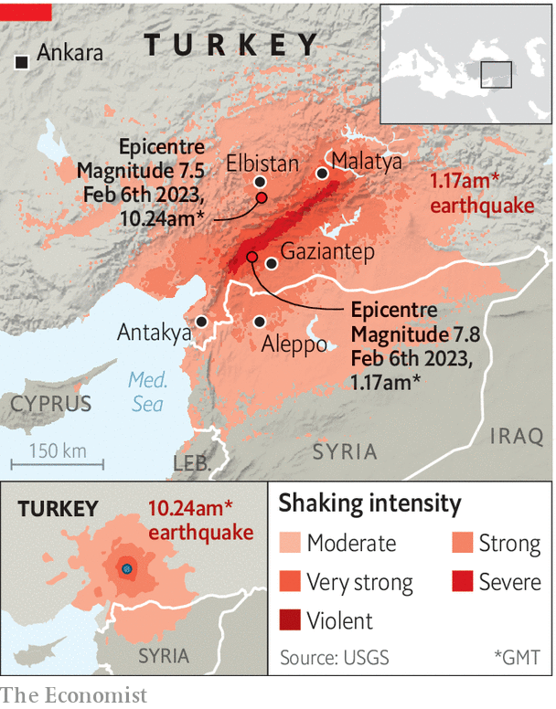

###### Life in containers

# Turkey’s sluggish post-earthquake reconstruction 

##### Before elections in the summer, rebuilding was speedy. But it has slowed since then 

 

> Nov 23rd 2023 

For ten months Esra Yildirim and her husband Mehmet have been living with their six children in a temporary container home in the town of Elbistan, three hours north of Gaziantep (see map). They share communal bathrooms with dozens of other families and are surviving on money that Mehmet, who is unemployed, borrowed from a bank. They have no idea when they will be able to return to their real home, which was damaged in the huge earthquakes on February 6th that struck southern Turkey and Syria.

 


The Yildirims are among 3.3m people in Turkey displaced by the disaster, in which more than 50,000 people died. Many of them have yet to return home. Around 400,000 are still living in container camps organised by the Turkish government and charitable foundations, with around the same number in informal camps and tents, say aid organisations. Tens of thousands more are living in rented accommodation or staying with friends and relatives.

The task of rebuilding is huge. Nearly 300,000 buildings collapsed or were assessed as damaged beyond repair. In the immediate aftermath President Recep Tayyip Erdogan pledged to rebuild 319,000 homes within a year. Until elections in May, which he and his party won, reconstruction seemed to be moving speedily ahead. New homes in three villages were even completed in time for Mr Erdogan to include them on his campaign trail. But since then reconstruction has slowed, and only 40,000 homes are expected to have been finished by the end of this month. Work on another 200,000 has begun, according to the urbanisation minister.

Part of the problem is that the sums no longer add up. In March the government calculated that rebuilding costs would run to $56.9bn. But since then costs have soared, with the price index of Turkey’s building materials showing a rise of 18% between March and July. The cost of imported materials has been pushed up by the Turkish lira’s fall of 32% against the dollar since March. Other expenses are rising, too. In September, the government put up industrial electricity prices by 20%, hitting steel producers.

Last month a government official told Reuters that there was insufficient funding in the budget to open new tenders. Turkey’s economy, already weakened by years of Mr Erdogan’s unorthodox economics, simply “does not have the financial means to withstand the devastation caused by the earthquake”, said Veysel Ulusoy, director of ENAG, an independent Turkish research group that monitors inflation.

In Elbistan, close to the epicentre of one of the earthquakes, the impasse is clear. Gaps still yawn where buildings fell or have been pulled down, but rebuilding is yet to start. Other blocks have been stripped of their fittings but are still standing as the courts are still hearing appeals; some initial damage assessments are being challenged by the owners. Other obstacles to rebuilding are even more complicated. The city of Antakya, which suffered huge damage, is an open museum of valuable historic sites that belong to a patchwork of religious foundations. Last month a consortium of 13 international architecture firms led by Foster + Partners was appointed to design a new Antakya, including the restoration of damaged historic sites. The plan will be unveiled in 2024.

The effects are trickling down. Rental prices are soaring everywhere in Turkey, but areas affected by the quake saw sudden sharp increases between January and March, just as the number of available units dropped. Malatya, one of the worst-hit cities, saw such steep rises that in March it topped the annual table, with year-on-year rental prices jumping more than three-fold. The continuing displacement has reduced the region’s vital farming output, pushing the price of food up even higher.

The humanitarian crisis will increase as the region’s bitter winter draws in. Container roofs are being reinforced but some units have already flooded. Heating units have not yet been distributed. “In the first six months, tents were on the field as a temporary shelter solution,” says Rukiye Daghan Cetin, field co-ordinator for Support to Life, a Turkish organisation. Aid workers now predict that some people may be living in them for years to come. ■

