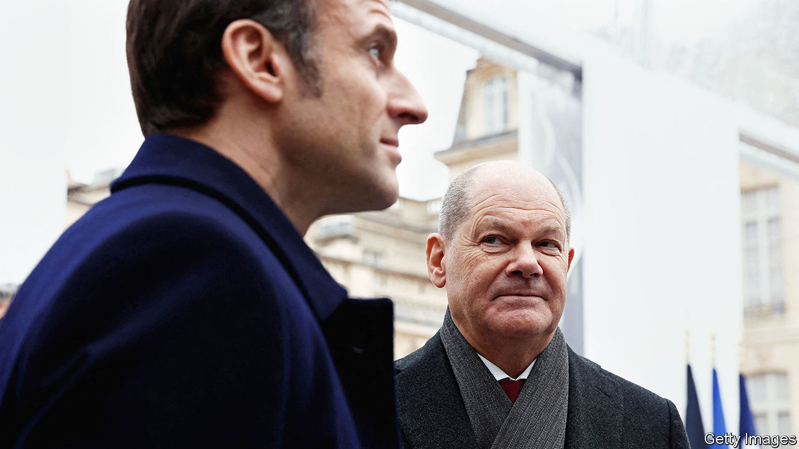
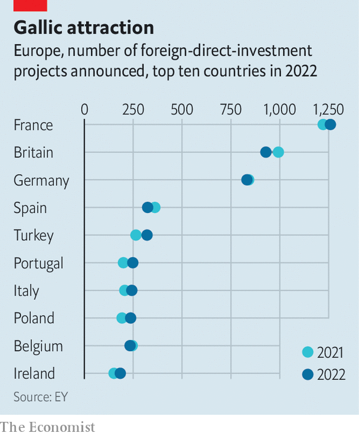

###### Cross-Rhine rivals

# Why German bosses are heaping unexpected praise on France 

##### It is not how things used to be 

 

> Nov 21st 2023 

A DECADE AGO French business leaders tended to gaze across the Rhine with envious eyes. The German economic model, with its strong exports, conciliatory workforce, low unemployment and productive industry, was a source of widespread admiration. French publishers put out books with such titles as “Should we follow the German model?” Newspaper headlines asked “But how do the Germans do it?” French business chiefs and policymakers alike lamented their country’s inability to emulate their bigger European neighbour. 

 


Today the talk among business leaders in Berlin would make French ministers blush. German bosses, frustrated by the country’s dysfunctional three-party ruling coalition, glance admiringly at the French government, which prioritises business, courts corporate leaders and aggressively promotes France as a place for investment and innovation. Many business types support Christian Lindner, the finance minister and boss of the free-market FDP, who wants corporate tax cuts and less red tape, but the FDP is by far the weakest of the three parties in the government coalition. Meanwhile France is harvesting the fruits of President Emmanuel Macron’s pro-business reforms. In 2022, for the fourth consecutive year, France attracted more foreign direct investment projects than any other European country, according to EY, a consultancy. Paris is also winning the EU race to lure financial services from post-Brexit Britain. “France—the better Germany,” ran a recent headline in , a German weekly. “The roles have been reversed,” says Klaus Schweinsberg, a German who teaches at ESCP, a leading French business school. 

The reason German business leaders are heaping praise on France just now goes well beyond their difficulties at home dealing with the transition from dependence on Russian gas and Chinese exports, which has battered the German economy but left less-reliant France relatively unscathed. It comes down to a sense in Germany that the French have transformed the way they deal with investors and entrepreneurs. A country often criticised for its  seems to have found a way to use its centralised institutional structures not to control things but to support private-sector firms, lure investors and nurture entrepreneurs.

Take Pfeiffer Vacuum, a German maker of vacuum pumps, which announced in May that it would invest €75m ($82m) in its factory in Annecy, in south-eastern France. Britta Giesen, the company’s chief executive, says she was personally wooed by the team around Mr Macron, promised a subsidy of around €20m, and given help with paperwork. To top it off, she was invited to make the announcement at “Choose France”, an annual pow-wow of top politicians and foreign investors which has no German equivalent, hosted this year by Mr Macron at the Château de Versailles. As the boss of a midsize firm, Ms Giesen was tickled to be seated next to Elon Musk, the boss of Tesla, and Lakshmi Mittal, a steel tycoon. 

One difference, notes Ms Giesen, is that Mr Macron, a former investment banker, puts people with a business background in government. Roland Lescure, the industry minister, for example, is a former investor. Indeed the president is regularly lambasted by his political opponents, on the hard left and hard right, for being too pro-business. But such types know what firms need, and the investments they help attract can be politically useful when new factories hire staff in the French rust belt and other regions that tend to vote for the extremes. In Germany virtually no member of parliament or top civil servant has such experience, with the exception of Jörg Kukies, a former boss of Goldman Sachs in Germany, one of the German chancellor’s closest advisors.

More broadly, France is quietly reinventing the nature ofindustrial planning. Under Georges Pompidou in the 1970s the state drew up the plan (fast trains, nuclear energy) and its civil servants put it into place. Today, there is still a plan, called France 2030, which involves investing €54bn in future and green technologies, including green-hydrogen production, new modular nuclear reactors, battery and semiconductor production and low-carbon aircraft. But, says Mr Lescure, “It’s in no way a return to the  of the past. It’s not about doing it all ourselves in the ministry, but facilitating the job for private investors and entrepreneurs.” Verkor, the firm currently building a €2bn battery plant in Dunkirk, for example, as part of France’s planned “Battery Valley”, is a startup. Rather, the state builds infrastructure and pays to tackle externalities. On November 22nd the government signed agreements to subsidise emission reductions with the 50 factories that between them account for a tenth of all France’s carbon emissions. It also speeds up the paperwork. A new “green industry” law aims to reduce the average time to acquire all building and official permits for a new factory from 17 months to nine.

France is now better than Germany at using state policies to support the market economy, says Sven Janssen, a German venture capitalist. “Mr Macron understands in particular the promotion of innovation and startups,” he notes. La French Tech is a cleverly branded networking platform that France’s economy ministry uses to market tech firms abroad; Germany has no real counterpart. French startups, such as Doctolib, an online booking service for medical appointments, or PayFit, a maker of payroll software, are now household names in Germany. The French public investment bank, Bpifrance, has also turned out to be a linchpin for France’s entrepreneurs. When it was set up in 2013, sceptics feared it would grow into an unwieldy bureaucracy, under political orders to prop up ailing firms. Today it manages assets worth €50bn, and in 2022 made net profits of €1.5bn. 

The philosophy, says Nicolas Dufourcq, Bpifrance’s head, is “to invest as much money as possible into the reinvention of the French economy by entrepreneurs.” This means fostering a culture of risk-taking and crushing bureaucracy. The bank, among other things, has invested heavily in the development of a generation of French venture-capital funds; it also takes direct stakes and helps its clients negotiate red tape. None of the bank’s staff of 3,500 are civil servants; Mr Dufourcq himself is a former technology consultant. Bpifrance’s German counterpart, the KfW, by contrast, finances entrepreneurs indirectly via their banks.

Germany remains Europe’s industrial powerhouse, of course. It is also still home to more of the continent’s biggest 20 startups than is France. France got serious about a new industrial policy after being spooked by Germany’s decision in 2022 to splurge on its own industrial transition. Nor have the French given up on the old-style subsidy race. When Tesla recently chose Germany over France (and other places) for a huge expansion, it was only after heavy lobbying and the dangling of state subsidies by the French. In any case the draw of France is underpinned by a broader record of getting the big things right, from nuclear-energy and top-class infrastructure to state-provided child care and. 

Ultimately, France’s dream of greater industrial and economic autonomy for Europe depends on Germany’s ability to get it right too. But as German bosses voice an unexpected admiration for their French neighbour, the country has learned a lesson in humility too. In the German press at least, there is no more talk about  (sick France). ■

