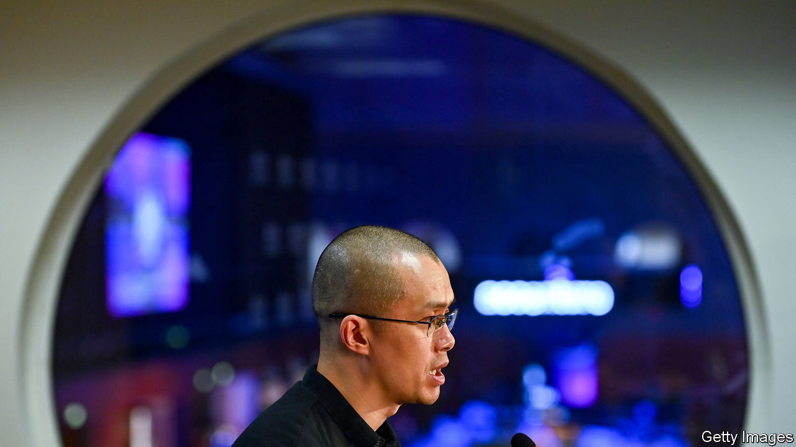

###### Do not pass go

# Another crypto boss falls 

##### Changpeng Zhao may face jail, while his firm pays a $4.3bn fine 

 

> Nov 22nd 2023 

Fictional money, a shot at inordinate riches and a good chance of landing in jail at some point. That, in a nutshell, is the popular board game of Monopoly. But it describes just as accurately the experience of those who have founded some of the world’s biggest cryptocurrency exchanges.

On November 21st Changpeng Zhao, boss of Binance, resigned after pleading guilty to criminal money-laundering charges. He becomes the third founder of a major crypto exchange to be convicted of crimes. In May 2022 Arthur Hayes, who set up BitMEX, was sentenced to six months under house arrest for violating anti-money-laundering laws. And on November 2nd this year Sam Bankman-Fried, the founder of FTX, was convicted on seven counts of fraud. He may face decades in prison. 

Mr Zhao will pay a $50m fine. He may also go to jail—probably for up to 18 months—after he is sentenced in Seattle in February. In the meantime he has been released in return for posting a $175m bond. Binance also pleaded guilty to violating money-laundering laws and the International Emergency Economic Powers Act, the legislation under which America imposes sanctions. As part of the plea agreement, Binance will be allowed to continue operating under the supervision of a government compliance team. It will also pay a $4.3bn fine. Janet Yellen, the treasury secretary, called the enforcement action “historic”. It will be the largest such settlement the Treasury has ever been paid.

The indictment, which was unsealed on November 21st, does not allege that Mr Zhao intentionally set up a platform that criminals or those under sanctions could use to evade scrutiny. Instead, it says that he put his relentless pursuit of market share, growth and profits ahead of all else.

There are all kinds of people with whom the law forbids financial institutions from doing business. This means they must carry out a reasonable amount of vetting of potential clients. Yet between 2017 and 2021 most of Binance’s users could sign up with just an email address. Letting everyone trade freely probably helped Binance create a deep, liquid market—the most useful sort for customers—and thus build market share. But allowing American citizens to swap bitcoin with anonymous accounts linked to Iranian phone numbers is bound to land you in trouble eventually. 

There are countless examples in the indictment showing Binance either did not care about these kinds of problems, or thought that existing financial rules might not apply to the novel crypto business. But there are also instances of deliberate rulebreaking. Binance’s compliance team at times identified users who appeared to be using the platform for illicit activity, like moving funds from Hydra, a Russian dark-web marketplace. They were told, before banning such users, to check their “VIP” status, a designation for high-value accounts. VIPs whose accounts were closed were then told they could open a new one. “Let him know to be careful with his flow of funds,” a former Binance executive said about one dark-web user; “He can come back with a new account...but this current one has to go, it’s tainted.”

Mr Zhao and other Binance executives discussed blocking accounts with IP addresses, or internet location markers, from Iran or North Korea. They do not seem to have done much more than talk. The indictment claims that 12,500 users with Iranian phone numbers were active on Binance in 2019. Some 7,000 customers provided identity documents issued by countries under sanctions. In the end Binance processed almost $1bn-worth of trades between American and Iranian accounts.

“Binance became the world’s largest cryptocurrency exchange in part because of the crimes it committed,” said Merrick Garland, America’s attorney-general, at the press conference announcing the exchange’s plea agreement. Ms Yellen said Binance allowed money to flow to cybercriminals and terrorists—including Hamas, al-Qaeda and Islamic State.

Eventually, the exchange did at least attempt to clean up its act. It put full “know-your-customer” procedures into place in 2021. By May 2022, even users with pre-existing accounts could not trade unless they had uploaded identification documents first. As crypto regulation has been written around the world, Binance has applied for licences to operate a fully regulated and compliant exchange. Speaking to in October, Mr Zhao called Binance “the most licensed crypto firm in the world”. But it is clearly too little too late for Mr Zhao, who will probably not be allowed to work in a financial institution again.

In a long post on X (formerly Twitter) Mr Zhao said he had “made mistakes’‘ and “must take responsibility”. He announced that Richard Teng, a Singaporean career regulator, would replace him as Binance’s boss. As for Mr Zhao himself, he will now “take a break”, having not had a “real (phone off) break for the last six and a half years”. But the length of that break may not be entirely up to him. ■


