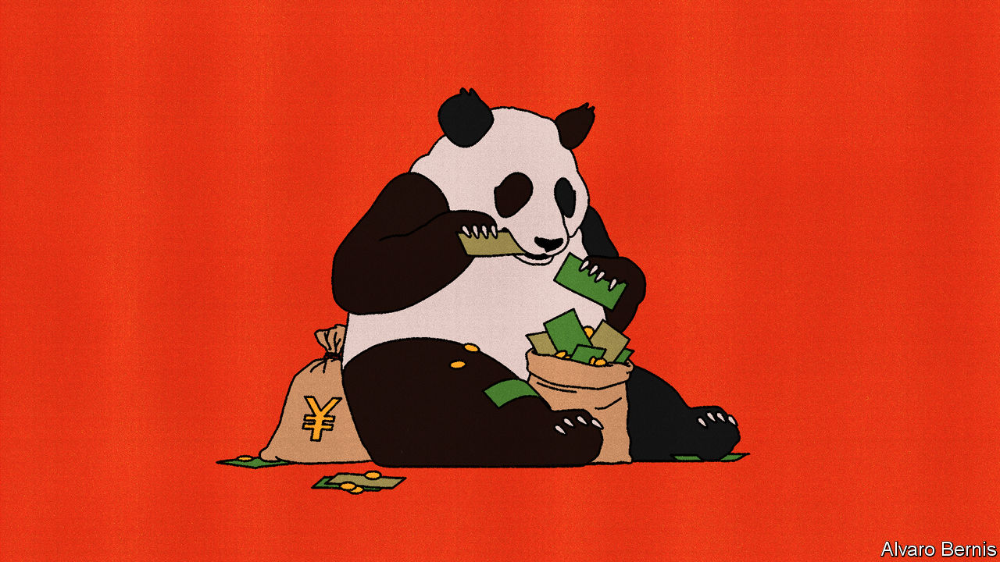

###### Free exchange

# How to save China’s economy 

##### Lessons from the last stimulus for the next one 

 

> Nov 23rd 2023 

EARLIER THIS year a Chinese publisher released a translation of “In Defence of Public Debt”, a book by Barry Eichengreen of the University of California, Berkeley, and several others. Reaching deep into history, the book seeks to restore balance to the debate on government borrowing by emphasising its neglected benefits. Mr Eichengreen argues that indebted countries can get into trouble when they turn to fiscal restraint too soon, neglect growth or succumb to deflation, which only makes debt harder to service. The arrival of the translated edition was timely. Many economists believe the Chinese government’s fiscal caution this year has contributed to disappointing growth and the danger of falling prices.

Thankfully, China’s government has now begun to loosen the purse strings. It has taken the rare step of revising its budget-deficit target from 3% of GDP to 3.8%. It has allowed provinces to issue “refinancing bonds”, which will help them repay some of the more expensive debt owed by affiliated infrastructure firms known as local-government financing vehicles. Financial regulators have urged banks to meet the “reasonable” financing needs of the less rickety property developers, without discriminating against private ones. Officials also talk more often about “three major projects”: affordable housing; leisure facilities that can also help China cope with disasters and emergencies; and efforts to renovate “urban villages”, or formerly rural enclaves.

But these steps by themselves will not be enough. Houze Song of MacroPolo, a think-tank, worries that the “stimulus is not big enough to reflate the economy”. The government seems to fear an excessive response more than it fears an inadequate one. Many in China view public debt as suspect despite the arguments in its favour. Even defenders of public borrowing are careful not to appear too strident. The Chinese edition of Mr Eichengreen’s book is not called “In Defence of Public Debt”. It carries the more anodyne title “Global Public Debt: Experience, Crisis, Response”.

What explains the government’s fiscal reticence? It may be ideology. But it may also be recent history. Fifteen years ago this month, China’s government announced a fiscal stimulus worth about 4trn yuan (or $590bn) in response to the global financial crisis. Financial regulators also gave their blessing to local governments to sidestep restrictions on their borrowing by setting up financing vehicles that could issue bonds and borrow from banks. Local governments responded with “frenzied enthusiasm”, as Christine Wong of the University of Melbourne put it. With the extra borrowing, the initial 4trn yuan ballooned into 9.5trn yuan (or 27% of 2009 GDP) spread over 27 months.

The frenzy successfully revived growth. But in the years since, stimulus has acquired a stigma in China. Chinese officials have repeatedly warned of the dangers of a similar “flood-like” response to economic slowdowns. The lending spree has been accused of privileging state-owned enterprises, crowding out manufacturing investment, and impeding spending on industrial R&amp;D.

Drawing on confidential loan data from 19 banks, Lin William Cong, now of Cornell University, and co-authors have shown that the increased supply of credit in 2009 and 2010 favoured state-owned enterprises over private firms. And among private firms, it favoured those making less productive use of their capital. The authors guess that in a crisis, banks prefer to lend to companies that enjoy the backing of local governments, whether they be state-owned enterprises or well connected but inefficient private firms. Jianyong Fan of Fudan University and co-authors argue that spending on R&amp;D by industrial firms was squeezed by higher capital costs in parts of the country where local governments borrowed most heavily. These localities were often led by newly promoted party secretaries who were eager to shine.

It is easy to read these studies and conclude that the 2008 stimulus was a mistake. But the flaws of that response do not mean that it was worse than nothing. The paper by Mr Cong, for example, does not show that the increased supply of credit hurt borrowing by private firms, merely that it benefited them less than it helped state-owned firms. The study of R&amp;D by Mr Fan and his colleagues also controls for each locality’s growth rate. That means that if the stimulus boosted growth, and growth boosted R&amp;D, this beneficial effect will be stripped out of their results.

Since the stimulus amounted to a “flood” of lending and investment, it would be surprising if private firms were parched of credit. Indeed, lending to them grew briskly in 2009 and 2010, show figures compiled by Nicholas Lardy of the Peterson Institute for International Economics, a think-tank. Investment by private manufacturers was also strong. Instead stimulus spending crowded out China’s accumulation of foreign assets, including the American Treasury bonds bought by its central bank, argues Zheng Song of the Chinese University of Hong Kong, co-author of another influential paper on China’s fiscal expansion.

Stimulus check

Looser financial limits on local governments nonetheless cast a “long shadow”, as Mr Song’s paper put it. Their financing vehicles continued to borrow long after the crisis. Some of the debts these vehicles have accumulated now look impossible for local governments to repay, adding to the gloom hanging over China’s economy. Like many economists, Mr Song believes the next stimulus should adopt different fiscal machinery, providing handouts to households. Mainland China could, for example, copy the electronic consumption vouchers distributed in Hong Kong, which are forfeited if they are not spent within a few months.

Fifteen years on, the side-effects of China’s 2008 lending spree are an argument for better stimulus, not zero stimulus. Public borrowing to rescue an economy can leave a difficult financial legacy, as Mr Eichengreen’s book points out. But that is different from saying that “not borrowing would have been better”. ■


