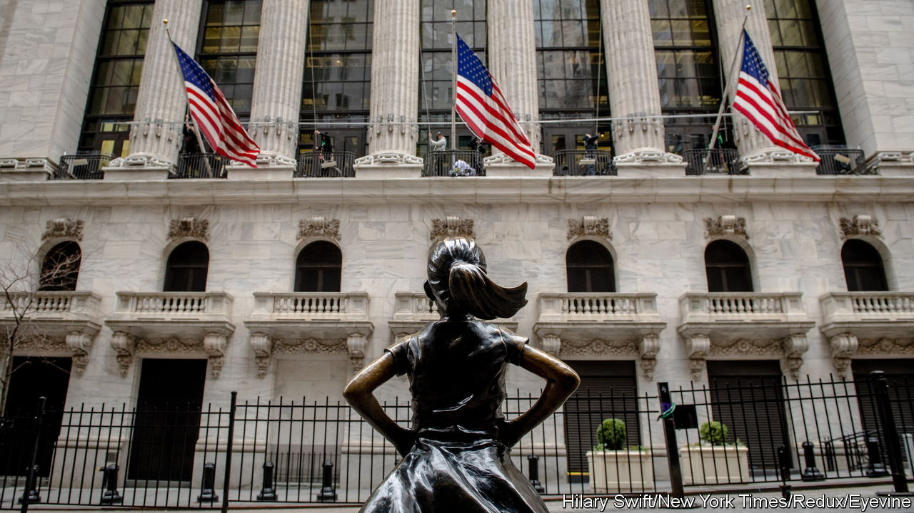

###### Ask again later

# How will America’s economy fare in 2024? Don’t ask a forecaster 

##### The consensus is that there is no consensus 

 

> Nov 23rd 2023 

November brings with it the beginning of the end of the year. The first frost signals winter has arrived. Thanksgiving marks the start of the holiday season. And from the hallowed halls of every large investment bank come pages and pages of “outlook” research. Their arrival means this year’s economic story is mostly written. Next year is what matters now.

 


Often an investor thumbing through all these will experience a sense of déjà vu. With all the vanity of small differences, researchers will elaborate on why their forecast for growth or inflation deviates by perhaps 30 or 40 hundredths of a percentage point from the “consensus” of their peers. (Your correspondent once penned such outlooks herself.)

Yet this year’s crop did not deliver soporific sameness. Goldman Sachs expects growth in America to be robust, at 2.1%, around double the level that economists at ubs foresee. Some banks see inflation falling by half in 2024. Others think it will remain sticky, only dropping to around 3%, still well above the Federal Reserve’s target. Expectations for what the Fed will end up doing with interest rates range, accordingly, from basically nothing to 2.75 percentage points of rate cuts.

The differences between these scenarios come down to more than simple disagreement over growth prospects. Economists at Goldman might think growth and inflation will stay hot whereas those at ubs think both will slow down sharply. But Bank of America expects comparative stagflation, combining only a modest reduction in inflation with a pretty sharp drop in growth (and therefore little movement in the Fed’s policy rates). Morgan Stanley expects the opposite: a version of the “immaculate disinflation” world in which inflation can come back to target without growth dropping below trend much at all. 

That each of the outcomes bank economists describe feels eminently plausible is a testament to the sheer level of uncertainty out there. Almost everyone has been surprised in turn by how hot inflation was, the speed of rate rises required to quell it and then the resilience of the economy. It is as if being repeatedly wrongfooted has given economic soothsayers more freedom: if nobody knows what will happen, you might as well say what you really think.

The result is a bewildering array of analogies. Economists at Deutsche Bank think the economy is heading back to the 1970s, with central bankers playing whack-a-mole with inflation. Those at ubs expect a “’90s redux”—a slowdown in growth as rates bite, followed by a boom as new technology drives productivity gains. Jan Hatzius of Goldman thinks comparisons with decades past are “too simple” and may lead investors astray. 

There is one similarity in the stories economists are telling, however. Many seem to think the worst is over. “The last mile” was the title of Morgan Stanley’s outlook document; “The hard part is over,” echoed Goldman. They might hope that this applies to both the economy and the difficulty of forecasting. In 2024 the contradictions in America’s economy should resolve themselves. Perhaps in 2025 there will be consensus once more. ■


