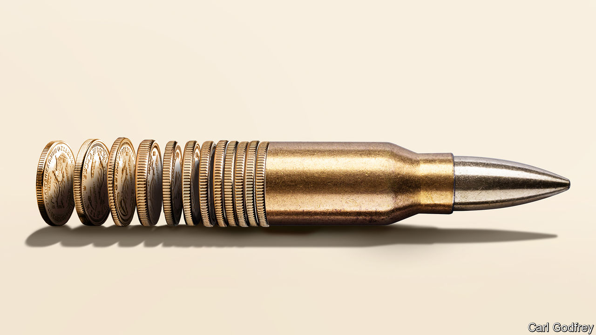

###### The sinews of war

# Inside Hamas’s sprawling financial empire 

##### Why Israel is powerless to dismantle the group’s finances 

 

> Nov 20th 2023 

Viewed from one of Istanbul’s glitziest restaurants, the Bosporus looks sublime. The venue is a favoured haunt of mandarins, businessmen, minor celebrities—and Hamas’s financiers. A man on whom America has imposed sanctions for funding the Islamist group describes his various board seats. “It’s ridiculous,” he says of America’s accusation. Eventually, though, comes an admission. “Now, if you’re asking what our employees do with their own money, why would I know?”

Hamas has three sources of power: its physical force inside Gaza, the reach of its ideas and its income. Since Hamas’s attacks on October 7th, Israel has killed more than 12,000 Palestinians in Gaza in seeking to wreck the first. But Israel’s declared goal of destroying Hamas for good requires its financial base to be dismantled, too. Very little of this sits in Gaza. Instead, it is overseas in friendly countries. Furnished with money-launderers, mining companies and much else, Hamas’s financial empire is reckoned to bring in more than $1bn a year. Having been painstakingly crafted to avoid Western sanctions, it may be out of reach for Israel and its allies.

Hamas’s income pays for everything from schoolteachers’ salaries to missiles. Around $360m each year comes from import taxes on goods brought into Gaza from the West Bank or Egypt. This is the easiest source of cash for Israel to strangle. After withdrawing from the strip in 2005, it strictly limited the movement of goods and people across the border. Now it stops even most basic necessities, such as food and fuel, from getting in.

A much larger income stream, though, comes from abroad. Israeli officials reckon this amounts to around $750m per year, making it the main source of funding for Hamas’s current stockpile of arms and fuel. Some of the money comes from friendly governments, the biggest of which is Iran. America reckons that the ayatollahs provide $100m a year to Palestinian Islamist groups, mainly in military aid. The task for Hamas’s financiers is to move this money around without falling prey to America’s sanctions. In the past month alone, American officials have imposed three rounds of restrictions on people and companies for funding Hamas.

Dodging American sanctions requires some ingenuity. Millions of dollars flow to Hamas through crypto markets. “You’d be surprised how much of the market’s activity comes back to [Hamas],” says Firuze Segzin, an economist at Bilkent University in Turkey. America’s Treasury Department says Hamas has smuggled more than $20m through Redin, a currency exchange crammed among tourist shops deep in Istanbul’s run-down Fatih neighbourhood. The department also says Binance, the world’s biggest crypto exchange by trading volume, has allowed its users to carry out transactions with Hamas.

But the lion’s share of Hamas’s money—at least $500m a year, say Israeli officials—comes from its investments, some of which are firms registered in countries across the Middle East. These are run by Hamas’s investment office and employ its members. American officials say the firms donate to charities which in turn funnel funds to Hamas; Turkish officials say profits are sometimes taken directly.

Untangling these revenue streams is tricky for Western regulators. One such firm built the Afra Mall, Sudan’s first shopping mall, while another has mines near Khartoum, its capital. A third built skyscrapers in Sharjah, in the United Arab Emirates (uae). Many of these companies boast of their business deals, but deny any affiliation with Hamas.

Can the revenue streams still flowing to Hamas be stanched? That depends on the countries they pass through. Since 1989, when Israel arrested a handful of Hamas’s top brass in Gaza and the West Bank, its bankers have lived abroad. Over time, though, geopolitical shifts have forced them to keep moving. Hamas abandoned its first financial hub, in Amman, Jordan’s capital, under pressure from America.

Today, while Hamas’s politicians favour Doha, the capital of Qatar, and its companies range from Algeria and Sudan to the UAE, its financiers live in Istanbul. Zaher Jabarin, accused by Israel of running Hamas’s finances (which he denies), is based there, as are several other individuals under sanctions by America for funding the organisation. Eager to garner regional influence by supporting the Palestinian cause, Recep Tayyip Erdogan, Turkey’s president, offers shelter. Israel says that the Turkish government hands out passports (which it denies) and lets Hamas keep an office in the country. 

Meanwhile, Turkey’s banking system helps Hamas dodge American sanctions by conducting complex transactions across the world. A booming, lightly regulated crypto market makes things even easier. Many of Turkey’s biggest banks, including Kuveyt Turk, have been accused by Israel and America of knowingly storing Hamas’s cash. Some murmur that Mr Erdogan quietly approves. In 2021 the Financial Action Task Force, a G7 watchdog, placed Turkey on its “grey list” of countries doing too little to freeze terrorists’ assets.

No one benefits more than Hamas’s businessmen. The Turkish government’s tacit approval “opens doors and makes things smooth in business”, says one of the group’s finance employees. Trend GYO, an Istanbul-listed firm that has been placed under sanctions by America for funnelling funds to Hamas, won an official contract to build Istanbul Commerce University. Construction companies, which feature heavily in Hamas’s portfolio, can quietly swallow huge lumps of cash and often receive large loans. All this enables Turkish officials to protest that they are not directly lining Hamas’s pockets.

So far Hamas seems financially bulletproof. Israel has managed to inflict little harm on either its income or its savings; Turkey’s banks have been unco-operative. America’s numerous sanctions are less effective if their targets can keep cash outside its banking system. And Hamas hides its companies well. “Every time you think you’ve got a big fish, it changes its name,” despairs one ex-Treasury official.

In fact, the risk is that Hamas’s finances will improve. As Israel steps up its attacks on Gaza, countries with pro-Palestinian populations may make life even easier for Hamas’s bankers. For months rumours have circulated that some civil servants in Mr Erdogan’s economic ministry are co-ordinating with Hamas’s finance office.

For Israel, the prospect of Hamas growing richer despite the war would be a bitter failure. With its wealth and financial roots intact, Hamas—or a similar organisation—might re-emerge and flourish anew from the destruction. While Gazans have been plunged into tragedy, Hamas’s money is safely ensconced elsewhere—and its financiers can eat lobster as they gaze across the Bosporus. ■


