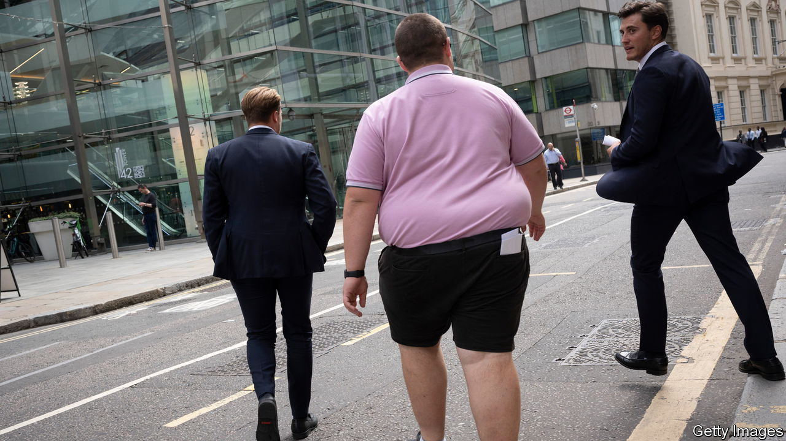
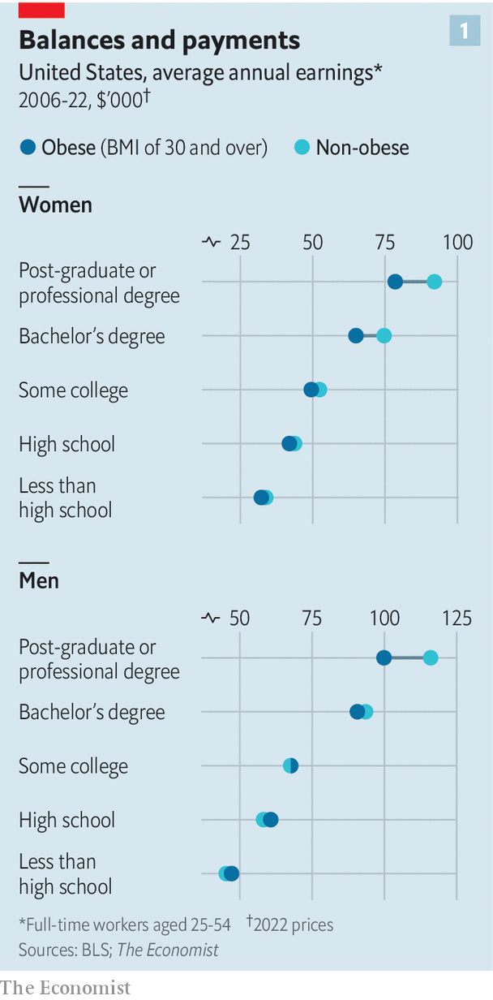
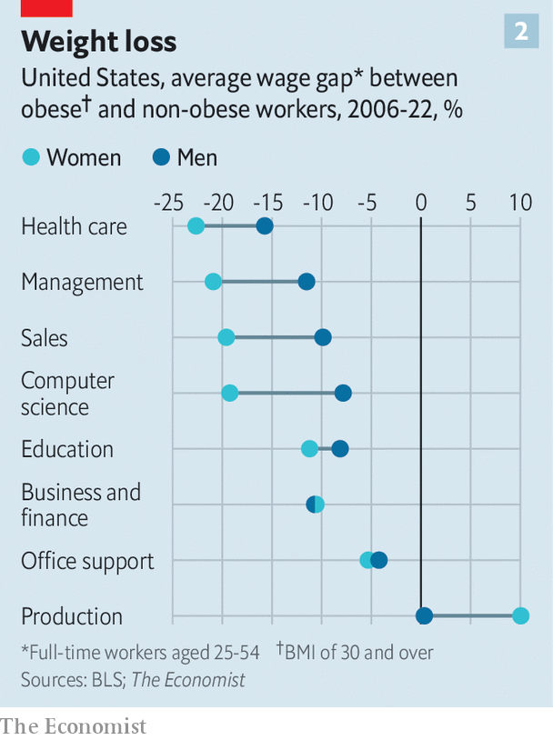

###### Economies of scales

# The obesity pay gap is worse than previously thought 

##### It affects men as well as women, and is wider for the well-educated 

 

> Nov 23rd 2023 

Obese people experience discrimination in many parts of their lives, and the workplace is no exception. Studies have long shown that obese workers, defined as those with a body-mass index (BMI) of 30 or more, earn significantly less than their slimmer counterparts. In America, several state and local governments are contemplating laws against this treatment. On November 22nd, one such ban came into force in New York City. 

Yet the costs of weight discrimination may be even greater than previously thought. “The overwhelming evidence,” wrote the Institute for Employment Studies, a British think-tank, in a recent report, “is that it is only women living with obesity who experience the obesity wage penalty.” They were expressing a view that is widely aired in academic papers. To test it,  has analysed data concerning 23,000 workers from the American Time Use Survey, conducted by the Bureau of Labour Statistics. Our number-crunching suggests that, in fact, being obese hurts the earnings of both women and men.

 


The data we analysed cover men and women aged between 25 and 54 and in full-time employment. At an aggregate level, it is true that men’s BMIs are unrelated to their wages. But that changes for men with university degrees. For them, obesity is associated with a wage penalty of nearly 8%, even after accounting for the separate effects of age, race, graduate education and marital status. When we re-ran our analysis, using a different dataset that covers nearly 90,000 people, from the Department of Health and Human Services, we got similar results.

The conclusion—that well-educated workers in particular are penalised for their weight—holds for both sexes (see chart 1). Moreover, the higher your level of education, the greater the penalty. We found that obese men with a bachelor’s degree earn 5% less than their thinner colleagues, while those with a graduate degree earn 14% less. Obese women, it is true, still have it worse: for them, the equivalent figures are 12% and 19%, respectively. 

 


Your line of work makes a difference, too (see chart 2). When we crunched the numbers for individual occupations and industries, we found the greatest disparities in high-skilled jobs. Obese workers in health care, for example, make 11% less than their slimmer colleagues; those in management roles make roughly 9% less, on average. In sectors such as construction and agriculture, meanwhile, obesity is actually associated with higher wages.

These results suggest that the aggregate costs of wage discrimination borne by overweight workers in America are hefty. Suppose you assume that obese women, but not men, face a wage penalty of 7% (the average across all such women in our sample) and that this is the same regardless of their level of education. Then a back-of-the-envelope calculation suggests that they bear a total cost of some $30bn a year. But if you account for both the discrimination faced by men, and for the higher wage penalty experienced by the more educated (who also tend to earn more), the total cost to this enlarged group more than doubles, to $70bn per year.


What can be done? Several cities, such as San Francisco and Washington, DC, already ban discrimination on the basis of appearance. A handful of states—including Massachusetts, New York, New Jersey and Vermont—are considering similar bills. The ban New York City began to enforce on November 22nd prohibits weight-based discrimination in employment, housing and public accommodation such as hotels and restaurants. Alas, it is unlikely to accomplish much. When we restricted our analysis to workers in Michigan, where a similar ban has been in place for nearly 50 years, we found the obesity wage penalty to be no lower than for America as a whole. Outlawing prejudice is one thing. Ironing it out of society is quite another. ■


