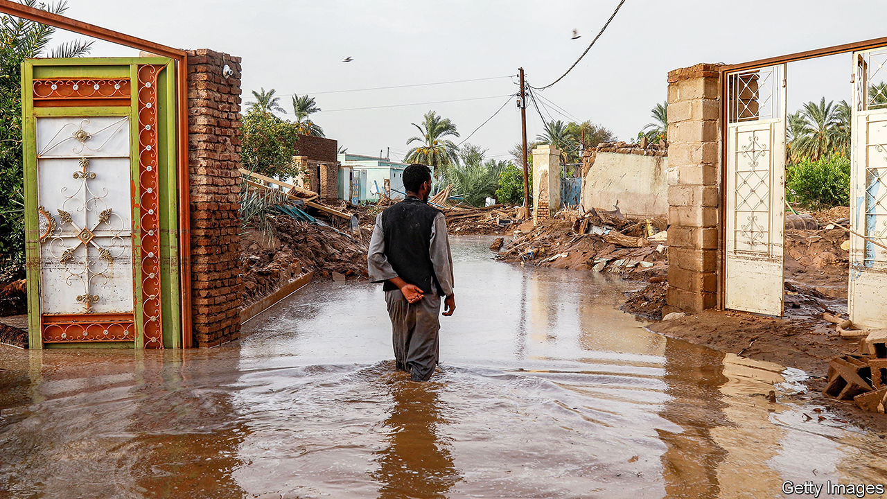
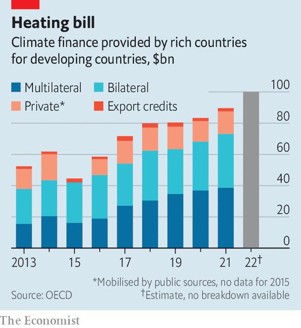

###### A day late and a dollar short

# The rich world claims it has paid its overdue climate debts 

##### That will not stop countries squabbling over the bill for a hotter planet 

 

> Nov 23rd 2023 

Mission accomplished? Rich countries have at last met a promise to provide $100bn a year of climate finance to poorer ones, according to estimates for 2022 from the OECD, a club of mostly rich countries. That is two years late: the amount was originally pledged in 2009, when it was supposed to arrive by 2020. It is also not a sure thing. The OECD‘s figures are preliminary and may be revised.

Still, the estimates may ease tensions between rich countries and poor ones ahead of COP28, this year’s UN climate summit in Dubai, which begins on November 30th. The missed pledge had become a symbol of rich-world hypocrisy: urging poor countries to forgo fossil fuels without providing the finance to help them achieve that, or to help them adapt to the warmer planet brought about by its own coal-and-oil-fuelled development. An indication, however tentative, that rich countries have at last met the goal is better than none.

Developing countries will take a “trust but verify” approach, reckons Joe Thwaites of National Resources Defence Council, an environmental pressure group. The estimates are based on OECD projections published at the Glasgow climate summit in 2021. Since then, the spending data from multilateral development banks (MDBs) and governments have been at the top end of those forecasts. And so the OECD judges it likely that the $100bn pledge has been met. “I doubt they would say that without feeling really confident,” says Mr Thwaites.

 


Even so, any self-congratulation by rich countries will be poorly received. As well as being late, much of the money has come in the form of loans from MDBs that poor countries must pay back, and that will take priority in any debt restructuring. Poor countries will argue at this year’s COP that borrowing to fund climate investments will make their debt burdens less sustainable, as they already struggle with high food and energy prices and a strong dollar. At the Africa Climate Summit, where African nations hashed out a common position ahead of COP, they called for a “comprehensive and systemic response to the incipient debt crisis”, beyond the existing system of dealing with national defaults.

Nor do the rich countries appear to have done well at “unlocking” private finance, which they have often promised to do. Estimates of the amount of external finance that countries in the global south will need to adapt to climate change tend to be in the trillions of dollars. Stretched finance ministries in the global north suggest that they will use scarce aid money to “crowd in” private finance rather than provide everything themselves. The OECD, however, found that the amount of private-sector funding mobilised by such wheezes amounted to just $14bn in 2021.

Rich countries will hope to avoid fraught arguments over money in Dubai. A deal over climate pledges agreed by America and China last week has raised hopes of a breakthrough. A similar bargain between the world’s two largest polluters preceded the Paris climate agreement in 2015. Last year’s COP was dominated by negotiations over “loss and damage”, or funding to compensate poor countries for the impact of climate change rather than help them mitigate or adapt to it. The conference thus failed to produce any commitment to a more ambitious reduction of the pace of global warming. Ahead of this year’s COP, the EU has said it will make a “substantial” contribution to a loss and damage fund, while John Kerry, America’s climate negotiator, has said the country will pledge “millions”. That, along with rich countries having finally met their $100bn pledge, could take the heat out of arguments.

Yet now rich countries must agree on a new pledge by 2025, since the framework they are currently following expires then. Technical discussions have so far been “rudderless”, says Michai Robertson of the Alliance of Small Island States, a group of countries that are vulnerable to climate change. There is no consensus on what should count as climate finance, the period for which the new target should run or who should contribute. Established in 1992, the group of donor nations excludes big emitters such as China and fossil-fuel producers such as Saudi Arabia and the UAE. Rich countries sometimes venture that these countries, too, should cough up.

Disagreement also persists over the use to which any new money should be put. In 2021 rich countries pledged to double the amount of finance they provide for adapting to climate change, as opposed to for reducing emissions. Such adaptation is a priority for the poorest countries that emit little but are highly exposed to the risks of a warmer planet. Meanwhile rich countries, accountable to climate-conscious voters at home, are often more focused on getting middle-income countries to stop using coal. The headline announcement at last year’s conference was a deal for $20bn between a small group of rich countries and Indonesia to do exactly that. Making good on overdue promises is a start. But there is no end in sight for the rows over the bill for a hotter planet. ■


