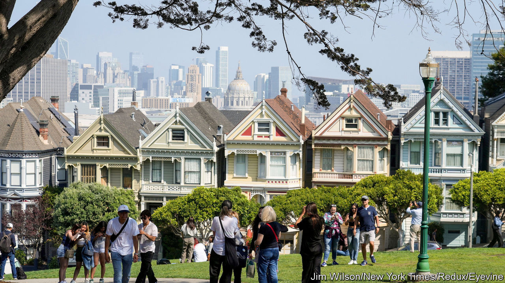
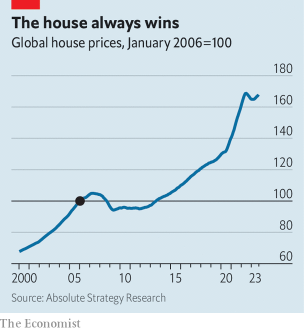

###### Walking on air

# Why house prices have risen once again 

##### Across the rich world, they have brushed off higher rates. Can that last? 

 

> Nov 21st 2023 

In parts of San Francisco, the housing market is in dire straits. Consider the example of one swish apartment close to City Hall, with quartz countertops and a rooftop deck, which in 2019 sold for $1.25m. Not today. After the chaos of the covid-19 pandemic, City Hall now overlooks the locus of the city’s . Biblical scenes of lawlessness and human suffering play out every night. The flat is now listed for $769,000—and has yet to sell.

Away from its troubled districts, though, San Francisco’s housing market is once again robust. Prices have risen by 3% from a trough reached earlier this year. Property in swankier parts of town fetches well above the asking price. In nearby San Jose, in Silicon Valley, house prices are up by 8% from the trough. The story is similar across the rich world: pockets of weakness, but surprising overall strength.

 


Figures from the Dallas branch of the Federal Reserve suggest that global house prices rose by 1.3% between the first and second quarters of 2023. Estimates for more recent months point to a further rise (see chart). In cash terms this puts them in line with the previous peak reached in 2022. Adjusted for inflation, they have fallen by less than 5%. That pales in comparison with the 13% peak-to-trough decline which followed the financial crisis of 2007-09, and which also lasted a lot longer.

Even in places where the housing market went bananas during the pandemic, leading people to expect a crash, prices are now higher than many had feared. In Britain, a house-price index produced by Halifax, a building society, rose by 1.1% in October, defying economists’ expectations of a 0.4% monthly drop (though the number of transactions is unusually low). Data from Zillow, a housing website, indicate that  are nearly 2% higher than they were a year ago. A recent survey by Bloomberg, a financial-data firm, suggests that Australian house prices may rise by 7.7% this year.

All this has taken most economists by surprise. Since the start of 2022 the rich world’s central banks have raised interest rates by an average of five percentage points. Economists thought house prices would crash as buyers’ purchasing power declined, mortgage-holders struggled to repay their debts and the economy slowed.

Three factors, however, explain why housing markets have so far brushed off higher rates. The first is a shift in preferences. The pandemic seems to have made people more : they work from home more and spend more time on home entertainment than on going out. People thus place a higher value on their living space, raising demand for housing. This arrests price declines.

The second factor is a changed mortgage market. In some countries, such as America and , it has long been common to borrow on fixed rates, allowing people to insulate themselves from central-bank rate rises. In the years before 2022 households in other countries shifted in the same direction. Between 2011 and 2021 the share of mortgages in EU countries on variable rates fell from nearly 40% to less than 15% (although some of the rest are fixed for only a few years). The effect has been to delay the impact of rate rises. Since 2021, the average mortgage rate across the rich world has only risen by half as much as the average central-bank policy rate.

Household finances also make rising interest costs more manageable—the third factor supporting house prices. Following the property crisis that began in 2007, many governments introduced tougher regulations, shutting out less creditworthy borrowers. Richer folk find it easier to weather higher interest bills. In addition, many borrowers are still sitting on large “excess savings” accumulated during the pandemic, which they can use to make their repayments. The latest estimates suggest that, in the average rich country outside America, these savings still amount to 14% of yearly disposable income.

Could housing-market pain merely be delayed? Mortgages with short-term fixes will soon expire. Households will then need to refinance, possibly at the high rates of today; if inflation remains sticky, central bankers may need to raise rates even further. Excess savings will run out eventually, and a rise in unemployment, linked to a weak economy, would also imperil some homeowners. But for now the rich world is a long way from City Hall. ■


