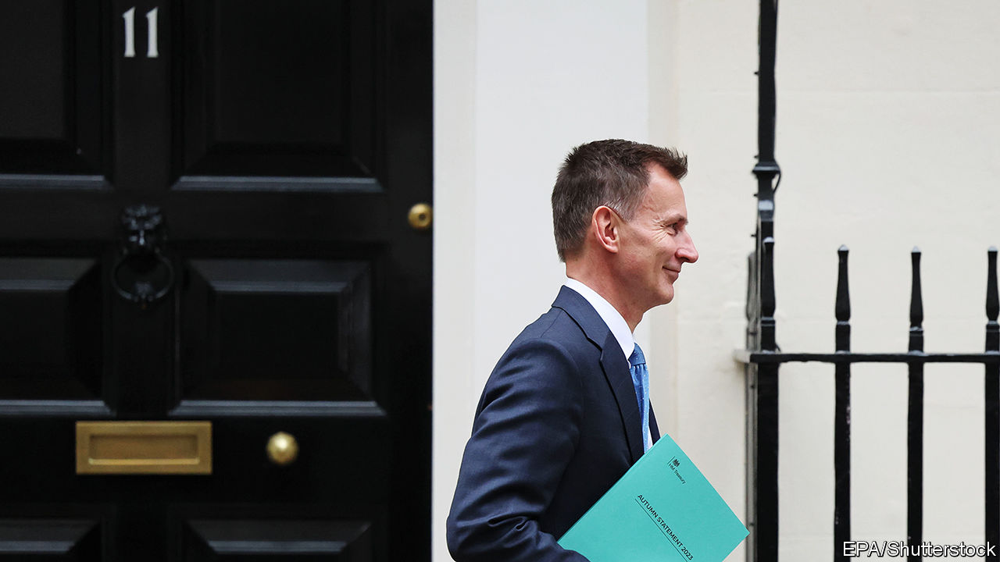

###### One cheer for Jeremy Hunt

# Britain’s autumn statement got business taxes right 

##### It also cynically handed out an illusory windfall 

 

> Nov 22nd 2023 

You DO NOT have to be an economic historian to know that politicians like to cut taxes before elections. On November 22nd Jeremy Hunt, Britain’s chancellor of the exchequer, announced tax cuts worth £18bn (0.7% of GDP), 14 months at most before Britain goes to the polls. Mr Hunt said he was able to loosen the purse strings because of his sound economic stewardship. One of his measures was indeed a striking example of sensible policymaking. Unfortunately, the rest of the budget  for the next government, which surveys suggest is very likely to be formed by the Labour Party. 

Start with what he got right. Mr Hunt said that he would make permanent “full expensing”—the right of businesses to deduct upfront their capital expenditures from their taxable profits. This nerdy-sounding change was probably the single biggest pro-growth tax reform he could have unveiled that was also politically feasible. Expensing undoes much of the investment-crushing effect of corporate taxes. The Office for Budget Responsibility (OBR), Britain’s fiscal watchdog, estimates that the policy will boost annual business investment by almost 1% of GDP—a welcome fillip in an economy that has been starved of capital expenditure. Estonia and Latvia have permanent full expensing, but among big rich economies Britain will stand out for the friendliness of its tax code.

Where did the money come from? Mr Hunt said that a fall in inflation had made possible both permanent expensing and his other headline-grabbing tax cut: a two-percentage-point reduction in the rate of national insurance, a payroll tax. In fact, close to the opposite is true. Most of the “headroom” was created by . Higher inflation fills the Treasury’s coffers because the government has frozen tax allowances in cash terms. Yet the chancellor is not increasing public investment to make up for higher inflation. In effect, he has pencilled in further real-terms cuts in public spending. 

After analysing various government-spending pledges, the OBR calculates that some budgets would have to fall in real terms by an average of 4.1% per year after 2026 to make the government’s numbers add up. This is not credible. Britain has already been through a decade of austerity. The National Health Service in England has a waiting list 6.5m people long. The prison system is full up. Many school buildings are unsafe. In the coming years Britain must cope with the pressures of an ageing society, the green-energy transition and rising defence spending. Mr Hunt promises better public-sector productivity. That is a worthwhile goal but it is hard to pull off and unequal to the country’s needs. A fiscally responsible government would admit taxes must rise.

Instead Mr Hunt crowed about public debt falling—by which he means complying with the risibly lax constraint that the debt-to-GDP ratio must be forecast to fall between four and five years hence. If his successors do not reverse his tax cuts, then meeting this goal will squeeze cash-starved public services even more tightly. 

More likely is that debt continues to drift upwards, even with low unemployment. It is a disappointing legacy after 13 years of Tory or Tory-led government, which has also been almost comically self-contradictory on tax. In the 2010s the Conservatives raised personal tax allowances, a change now being inflated away. They also cut investment carve-outs to fund a lower headline rate of corporate tax, the opposite of more recent changes. Only two years ago they announced plans, in effect, to raise national insurance, which Mr Hunt is now cutting. It is hard to make sense of what the Conservatives are trying to do other than win elections—and make life difficult for Labour if they lose. ■

