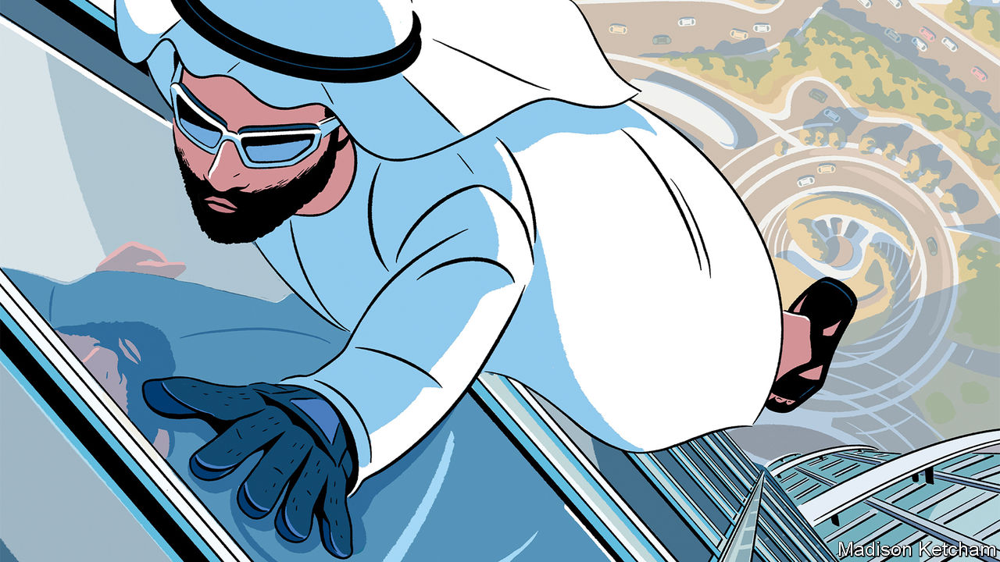

###### Climbing high

# How to thrive in a fractured world 

##### Lessons from the ambitious ascent of the United Arab Emirates 

 

> Nov 23rd 2023 

Over the next few weeks Dubai will be abuzz. Tens of thousands of diplomats, activists and business folk are due to fly in to join the un’s annual climate pow-wow. The United Arab Emirates’ skill at wrangling countries and industries with vastly disparate interests, in the hope of making further progress on tackling climate change, will be on full display. But that is not the only reason to pay attention to the uae. It also shows how to thrive in the multipolar age.

The country is home to just over 0.1% of the world’s people and produces only 0.5% of its gdp, but it contains nearly 10% of the world’s oil reserves, and this wealth helps it punch above its weight. Like many emerging countries today, it straddles political and economic divisions. It is a closed autocracy, yet one of the world’s most open economies. It is a close ally of America, but its biggest trading partner is China. Although its gdp per person exceeds that of Britain or France, it is often seen as part of the global south and is a hub for Indian and African businesses, making it the Singapore of the Middle East. And in 2020 it was one of the first  to normalise relations with Israel. 

As a consequence, the  even as war rages in the Middle East and superpower rivalry unravels the world . The non-oil economy is growing at nearly 6% a year, a rate that India is enjoying but that the West—and these days even China—can only dream of. Talent and wealth are flocking to the country, as Chinese traders, Indian tycoons, Russian billionaires and Western bankers alike seek stability and success. Last year it attracted more foreign investment for greenfield projects than anywhere except America, Britain and India.

Like Singapore, the uae is a haven for its region. But whereas Singapore’s ascent coincided with a golden age of globalisation, the uae is seizing opportunity in a time of chaos and disorder. It wants not just to thrive economically but, more dangerously, to exert its political influence abroad. Both its successes and its failures hold lessons for middling powers as they navigate a fragmenting world.

One lesson is to play to your economic strengths. The uae has had its share of economic embarrassments, notably Dubai’s debt-fuelled construction binge, which ended in crisis and a bail-out in 2009. An obsession with the blockchain has faded. But in other areas it has made the most of its advantages, to impressive effect. The operators of its vast ports now run sites from London and Luanda to Mumbai and Manila. DP World, one such firm, handles roughly a tenth of all global shipping-container traffic. Masdar, one of the world’s biggest clean-energy developers, has ploughed money into everything from wind farms in Texas to solar plants in Uzbekistan. All told, the uae is now one of the biggest investors in Africa, helping build vital infrastructure across the capital-starved continent.

Meanwhile, access to lots of capital, computing power and data has helped artificial-intelligence researchers in Abu Dhabi train up Falcon, an open-source large language model that in some ways beats Meta’s. Some experts reckon that the uae may well be the third-most-important country for AI, after America and China. And throughout, its rulers have doubled down on the utility of the country’s position as an entrepot at the crossroads of Africa, Asia and Europe, by building institutions for good economic governance and technocracy. 

Another lesson is to welcome foreign talent. With just 1m locals, the UAE needs lots of both highly skilled and low-skilled migrants. And the world is full of go-ahead people hoping to make their fortunes. Whereas Saudi Arabia is resorting to heavy-handed measures to attract expertise, such as requiring regional offices to be set up in the country, the uae focuses on making itself a more attractive place to live and do business. A golden-visa scheme set up in 2019 offers professionals long-term residency; a select few can even apply for citizenship, once unheard of in the Gulf. In time Saudi Arabia, which is just starting to wean its economy off oil, may become a serious rival. Although the UAE severely restricts political freedoms and has a bad record on human rights, the threat of competition is spurring it to become more socially and economically liberal. 

Nor has the uae forgotten the gains from trade. Other countries have favoured industrial policy and protectionism, but it has been doing deals. India, wary of free trade, signed its first such deal in a decade with the uae; commerce between the two has since leapt by 16% in nominal terms. An agreement with Israel has given the uae precious tech know-how and Israeli firms access to deep pools of capital and the bigger Gulf market. Western airlines stopped flying to Tel Aviv after the war in Gaza began. Etihad and Flydubai, two Emirati carriers, still make regular flights there. 

Yet some opportunities are turning out to be pitfalls. As America’s influence wanes, enterprising powers everywhere will be tempted to amass influence abroad for themselves. Muhammad bin Zayed, the uae‘s ruler, has duly seized the initiative. The country’s pragmatism has sometimes served it well. In much of Africa it is a welcome business partner, without the imperial baggage of the West; at the UN climate meeting, it hopes to be a broker between rich and poor. But the UAE has also made terrible mistakes. 

Mirage in the desert

Fearing the influence of political Islam in its backyard, and wanting to protect trade flows, the uae is arming the Rapid Support Forces, a Sudanese militia that is committing genocide in Darfur. In the past that approach has failed miserably. In Libya the uae backed a warlord who tried to march on Tripoli in 2019 and lost. In Yemen it joined Saudi Arabia in a long war against the Houthi rebels, before partially withdrawing in 2019. 

Over the years the uae’s rulers have built mechanisms to ensure a stable business environment at home; they know, too, that domestic failures would quickly incur the ire of their citizens. But the regime faces no such constraints abroad, allowing it to indulge its whims and protect its interests, no matter the consequences elsewhere. In a fragmented world, many countries will be looking for new ways to play on the global stage. The uae shows the promise that lies ahead—and the perils, too. ■


