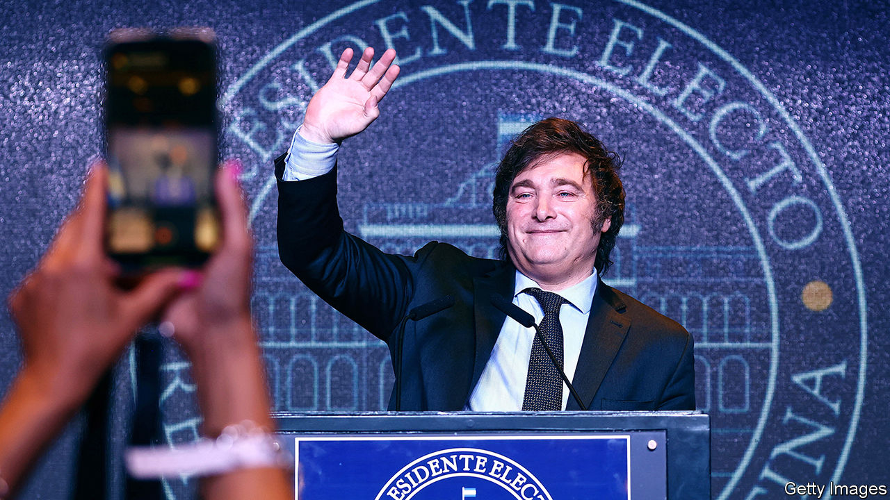

###### An election in Buenos Aires

# In Argentina Javier Milei faces an economic crisis 

##### The radical libertarian is taking over a country on the brink 

 

> Nov 20th 2023 

To an American audience,  may seem uncannily familiar. A political outsider with bouffant hair and a history of outrageous remarks promises to make the country “great again”, and is written off by the liberal elite before winning the presidential poll. Yet the election on November 19th of Javier Milei, a self-described “anarcho-capitalist”, is not a repeat in the  to power. Mr Milei faces a far trickier economic situation than any American president since the Depression. Many voted for him not because of his inflammatory rhetoric—but in spite of it, in an act of desperation.

. Annual inflation is over 140% and is expected to reach 200% by early next year. That is up from 54% when Alberto Fernández, the outgoing Peronist president, took office in 2019. Four in ten Argentines live in poverty. Public debt is 90% of gdp; and the fiscal deficit, when measured properly to include central-bank money-printing, is about 10% of gdp. Its dollar bonds trade at less than 33% of their par value. External sources of cash are tapped out: the country already owes the imf $44bn and its foreign-exchange reserves are about $10bn in the red on a net basis (after deducting central-bank swap lines and other liabilities). 


To face Argentina’s demons, Mr Milei will have to take some emergency economic measures. Rapid belt-tightening is needed to cut the fiscal deficit: unaffordable pensions and fuel subsidies are an obvious target. He must liberalise the exchange-rate system even though this will lead to a devaluation and spur inflation. This is inevitable: Argentina no longer has the dollars it needs to defend the official rates. And the new president needs to restructure Argentina’s debts to lower them to sustainable levels. This will probably require the imf to admit to losses, or to charge artificially low interest rates on the whopping loans it extended to Argentina, which represent one of the biggest mistakes in the fund’s history.

What about dollarisation, Mr Milei’s most eye-catching policy? When a country’s financial credibility is in shreds, adopting the greenback in place of its domestic currency may make sense. Eight countries other than the United States use the dollar as legal tender, including Ecuador and Panama. Nonetheless, to do this in an orderly manner requires elaborate and time-consuming preparation and a large initial float of dollars with which to back the banking system. On both counts Argentina fails. 

Indeed, the emergency economic measures are themselves a giant leap. Mr Milei may have won with a large mandate, but he will hold a fragile position in government: his coalition will have only 38 of 257 seats in the lower house of Congress and seven of 72 seats in the Senate. He will therefore have to build alliances, particularly with Patricia Bullrich, a moderate right-winger.

To forge these alliances Mr Milei needs to become more statesmanlike, after a lifetime of eccentricity. Until now he has surrounded himself with divisive figures and cranks. His running-mate, Victoria Villarruel, has downplayed the atrocities of Argentina’s military junta. To signal change, he should appoint Ms Bullrich and Mauricio Macri, a former president, to his cabinet. 

Mr Milei’s time in power will not be easy. Mr Macri was the first non-Peronist to complete a term in office since the restoration of democracy in 1983. Mr Milei needs to act quickly, but also to build a national consensus about economic reform so that his policies do not result in Argentines taking to the streets. So far, his lack of experience and volatile character do not suggest that he can manage this. Yet if Argentina has become an economic casino, Mr Milei is the last roll of the dice. ■

