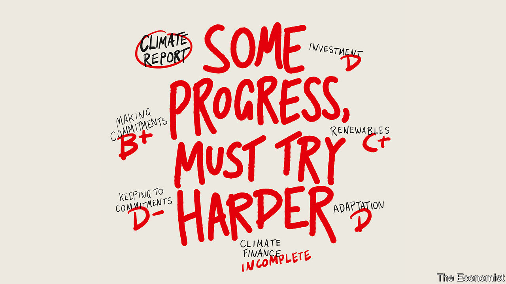

###### Must try harder

# Progress on climate change has not been fast enough, but it has been real 

##### And the world needs to learn from it 

 

> Nov 23rd 2023 

The agreement at the conference of the parties (COP) to the UN Framework Convention on Climate Change, which took place in Paris in 2015, was somewhat impotent. As many pointed out at the time, it could not tell countries what to do; it could not end the fossil-fuel age by fiat; it could not draw back the seas, placate the winds or dim the noonday sun. But it could at least lay down the law for subsequent COPs, decreeing that this year’s should see the first “global stocktake” of what had and had not been done to bring the agreement’s overarching goals closer. 

As the world gathers in Dubai for the 28th COP, the assessment of the first part of that stocktake is in some ways surprisingly positive. At the time of the Paris COP, the global warming expected by 2100 if policies did not change was more than 3°C above pre-industrial levels. If policies in place today are followed, central estimates put it around 2.5-2.9°C, though the uncertainties are large. That is still so high as to be disastrous for billions. But it is also a marked improvement.

A lot of this progress has come from cheaper and more widespread renewable energy. In 2015 global installed solar capacity was 230 gigawatts; last year it was 1,050GW. Better policies have spread, too. In 2014 just 12% of energy-related carbon-dioxide emissions came under carbon-pricing schemes and the average price per tonne was $7; today 23% of greenhouse-gas emissions do, and the price is around $32.

Those and other steps forward explain why the International Energy Agency, an intergovernmental think-tank which, at the time of Paris, saw carbon-dioxide emissions continuing to rise into the 2040s, today says they are likely to peak within a few years. Peaking is not enough; emissions must then fall very quickly to bring the projected warming down to just 2°C. But the almost ceaseless increase in emissions has been a fact of economic growth for two centuries. To reverse that could be seen as the end of the beginning of the fight for a stable climate. 

To ascribe all this progress to Paris would be daft. But the process it put in motion set new expectations; it made climate something that countries had to talk about. And by spelling out that a stable climate needs to balance residual sources of carbon dioxide with “sinks” which remove it from the atmosphere, it brought the idea of net-zero goals into the mainstream. One country had such a goal in 2015. Now 101 do. 

In a world where the seasons themselves are increasingly out of whack—witness last week’s extraordinary springtime heatwave in Brazil—the COPs provide a predictable annual space in the international calendar for side-agreements and new expressions of intent. A recent statement by Joe Biden, America’s president, and his Chinese counterpart, Xi Jinping, helped build momentum for a cop-adjacent deal on methane emissions. They also pledged their countries to do their bit in the tripling of renewable generating capacity by 2030, another goal for which the United Arab Emirates wants its COP remembered.

None of this means that COPs have saved the world. Paris provided a context for the boom in renewable energy, but it did not provide the investment that made it happen. The doubling of investment levels that BloombergNEF, a data outfit, sees as necessary for the proposed tripling in capacity will have to come from the private sector. To draw it forth is not a matter of COPpery. To attract funds, countries will need to redesign energy markets, hurry through permits, hugely improve grids and remove policies that still favour fossil fuels.

And none of this has stopped the climate from worsening. Nor could it. The main driver of global warming is the cumulative amount of carbon dioxide in the atmosphere. For as long as net emissions continue, temperatures will rise. Since Paris, that ineluctable warming has reached a level where it can no longer be treated as a problem of the future. This year climate change has felt particularly acute: the hottest August on record followed the hottest July, the hottest September the hottest August, the hottest October the hottest September.

That pace will not continue for ever. But the only way to stop the warming before reaching net zero is to cut the amount of sunshine the planet absorbs, perhaps by inserting particles into the stratosphere or whitening clouds over the ocean. The idea of “” alarms many climate scientists, activists and policymakers; but a number rightly see it as worth researching. That research needs an international debate about the proper restrictions on it and the possibilities it could lead to. The incrementalist, institution-bound COPs are not the place for those discussions. But before the next stocktake, set for 2028, some forum must be found. 

Mechanisms for removing carbon dioxide fall more comfortably within COP’s remit. Like solar geoengineering, this process also concerns many. Hearing oil companies, in particular, talking about  as a justification for keeping production up strikes them as likely to lead to a world where emissions continue but only a small amount of removal ever takes place. Given the industry’s history, this is not unreasonable.

To allay such fears, countries will have to be explicit about their removal plans in the next round of “Nationally Determined Contributions”—the proposals for further action that they have to present to each other by 2025. In order to guard against fudging, they should also be required to keep their targets for removals and emission reduction separate.

Not just COPy and paste

This may seem a low priority compared with emissions and adaptation: removals begin to matter materially only when emissions fall far below their peak. But at that point the scale of the removals needed will be thousands of times greater than can be achieved today. Best get cracking. Being explicit about the fact that, eventually, polluters will be paying for the removal of their waste will both spur investment in technologies and concentrate the minds of emitters. Again, a UN process cannot force the changes the world requires. But when it frames debates wisely and sets appropriate rules, it can help galvanise progress. That is just as well, seeing how much more is needed. ■


