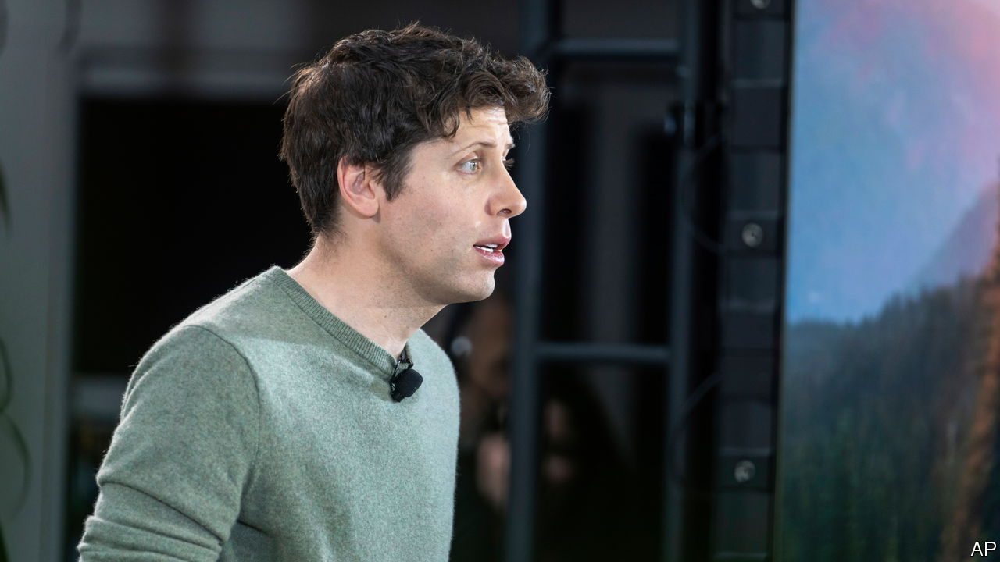

###### OpenChaos

# The fallout from the weirdness at OpenAI 

##### Sam Altman is set to return, but the episode holds some disturbing lessons 

 

> Nov 22nd 2023 

Five very weird days passed before it seemed that Sam Altman would stay at OpenAI after all. On November 17th the board of the maker of Chatgpt suddenly booted out its chief executive. On the 19th it looked as if Mr Altman would move to Microsoft, OpenAI’s largest investor. But employees at the startup rose up in revolt, with almost all of them, including one of the board’s original conspirators, threatening to leave were Mr Altman not reinstated. Between frantic meetings, the top brass tweeted heart emojis and fond messages to each other. By the 21st, things had come  .

All this seems stranger still considering that these shenanigans were taking place at the world’s hottest startup, which had been expected to reach a valuation of nearly $90bn. In part, the weirdness is a sign of just how quickly the relatively young technology of generative artificial intelligence has been catapulted to glory. But it also holds deeper and more disturbing lessons. 

One is the sheer power of ai talent. As the employees threatened to quit, the message “OpenAI is nothing without its people” rang out on social media. Ever since ChatGPT’s launch a year ago, demand for ai brains has been white-hot. As chaos reigned, both Microsoft and other tech firms stood ready to welcome disgruntled staff with open arms. That gave both Mr Altman and Openai’s programmers huge bargaining power and fatally undermined the board’s attempts to exert control. 

The episode also shines a light on the unusual structure of Openai. It was founded in 2015 as a non-profit research lab aimed at safely developing artificial general intelligence (agi), which can equal or surpass humans in all types of thinking. But it soon became clear that this would require vast amounts of expensive processing power, if it were possible at all. To pay for it, a profit-making subsidiary was set up to sell AI tools, such as ChatGPT. And Microsoft invested $13bn in return for a 49% stake. 

On paper, the power remained with the non-profit’s board, whose aim is to ensure that agi benefits everyone, and whose responsibility is accordingly not to shareholders but to “humanity”. That illusion was shattered as the employees demanded Mr Altman’s return, and as the prospect loomed of a rival firm housed within profit-maximising Microsoft. 

The chief lesson is the folly of solely relying on corporate structures to police technology. As the potential of generative ai became clear, the contradictions in OpenAI’s structure were exposed. A single outfit cannot strike the best balance between advancing AI, attracting talent and investment, assessing AI’s threats and keeping humanity safe. Conflicts of interest in Silicon Valley are hardly rare. Even if the people at OpenAI were as brilliant as they think they are, the task would be beyond them.

Much about the board’s motives in sacking Mr Altman remains unknown. Even if the directors did genuinely have humanity’s interest at heart, they risked seeing investors and employees flock to another firm that would charge ahead with the technology regardless. Nor is it entirely clear what qualifies a handful of private citizens to represent the interests of Earth’s remaining 7.9bn inhabitants. As part of Mr Altman’s return, a new board is being appointed. It will include Larry Summers, a prominent economist; an executive from Microsoft will probably join him, as may Mr Altman. 

Board senseless 

Yet personnel changes are not enough: the firm’s structure should also be overhauled. Fortunately, in America there is a body that has a much more convincing claim to represent the common interest: the government. By drafting regulation, it can set the boundaries within which companies like Openai must operate. And, as a flurry of activity in the past month shows, politicians are watching ai. That is just as well. The technology is too important to be left to the whims of corporate plotters. ■


