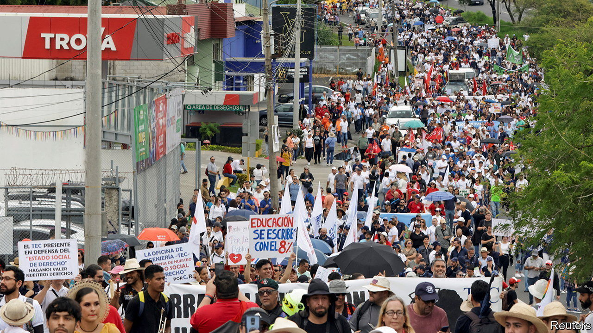

###### On secondary legislation, tariffs, interest rates, realtors, Costa Rica, the Sagrada Família, James Bond, flying lawn chairs

# Letters to the editor 

##### A selection of correspondence 

 

> Nov 23rd 2023 


Scrutinising the executive 

I was the chairman of the Secondary Legislation Scrutiny Committee in the House of Lords that produced the “government by diktat” report referred to in your article, “” (November 11th). As you pointed out, the temptation to use secondary legislation has proved irresistible to governments of all colours. The fact that such legislation can only be approved or rejected and cannot be amended has meant that both houses of Parliament, and particularly the Lords, have been reluctant to press the “reject” button. Indeed, on the last occasion the Lords did so, in 2015 over tax-credit cuts, a full-scale constitutional crisis resulted. 

How to redress this? One way would be to create some form of triaging process that would enable scrutiny by both houses to be focused on those regulations where it was really needed. The present procedure is more than adequate for probably more than 90% of the 700 or so pieces of secondary legislation brought forward in a normal parliamentary session. This would refute the likely argument by the government that any change to the scrutiny arrangements would gum up the whole machinery of government. 

A new procedure requiring proper debate and containing a power to amend could then be introduced for the remaining regulations. This would give some teeth back to the legislature. A number of us in the Lords have made practical suggestions as to how this might work. But it will only happen if backbench MPs are prepared to pick up the ball and run with it. Any other approach will result in the government of the day alleging that this is the unelected Lords telling the elected Commons how to do its job better. That would be game over. 

Robin Hodgson

Chairman

Secondary Legislation Scrutiny Committee, 2019-23

House of Lords


The decline in parliamentary scrutiny is not just an unfortunate accident. For good or ill, with a largely unwritten constitution, the British Parliament is dominated by precedent. The legislative short cuts so enthusiastically employed by the present government to avoid scrutiny for Brexit and covid will be quoted as legitimate by future administrations with even less justification. As you indicated, this forms part of a pattern, a consistent and remorseless shift of power to the executive. In our recently published analysis “Can Parliament Take Back Control?”, we reprint Lord Hailsham’s BBC lecture in 1976 on “Elective Dictatorship”. Is this where we are heading?

Paul Tyler

Former Liberal Democrat spokesperson for political and constitutional reform


One possible, but tendentious, proposal to resolve this terrible state of affairs would be a reform of the House of Commons, reducing the current number of constituencies and, therefore MPs, from 650 to around 300. Counterintuitive as this might sound, it would force a change to the whole content of an MP’s working day. He or she would need to focus on their main task of passing quality legislation and less time on the local affairs of their much bigger constituencies. To achieve the former they would need a much larger expert staff working with them to review bills properly. This would be made affordable by the huge reduction in the number of MPs. 

The vacuum in constituency work could be filled by devolving much more power to existing locally elected councillors, who would, in any case, be more up to scratch with local affairs and take informed decisions. 

Without a radical reform of our constitution in some way similar to this, there is little hope of any tangible improvement in the future.

Alan Cross


 


Limited trade protections

You agree that tariffs can help some manufacturers gain domestic market share (“”, November 4th). But you stress that this benefit comes at the cost of sheltered manufacturers getting away with being less efficient than their global rivals, and imposing costs on other domestic industries that use their more expensive products.

Protection can be arranged so as to give a higher benefit-cost ratio than you imply. In South Korea and Taiwan, new producers in strategic industries were given protection on their domestic market sales, and accrued higher profits. They were required to use the higher profits to subsidise entry into export markets. They were given a time limit to reach international levels of price and quality, after which the protection would be removed. Whether this could be implemented in the United States is questionable; but it should be considered in many industrialising countries. 

Robert Wade

Professor of global political economy

London School of Economics

 


A useful monetary tool

The claim that the world economy is defying gravity and will surely hit the rocks as higher interest rates bite downplays the considerable benefits that come from those higher rates (“”, November 4th). Most obviously, higher rates are a signal that the spectre of deflation that haunted the world economy for over a decade after the financial crisis of 2007-09, leading to ultra-low rates, has been banished. Zero or even negative interest rates caused serious distortions in the financial system and engendered a sense of malaise and economic permacrisis. 

The disappearance of low rates is a signal to consumers, at least, that things are “back to normal”. And, as you note, central banks will eventually cut rates again. This is the biggest benefit of all. Central banks have regained the ability to boost the economy by cutting interest rates, and quantitative easing can be consigned to history. 

Bill Smyth


 


The reality of realtors

Thank you for telling Americans how realtors rip them off (“”, November 11th). My wife and I have been “rippees” numerous times during our 80-plus year lifetimes. It takes no more time and effort to sell a $500,000 home than a $1m one, but the land sharks scoop up a commission that is doubled. Please follow up with “How to avoid the great realtor racket”. It would be very welcome.

Earl McMillin


 


Rising to the challenge

Costa Rica’s fiscal reform in 2018 shifted the debt-to-GDP ratio, aiming to balance the national budget for a future focused on human security through education and health care. This goal requires time and statesmanship, not populism (“”, November 4th). Costa Rica upholds remarkable achievements, including abolishing the armed forces in 1949, universal health care, launching the first-ever decarbonisation plan after the Paris agreement and becoming the first Central American country to join the OECD in 2021. In the realm of democracy and freedom, hope is still possible.

Carlos Alvarado-Quesada

President of Costa Rica, 2018-22


Unfinished works

Even Antoni Gaudí i Cornet’s magnum opus, the Sagrada Família, is only “sort of” by Gaudí. Its current and presumed end state certainly can’t be “exactly according to his vision” (, November 4th), not least because his incomplete plans and models were largely destroyed during the Spanish civil war in 1936. In particular, the angular Passion Façade, created for the basilica by Josep Maria Subirachs decades later, makes one wonder, “What would Gaudí think?” Like many debates, this one would be better settled over a couple of Barcelona vermouths or .

David Gibbons


The spy who loved TE

A letter from Alok Mohan () mentioned John F. Kennedy’s affinity for James Bond and . A less salubrious literary connection can be found in “An Impeccable Spy” by Owen Matthews, his biography of Richard Sorge, a wartime spy for the Soviets. The book mentions that Sorge regularly bought copies of , which, curiously, were available in the notorious Japanese prison where he was incarcerated in the 1940s. 

A. Chandrsekhar


 


Is it a bird? Is it a plane…? 

Although David Kirke is justly famous as the inventor of bungee jumping, I must take issue with the description of him as the pioneer of cluster ballooning in 1986 (, November 11th). Several people before Kirke accomplished this feat, most notably “Lawnchair Larry” Walters in 1982. With 42 weather balloons attached to his lawn chair, Walters rose to a height of 16,000 feet and was spotted by two commercial airliners. He drifted across part of Los Angeles before bursting several balloons with a pellet gun to slowly return to earth.

Keith Van Sickle


