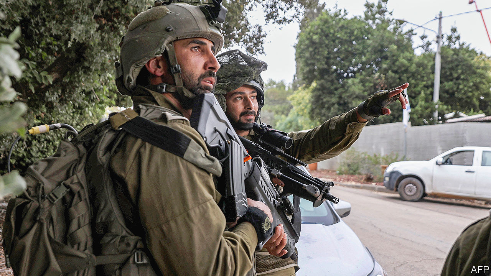

###### Israel’s non-Jewish minorities

# How the Gaza war affects Israel’s minorities in different ways 

##### For Muslim Arabs it is especially traumatic and conflicting 

 

> Nov 23rd 2023 

About a quarter of the population of the world’s only Jewish state are not Jewish. The different experiences of Israel’s minorities during the war in Gaza highlight the complexities of their position. 

It was impossible, on November 19th, to drive through the small hillside town of Peki’in in Galilee. Blue-and-white Israeli flags and the multicoloured banners of the Druze flew side-by-side on lamp-posts on the winding street leading to the main square and its statue of a mustachioed Druze warrior. Thousands had come to pay their last respects to Major Jamal Abbas, a 23-year-old paratrooper in the Israel Defence Forces (IDF) who was killed in action. In the heartland of Israel’s Druze community, which numbers 150,000, half a dozen military funerals have been held since October 7th. The IDF’s highest-ranking officer killed in the ground campaign inside Gaza was a Druze. Over 80% of Israel’s Druze men enlist, many in combat units. 


Other non-Jewish Israelis have been on the front lines too. Hamas is reported to have killed 21 Bedouin Arabs on October 7th, many of them at their places of work on Jewish farms near the border. Six Bedouin are among the 240-odd hostages taken by Hamas into Gaza. In the days after the attack, an alliance of Jewish and Bedouin NGOs jointly set up a hub in Rahat, a mainly Bedouin Israeli city east of Gaza, where volunteers from different communities have been making food packages for families hit by the war. The predicament of the Bedouin hostages held by fellow Muslims in Gaza is delicate. Many Bedouin have relatives there, under Israeli bombardment. Some in Rahat are suspected of sheltering Hamas attackers on the run.

Three-quarters of Israel’s 2m Arabs are Muslim Palestinians, and for them the war is especially traumatic and conflicting. Many condemn Hamas but are horrified by the violence in Gaza. “There is widespread revulsion among Arab and Muslim citizens over what Hamas did on October 7th,” says Wurud Jayusi, the head of the Arab Academic Institute at Beit Berl College, north of Tel Aviv. “The murder of civilians, of children, the barbarity of it, is something we can never accept. But at the same time we watch the Arab TV channels showing the terrible destruction in Gaza where many of us have family, something our Jewish friends are less concerned about.” 

A survey by the Israel Democracy Institute, a think-tank in Jerusalem, reported that the proportion of Arab-Israelis saying that they identify with the state was at its highest ever in the first weeks of the war. Yet as fighting continues, relations may come under strain. In the last outbreak of fighting in Gaza, in 2021, riots erupted in many of Israel’s mixed Jewish-Arab towns. Disturbances have not so far occurred during this one, but that may be because Arab-Israelis are afraid of the current right-wing government. Dr Jayusi says she is “cautiously optimistic” about the prospects for coexistence, but fears a chauvinistic trend among Jewish Israelis in the wake of the Hamas attack and warns against heavy-handed policing of Arab-Israeli dissenters. The Arab Centre for Alternative Planning, an advocacy group based in Eilaboun, a mainly Arab Christian village in Galilee, has so far recorded more than 200 arrests of Israeli Arabs, mainly for alleged “incitement” on social media. 

The domestic agenda of Israel’s right-wing politicians is also unhelpful. Two laws, passed by previous governments led by Binyamin Netanyahu, the present prime minister, have challenged non-Jews’ official status as citizens. One was a law to stiffen sentences on people who build homes without a permit, a sore point for Israel’s non-Jews, who are often discriminated against in land-allocation and planning permits, among other issues. The other—the Nation State Law—deemed an affront by minorities, states that “the right to exercise national self-determination in the State of Israel is unique to the Jewish People.” At the end of the funeral for Major Abbas, the fallen Druze officer, his grandfather, also a colonel (retired), called for those two laws to be abolished. ■

