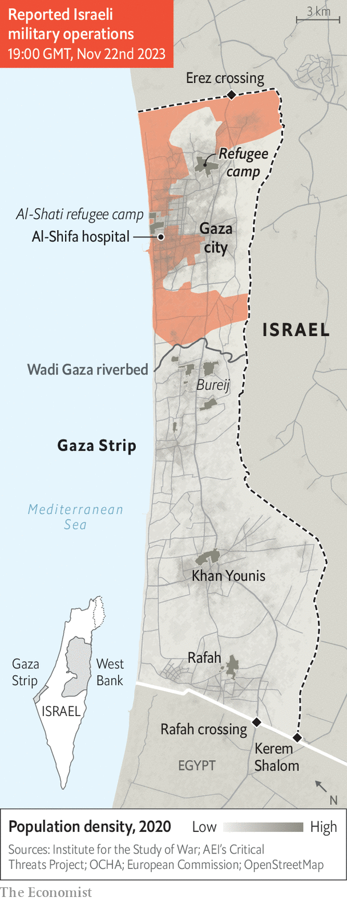

###### A break in the bloodshed

# Israel strikes a hostage deal, but says the Gaza war isn’t over 

##### Hamas is desperate to split Israel and turn a pause into a ceasefire 

 

> Nov 23rd 2023 

SINCE it began seven weeks ago, Israel’s war in Gaza has had two main objectives: to remove Hamas from power in the enclave, and to free the hostages Hamas abducted during its murderous rampage on October 7th. At times those goals have been in conflict. Air strikes meant to damage Hamas’s network of underground tunnels, for instance, risked killing the hostages held in those same tunnels. 

The war now faces perhaps its biggest contradiction yet. On November 22nd, after weeks of indirect talks, the Israeli cabinet approved a deal that would see Hamas free 50 women and children out of the roughly 240 hostages in Gaza. But Israel will temporarily have to halt its war and will face strong pressure not to resume it.


For the 2.2m Palestinians trapped in Gaza, meanwhile, the truce will bring a different dissonance. A few days of calm, and a promised influx of humanitarian aid, will be a small respite. But few will be able to savour it, crammed as they are into dirty, overcrowded shelters—and fearing that, when the truce ends, another round of fighting is likely to follow.

The prisoner swap and four-day truce were set to begin on November 24th, after went to press. Hostages would be released in phases: about a dozen each night, sent from Gaza to Egypt and then to Israel. For each hostage freed, Israel was to release three Palestinian prisoners (women and teenagers) from its jails.

Israel also agreed to allow 300 lorries carrying humanitarian aid to enter Gaza each day during that period—a significant increase over the previous month, when the daily average was just 45 lorries. President Joe Biden welcomed the pact, but cautioned that “it is important that all aspects of this deal be fully implemented”.

Polls have shown Israelis are divided over such a scheme. The Israel Democracy Institute, a think-tank, found that 45% of Israeli Jews opposed a prisoner swap, while 40% supported it. Itamar Ben-Gvir, the far-right national-security minister, called it a “very, very big mistake”. The limited number of hostages Hamas agreed to release and its demand for a temporary truce are meant to exploit such divisions in Israel.

Negotiations began almost immediately after the massacre on October 7th. Israel and its allies applied pressure on Qatar, which hosts some of the Hamas leaders. They warned Qatar that ties with the West could be harmed if it did not produce a deal. That led to the freeing of four female hostages, proving that Qatar could serve as a go-between with Hamas, which received nothing in return. 

Four days after the release of the second pair of women, however, Israel sent troops into Gaza. That reshaped the negotiations. Hamas indicated that it could release a larger number of hostages—but only in return for a pause in fighting. At that point it became a question of numbers and the length of a truce, with Israel unwilling to suspend the war for any fewer than 100 captives. Hamas officials in Qatar and Lebanon signalled their initial agreement. But it soon became clear that Yahya Sinwar, the Hamas leader in Gaza, would not accept that number. As pressure mounted, Mr Sinwar did not answer his phone for days.

The Israeli war cabinet was also split. Some members wanted to continue negotiating over a smaller number. Others thought Israel should press ahead with its ground offensive and wait for Hamas to soften its position. Binyamin Netanyahu, the prime minister, failed to come down on either side of the debate. “Netanyahu’s dithering meant Israel wasn’t making any decisions, either on the next stage of the ground campaign, or on the hostages,” says an Israeli security official. It took goading from both the families of hostages and from the Biden administration to convince Israel to accept a scaled-down deal.

 


Under the terms of the agreement, Hamas also has the option of offering to release more hostages at the end of the four-day period. Each ten additional captives it sets free will buy another 24 hours of truce. Israel fears this will give Mr Sinwar some control over events. The Israel Defence Forces (IDF) has sent four divisions, more than 10,000 soldiers, into northern Gaza to destroy Hamas’s military infrastructure. They have not finished doing so. More crucially, they have yet to start a serious campaign in southern Gaza, where Israel believes Hamas’s leaders—along with almost the entire population of Gaza—have fled.

The pause will give Hamas fighters, many of them holed up in tunnels, a chance to regroup and resupply. Israel will also face pressure to extend the truce, both from some Western allies and from the relatives of those hostages still in captivity. A few days of calm could give the world a more detailed picture of the humanitarian disaster in Gaza, which would add to the international outcry.

Still, both of Israel’s war objectives remain intact. “The war will continue until we achieve all of our goals,” Mr Netanyahu said before the cabinet vote. And although much of the world is united in calling for a permanent ceasefire, Mr Biden argues it would leave Hamas intact to menace Israel again. For Hamas, meanwhile, survival is victory: it need not defeat the IDF, merely endure until a ceasefire.

That would not feel like victory for most Gazans, who are furious with Hamas for inviting devastation upon them. Gaza’s health ministry stopped updating the death toll on November 10th, when it stood at 11,078. Officials said it is no longer possible to count the dead: many hospitals are not functioning, communications are often cut and bodies cannot be retrieved. The real toll is undoubtedly much higher.

The paltry flow of aid through Egypt has left many struggling to find food, medicine and clean water. Fuel deliveries are limited to the two tankers a day that Israel allows the UN to import. “Even if we get fuel, what would we do with it?” asks Umm Muhmmad, a resident of Gaza city now staying in Rafah. “Our homes are gone. Our cars are gone. What would we do with the fuel?”

An estimated 1.7m Gazans, 77% of the population, have been displaced. More than half are crammed into teeming shelters run by the UN, where 160 people share each toilet and 700 people must use each shower. Skin diseases and diarrhoea are rife. A brief pause in the fighting will not offer Gazans much respite from this miserable existence. “The truce is empty talk,” says Alaa Labad, who was displaced from northern Gaza to a UN school in Khan Younis in the centre. “Israel will not allow us to return to our homes during it.”

Many no longer have homes to return to: satellite imagery suggests that perhaps half of the buildings in the northern part of the enclave have been destroyed or badly damaged. Instead of going home, they may be displaced again. Before the pause in fighting the IDF warned some residents of Khan Younis to evacuate, suggesting that it planned to intensify air strikes—a likely prelude to a ground offensive.

On November 22nd, as the truce grew closer, there was also little sign of a lull in Rafah, the southernmost city in Gaza. A group of young men carried a body, shrouded in an old curtain, from the rubble of a house as rescue workers clambered through the debris of the ruined building. Witnesses said 20 people had been living there: many houses in Rafah and Khan Younis are packed with multiple families who have fled from the north.

A major Israeli offensive in the south would almost certainly have a horrific cost for Palestinians—one reason why so many want a ceasefire. That was certainly the message at the Manama Dialogue, an annual security pow-wow that began in Bahrain on November 18th. One after another, officials from Egypt, Jordan, Saudi Arabia and other Middle Eastern countries demanded an end to the war.

From Manama, Arab foreign ministers then set out on a tour of world capitals to push for a ceasefire, starting with stops in Beijing on November 20th and Moscow the next day. Some observers in Washington took this as a strong rebuke: America’s Arab allies visiting its geopolitical rivals to urge a shift in its Middle East policy. Seen another way, though, it was a sign of their impotence. Neither China nor Russia has any leverage to impose a ceasefire.

Many Arab leaders are keen to distance themselves from playing a major role in post-war Gaza. They have tried to swat down talk, for example, of an Arab peacekeeping force in the enclave. “Let me be very clear,” said Ayman Safadi, Jordan’s foreign minister, at the conference. “There will be no Arab troops going to Gaza. None. We’re not going to be seen as the enemy.”

Their reluctance is understandable. Arab leaders do not want to clean up Israel’s mess and help it police their fellow Arabs. But they also do not wish to see Israel reoccupy the enclave, and they admit, at least in private, that the Palestinian Authority (PA) is too weak to resume full control of Gaza. But if none of those options is realistic or desirable, it is not clear what is.

Officials in wealthy Gulf states also say they are loth to pick up the tab for rebuilding Gaza. It is too early to put a price tag on the damage, but it could easily run into the tens of billions of dollars: after a far less devastating war between Israel and Hamas in Gaza in 2014, donors pledged $5.4bn for reconstruction. Diplomats from Saudi Arabia and the United Arab Emirates say they should not be expected to write cheques unless Israel commits to a serious peace process with the Palestinians and until the PA, notorious for corruption, is reformed.

After nearly two months of war, there is little optimism. Some Israelis will be reunited with their loved ones; others will have their hopes dashed. Civilians in Gaza will probably have just a short break from bombardment. A ceasefire seems far off; a happier post-war order for Gaza, further still. After a few days the truce will end, and the fighting will resume. ■


