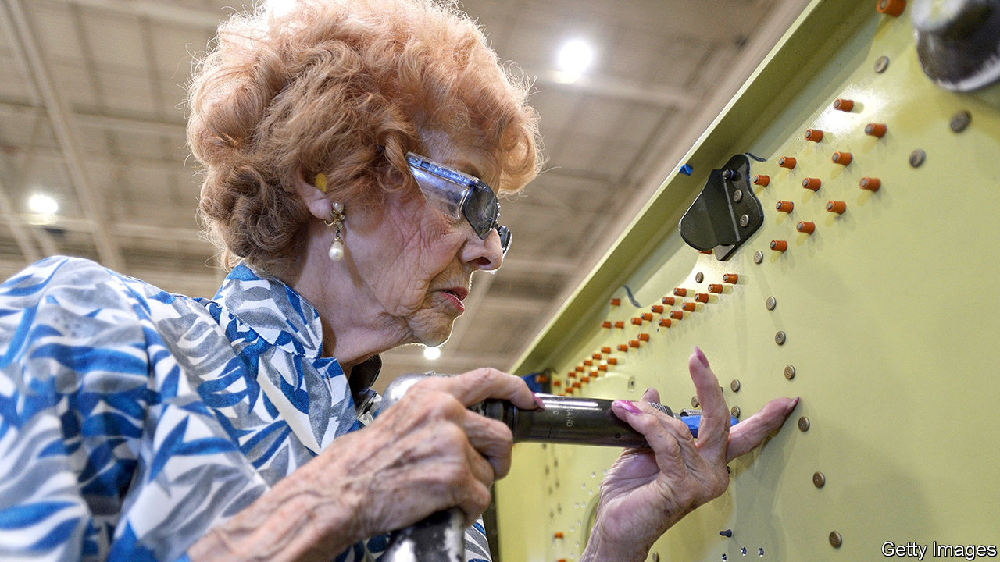

###### The fastest gun in the west

# Elinor Otto did not realise what giant strides she was making for women 

##### The longest-working “Rosie the Riveter” died on November 12th, aged 104 

 

> Nov 22nd 2023 

Busy, busy, busy. So Elinor Otto liked to be: always doing, accomplishing something. Starting every working day at 4am with a shower and a drive. Parking the car a long way from the plant to get a brisk morning walk. Coffee, and reading the newspaper, both at once. Then, at 6am, getting down to work on Boeing’s assembly line in Long Beach. 

She liked neatness, too. So every Thursday, when she felt her hair was mussed or her nails getting dull, she went to the beauty parlour. She taught her grandson proper manners, including correcting, in red ink, the spelling in the letters he wrote to her. And her working days were spent firing neat rows of rivets, , into the wing sections of C-17 cargo planes. 

That was in her 90s. By then she had spent almost 70 years as a riveter and would have gone on, if Boeing hadn’t closed the plant. She made a fine show on the factory floor: red hair, bright pink or purple nail polish. What’s that old bag doing here? she imagined some colleagues saying. Well, if they thought she couldn’t handle the two-foot rivet gun, or being on her feet all day, they were wrong. She might be slight, but she was strong. And she’d been using that gun since before most of them were born. 

It was in 1942, after Pearl Harbor, that she became a riveter, answering the government’s call for women to do the jobs, especially in aircraft and armaments, that the men had left to go to war. She and one of her two sisters both became riveters at Rohr Aircraft in San Diego, where they lived, while her other sister was a battleship welder in the Bay Area. (California was the hub of both ship- and aircraft-making.) The money was great: 65 cents an hour, about twice what she could get as a sad, immobile typist. It was a no-brainer to change. Besides, she was newly divorced with a baby and her mother to look after. The extra money paid for her son’s care while she eagerly went off to the production line. 

The one drawback was the hours, which were crushing. But she and her friends would find an incentive to jump up and get dressed by playing on the wind-up phonograph the new 78rpm record by the Four Vagabonds, a merry number with a plunky ukulele called “Rosie the Riveter”:

 All day long, whether rain or shine

 She’s a part of the assembly line

 She’s making history, working for victory,

 Rosie, brrrrrrr, the riveter 


The fictional Rosie had a boyfriend, Charlie, who was a marine. But not all the men were away. Those who remained were wary of the women at first. They didn’t like the fact they had to stop smoking now, and keep their shirts on. They didn’t believe women could do their jobs, either. Elinor, like the others, had no doubt she could meet the challenge. There was no time for formal training, so she had to listen to and carefully copy the men for a while. But even on her first day she astonished them by fiercely wielding a big mallet to drive a crooked piece of metal precisely into a casting. No one else could work it out. After that, she soon went faster than they did. And since she was pretty, with blue eyes and masses of dark hair, the men started to hang around her.

Everyone stops to admire the scene

Rosie at work on the P-19

She’s never twittery, nervous or jittery...

Rosie, hm-hm-hm-hm, the riveter 

Out of 6m women who took up men’s jobs in the war, 300,000 were aircraft riveters like Rosie and Elinor. She was possibly not the last of the Rosies, but certainly the longest-working. Everything about the job appealed: the camaraderie, the routine. Other “female jobs” were boring or even stupid. But once the war was over and the men returned, women were expected to go back to such work, or preferably stay at home. For a while she was a car-hop, running burgers out to drivers. She left when the boss ordered her to do it on roller skates. She didn’t make a fuss about losing out to the men; this was how things were. But riveting was proper work, and by 1951 she was back doing it at Ryan Aeronautical in San Diego. “I don’t act in movies,” she liked to say. “I build planes.” 

She was deeply proud of that. In wartime, working mostly on the noses and fuselages of B-24 bombers, she felt completely absorbed in this huge thing, “working for victory”. Every rivet she fired into place made each plane stronger. But afterwards, too, when she moved on to McDonnell Douglas and then to Boeing, every C-17 cargo plane she riveted (that is, every one of the 279 produced in the 49 years she was there) thrilled her with the thought that it was taking food somewhere, or going to help some other country. They could fly safely, thanks to her. 

Women could also make giant strides into the workforce, thanks to her. She and the other Rosies had paved the way, even if not immediately. It took her a while to realise this. In later years the name “Rosie the Riveter” was attached to a poster by J. Howard Miller called “We Can Do It!”, with a woman in blue overalls and a polka-dot bandana powerfully flexing her arm. It was produced in 1943 to motivate workers at Westinghouse. Elinor never saw it until the 1980s, when it was rediscovered. The women’s movement seized on it, and so did she. This was her younger self: same working clothes, same attitude. At the drop of a hat she would pose like this “Rosie”, pumping her right arm even on her 100th birthday when, in a bar in Long Beach named “Elinor” after her, she vigorously blew out all the candles on her cake and perched on a gilded throne, the picture of energy and elegance. 

Two years before, in 2017, she had taken her first flight in one of the C-17s she had helped to build. C-17s remained her favourite to work on, alongside the B-17 bomber and the Lockheed P-38 Lightning. They took off towards the heavens. She didn’t especially want aircraft and rivet guns to be waiting for her up there. But she hoped God meant to keep her busy. ■ 

