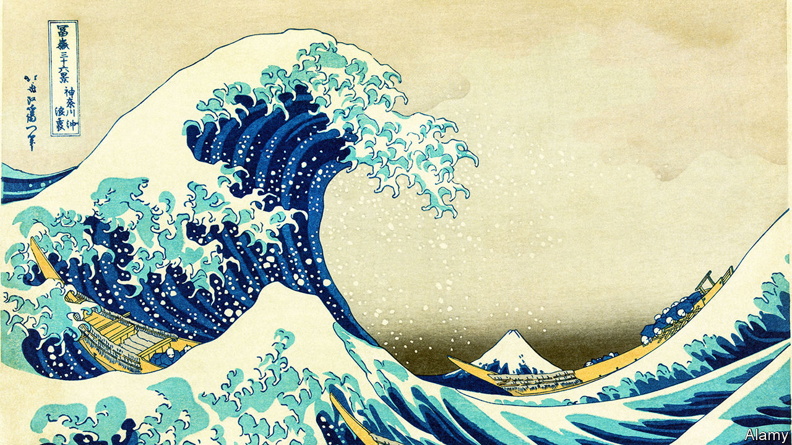

###### Explaining the wave function

# A new way to predict ship-killing rogue waves 

##### And a way to figure out how, exactly, AI works its magic 

 

> Nov 22nd 2023 

Artificial-intelligence (AI) models are modern oracles. The neural networks that power them are flexible mathematical tools, capable of finding any pattern, fitting any shape and drawing any line. They are used to forecast the weather, anticipate road maintenance and diagnose diseases. The problem is, since they train themselves to accomplish those tasks, no one really knows exactly how they do it.

This “black-box problem” makes it hard to rely on such models, especially when, as in health care, they are making high-stakes decisions. It makes them less useful for scientists, too, who are interested not only in predicting an outcome but also in understanding why that outcome happened.


In a paper in , a group of researchers led by Dion Häfner, a computer scientist at the University of Copenhagen, describe a clever way to make AI more understandable. They have managed to build a neural network, use it to solve a tricky problem, and then capture its insights in a relatively simple five-part equation that human scientists can use and understand.

The researchers were investigating “rogue waves”, those that are much bigger than expected given the sea conditions in which they form. Maritime lore is full of walls of water suddenly swallowing ships. But it took until 1995 for scientists to measure such a wave—a 26-metre monster, amid other waves averaging 12 metres—off the coast of Norway, proving these tales to be tall only in the literal sense.

Scientists have a few ideas about what causes rogue waves, but not a complete picture. Waves can merge and stack, or break in ways that make them unusually big. Currents, the wind and the shape of the sea floor matter too. All those factors mix in chaotic ways, in the mathematical sense of the word: a small change in one can lead to a drastically and unpredictably different outcome.

A good problem, then, for AI to get its teeth into. To produce something a human could follow, the researchers restricted their neural network to around a dozen inputs, each based on ocean-wave maths that scientists had already worked out. Knowing the physical meaning of each input meant the researchers could trace their paths through the network, helping them work out what the computer was up to. 

The researchers trained 24 neural networks, each combining the inputs in different ways. They then chose the one that was the most consistent at making accurate predictions in a variety of circumstances, which turned out to rely on only five of the dozen inputs. 

To generate a human-comprehensible equation, the researchers used a method inspired by natural selection in biology. They told a separate algorithm to come up with a slew of different equations using those five variables, with the aim of matching the neural network’s output as closely as possible. The best equations were mixed and combined, and the process was repeated. The result, eventually, was an equation that was simple and almost as accurate as the neural network. Both predicted rogue waves better than existing models.

The first part of the equation rediscovered a bit of existing theory: it is an approximation of a well-known equation in wave dynamics. Other parts included some terms that the researchers suspected might be involved in rogue-wave formation but are not in standard models. There were some puzzlers, too: the final bit of the equation includes a term that is inversely proportional to how spread out the energy of the waves is. Current human theories include a second variable that the machine did not replicate. One explanation is that the network was not trained on a wide enough selection of examples. Another is that the machine is right, and the second variable is not actually necessary.

Better methods for predicting rogue waves are certainly useful: some can sink even the biggest ships. But the real prize is the visibility that Dr Häfner’s approach offers into what the neural network was doing. That could give scientists ideas for tweaking their own theories—and should make it easier to know whether to trust the computer’s predictions. ■


