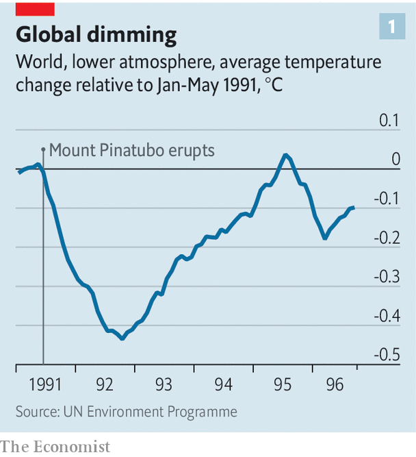

###### Dimming the sun

# Solar geoengineering is becoming a respectable idea 

##### One way to fix an accidentally altered climate is to alter it again deliberately 

 

> Nov 22nd 2023 

WHAT A DIFFERENCE a decade makes. That, roughly, is how often the Open Science Conference, run by the World Climate Research Programme (WCRP), comes along. At the previous get-together in 2011, says Jim Hurrell, a climate scientist and WCRP member, almost no one was talking about geoengineering. This is the idea of deliberately meddling with the Earth’s climate to try to make it cooler, and thus to offset the worst effects of another type of climatic meddling—namely greenhouse-gas-driven global warming. 

At this year’s event, held in Rwanda, Dr Hurrell gave a keynote address on the subject. There were “hundreds of papers and talks and posters”, he says. That reflects a broader shift in thinking. Although geoengineering has for many years been the subject of serious, albeit small-scale, scientific interest, it has been largely shunned by environmental NGOs and politicians. Now that is starting to change. 

Since the start of this year, solar geoengineering, sometimes known as solar radiation modification (SRM), has been the whole or partial focus of reports published by the European Commission and Parliament, America’s government, the Climate Overshoot Commission (COC; a collection of global bigwigs and worthies), and four separate bits of the UN. A common thread in all of them was that, given the world’s failure to cut greenhouse-gas emissions fast enough, the risks and benefits of SRM should be properly examined. 

Understanding how humans might tweak the climate to their benefit starts with understanding how they have already done so to their detriment. When light from the sun reaches Earth, about 70% of it is absorbed (the rest is reflected back into space by clouds, ice and the like). That absorbed energy is eventually re-emitted as infrared radiation. But not all of it makes it back into space. Greenhouse gases such as carbon dioxide absorb infrared radiation, trapping some of the re-radiated heat. 

At first unwittingly, then knowingly, humans have been thickening that atmospheric blanket. The amount of carbon dioxide—the most important greenhouse gas—in the atmosphere has risen from around 280 parts per million before the Industrial Revolution to 417 parts per million last year. That has trapped more heat, raising average temperatures by around 1.2°C over the same period. 

The great dimmer switch in the sky

Most plans to tackle climate change aim to fix the problem at its source by replacing fossil fuels with sources of energy, like wind, solar and nuclear power, that do not produce greenhouse gases. Solar geoengineering aims at the other side of the equation. Rather than allowing more energy to escape from the Earth’s surface, it aims to stop quite as much from arriving in the first place, by increasing the planet’s albedo—that is, its tendency to reflect sunlight.

 


Nature has already done the proof-of-concept work. The Earth’s albedo can be temporarily altered by volcanic eruptions, which spew particles and gases into the air. Sulphur dioxide is particularly influential because of how it combines with water to form sulphuric aerosols—a light-scattering haze which hangs in the sky. In 1991 Mount Pinatubo, a volcano in the Philippines, sent 15m tonnes of the stuff into the atmosphere. That was enough to cool the planet by up to about 0.5°C for well over a year (see chart 1).

Humans already do something similar by burning fossil fuels that contain sulphur, such as coal or the heavy fuel oil that powers big ships. Since these emissions happen near ground level, the resulting particles are trapped in the troposphere, the lowest layer of the atmosphere. Humanity’s emissions have a cooling effect on the planet of perhaps a few tenths of a degree Celsius. But they are also toxic, and are thought to cause hundreds of thousands of deaths each year. 

The best-researched version of SRM relies on the same mechanism. The idea is to inject sulphur dioxide—or perhaps other chemicals such as calcium carbonate or powders made of aluminium or diamonds—not into the troposphere, but the stratosphere, which begins up to 20km above the surface. Such high-flying particles would end up distributed more widely than those from ships or volcanoes, and would hang around for longer. That means much less would be required for a given level of planetary cooling.

 


By some estimates, reflecting enough extra sunlight to suppress average temperatures by 1°C would require the injection of roughly 2m tonnes of sulphur into the stratosphere annually. That is far less than is produced by volcanic eruptions and fossil-fuel burning, and might cost a few tens of billions of dollars annually. Estimates of the cost of decarbonising the world economy, by contrast, run into the trillions of dollars each year. 

Put that way, solar geoengineering sounds like a bargain. But worries abound. Although it argued for doing more research, the European Commission said earlier this year that, given the current state of development, SRM “represents an unacceptable level of risk for humans and the environment”. The COC recommended that countries should put a moratorium on the deployment of SRM, including any large-scale outdoor experiments or any activity with a “risk of significant transboundary harm” (that is, that could do damage across national borders). 

Some of the worries are about SRM’s potential effects on the weather. Early attempts to study the mechanisms of solar geoengineering assumed an enormous level of sulphur injection. That made good scientific sense: a nice strong signal makes a phenomenon easy to understand. But the modelling suggested that such drastic changes in the energy balance in the upper atmosphere could play havoc with tropical monsoons, the seasonal rains on which the agriculture and economy of many countries depend. 

Later research, using more realistic numbers, was more reassuring. In 2020 academics at Harvard University concluded that dimming the sun by less than necessary to completely offset the existing level of warming would not significantly alter rainfall in most places in the world. In the areas where it did, it seemed to result in more water rather than less.

The effect that spraying aerosols might have on stratospheric chemistry is also unclear. It could, for instance, amplify chemical reactions that break down ozone molecules, slowing the recovery of the ozone layer and allowing more cancer-causing ultraviolet radiation to reach the ground. And rising carbon-dioxide levels do more than just heat the planet. A good deal of the gas is absorbed by the oceans, where it forms carbonic acid. As a result, Earth’s oceans are more acidic than they have been for at least 2m years. Since SRM does not reduce carbon-dioxide emissions, it would do nothing to solve that problem.

The same cheapness that makes solar geoengineering attractive is also a source of worry. One analysis, by Wake Smith, a geoengineering researcher at Yale University, tried to model the cost of SRM in 2100. The researchers assumed that the world would not cut its greenhouse-gas emissions fast enough to adequately suppress global temperatures for the rest of the 21st century. Even so, they concluded it might cost around $30bn a year in 2020 dollars to hold temperatures at the levels they would have reached in 2035. 

That, as Dr Smith points out, is roughly what Americans presently spend on pet food each year. Even today, such a sum is easily within reach of a single big economy, and probably even a coalition of smaller ones. That raises the spectre of a country keen for the cooling consequences of SRM trying to deploy the technology against the wishes of others. 

Perhaps the most pervasive fear around SRM, though, is of its “moral hazard”—that by offering a cheaper alternative, it could undermine attempts to fix climate change by cutting greenhouse-gas emissions. Those attempts are already falling short (see chart 2). On November 20th the UN announced that the greenhouse-gas reductions planned around the world for 2030 would lead to between 2.5°C and 2.9°C of warming by the end of the century. Keeping temperatures to 2°C—the higher of the two targets laid out in the Paris Agreement in 2015—will require extra greenhouse-gas cuts of at least 28% by 2030.

Don’t mention the G-word

Critics argue that the example of sucking carbon dioxide directly from the air—another technology which does not yet exist at any useful scale, but which nevertheless underpins almost all long-term emission-reduction plans—shows that countries will seize on anything that allows them to avoid painful emissions cuts. People more open to the idea retort that geoengineering could be used to buy more time for those emissions reductions to happen, and keep temperatures lower in the meantime, an idea they refer to as “peak shaving”.

All this explains SRM’s radioactive reputation among climate wonks. Those opposed to the recent interest have redrawn their own battle lines more strongly in response. An experimental test of delivery mechanisms for sulphur particles, due to take place in Sweden in 2021, was cancelled after lobbying from environmental activists. In 2022 Make Sunsets, an American startup, carried out an unauthorised experiment in northern Mexico, releasing small amounts of aerosols from a balloon to study how they reflected sunlight. The Mexican government banned anything similar from happening again. 

In January 2022 more than 400 well-respected academics (many of them social scientists, rather than climate researchers) signed an open letter objecting to the idea that solar geoengineering was an issue worth studying or a legitimate research topic. They urged governments to commit to an “international non-use agreement” on anything relating to the idea, including all outdoor experiments as well as research programmes and assessments, even by outfits such as the Intergovernmental Panel on Climate Change (IPCC). 

Whether the signatories will get their way is far from clear. Other climate-change taboos have weakened with time. As recently as the 2000s the concept of adaptation—protecting oneself against a changing climate by, for instance, building higher sea walls—was controversial for similar reasons that SRM is today. Opponents worried that thinking too much about adapting to a hotter world would divert resources from efforts to prevent it from heating up in the first place. But vulnerable countries, particularly small island states, carried out their own assessments nevertheless. Combined with the difficulty of cutting emissions, the case for adaptation gradually became unanswerable. These days it is part of the IPCC’s remit. 

Something similar may be happening with SRM. This year will almost certainly be the hottest on record. Berkeley Earth, an American research group, sees a more than 90% chance of 2023’s average temperature exceeding 1.5°C above pre-industrial levels—making it the first year hotter than the lower of the two Paris Agreement temperature targets. Dr Hurrell says that what is needed is a serious research programme into the feasibility of SRM, run by an institution like the IPCC or the World Meteorological Organisation. He thinks such an endeavour would probably form the basis of a strong argument against SRM, rather than support for deploying it. 

Policymakers, too, seem increasingly keen to explore SRM’s pros and cons. Janos Pasztor runs the Carnegie Climate Governance Initiative, which encourages discussions about various climate technologies, including SRM. Initially, he says, SRM was seen as unpalatable. Now, politicians and officials discuss whether it might have a role in climate policy after all. None of those the CCGI has spoken with are opposed to further research into the idea.

Perhaps the biggest shift has come in poor countries, which have the most to lose from both rising temperatures and any unintended consequences of SRM. Anote Tong is a former president of Kiribati, a low-lying Pacific island state menaced by rising sea levels. Last year he told  that, should the world continue on its current path, it would soon reach the point where “it has to be either geoengineering or total destruction”. Those are not the words of a man who believes that countries like his have many other options. ■


