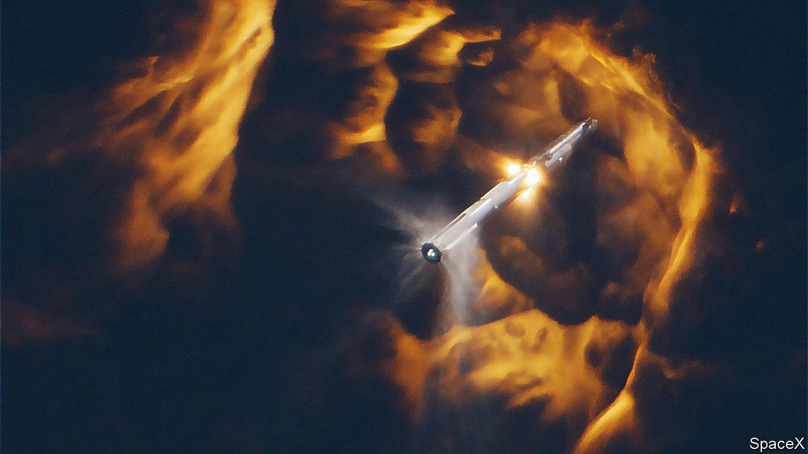

###### Big rockets and big rivers

# SpaceX tests Starship, and prepares to face down Amazon 

##### Elon Musk’s Starlink business could soon be competing with Jeff Bezos’s Kuiper 

 

> Nov 22nd 2023 

IN THE 21 years since it was founded, SpaceX, a rocketry firm set up by Elon Musk, has become the world’s space superpower. Its cheap, reusable Falcon 9 rocket dominates the launch industry. Thanks mostly to its Starlink satellite-internet business, the firm sends more mass into orbit each year than every other company and country on Earth combined. 

It has bigger ambitions still. November 18th saw the second test flight of its Starship rocket, the biggest ever built. The first test, in April, ended with a damaged launchpad and a rocket that self-destructed after trouble with several of the first stage’s 33 engines and the failure of its second stage to separate properly. 

The second launch was a big improvement. A new water-dampening system stopped the rocket from wrecking the rebuilt launch pad. All the first stage’s engines stayed lit. A new “hot staging” separation system, which required the second stage to begin firing its engines while still attached to the first, seemed to perform well (pictured). The firm had hoped the first stage might fly itself back to sea level for a landing test, but it blew up shortly after separation. The second stage, meanwhile, reached an altitude of 148km before some kind of malfunction activated its own self-destruct system.

Such fireworks are par for the course. Unlike its older rivals, SpaceX puts its faith in “iterative design”—trying often and learning from the failures, rather than trying to foresee every problem in advance. The lower stages of its Falcon 9 rockets crashed and burned  before the firm mastered the art of landing and re-using them, something that had not been done before. These days, with more than 250 successful missions, the Falcon 9 is the most reliable rocket ever made. One of its boosters has flown 18 times. 

If Starship can likewise be made to fly reliably, it could . It is designed to lug up to 150 tonnes into orbit, more than six times as much as a Falcon 9—and, thanks to being fully reusable, to be much cheaper to boot. NASA is relying on a modified version as part of its plan to return astronauts to the Moon. Astronomers are getting giddy at the prospect of flying enormous space telescopes, or sending fleets of rovers to Mars at once. 

A more immediate use will be to boost Starlink. The service beams internet access all over the world using thousands of cheap, low-flying satellites. In September SpaceX said it had 2m subscribers. It has attracted military interest after its unplanned role providing battlefield communications to  in its war against Russia. Excitement for its future is the main reason for SpaceX’s giddy $150bn valuation. But the business depends on launching enormous numbers of satellites (SpaceX plans at least 12,000). Each Falcon 9 flight launches around 22. Starship might manage a hundred or more at a time, and cost less while doing it.

Competition is heating up. OneWeb, a rival, operates its own fleet of 630 low-flying satellites. And two days before Starship’s second test Amazon, an internet giant, announced that two prototype satellites for its own “Kuiper” satellite-internet system had passed their own in-orbit tests. That should clear the way for the firm to begin manufacturing the satellites in bulk at its factory in Washington state. If all goes well, Kuiper could begin beaming internet service from space late next year.

Big rockets v big river

Satellite broadband is not an obvious market for Amazon, a firm best known for running an online department store and the world’s biggest cloud-computing operation. And SpaceX’s ultra-cheap rockets give it a big advantage. Kuiper has bought launches from Blue Origin, a rocketry firm established in 2000 by Jeff Bezos, Amazon’s founder. But although Mr Bezos is  as Mr Musk, Blue Origin is far behind SpaceX. It has yet to fly its rockets into orbit. That leaves Kuiper reliant, for now, on launches from United Launch Alliance, an American consortium, and ArianeSpace, a European one. Both cost far more than SpaceX. 

Amazon hopes it can gain an advantage in consumer hardware instead. One problem with satellite internet is the cost of the dishes that consumers must buy to use it. Starlink’s standard dish sells for $599, far less than it costs the firm to produce. Amazon reckons it can manufacture its own dishes for $400, a price that Caleb Henry of Quilty Analytics, a space-industry consultancy, describes as “a revolution”. (SpaceX’s manufacturing costs, says Mr Henry, are perhaps three times higher.)

Amazon also says Kuiper will work well with Amazon Web Services, its cloud-computing arm. It could provide redundant links between data centres if their ground connections fail. And having its own private, globe-spanning network will, says the firm, help it comply with privacy and “data sovereignty” laws, ensuring that sensitive customer data does not pass through prohibited countries. 

And Amazon may be banking on customers feeling wary of SpaceX’s dominant position. Despite American military interest in Starlink, Kuiper has already signed one exploratory contract with the Pentagon. In any case, says Mr Henry, Starlink’s success among both consumers and soldiers has helped spark a “gold rush” in satellite internet. Low-earth orbit is about to get even more crowded. ■


