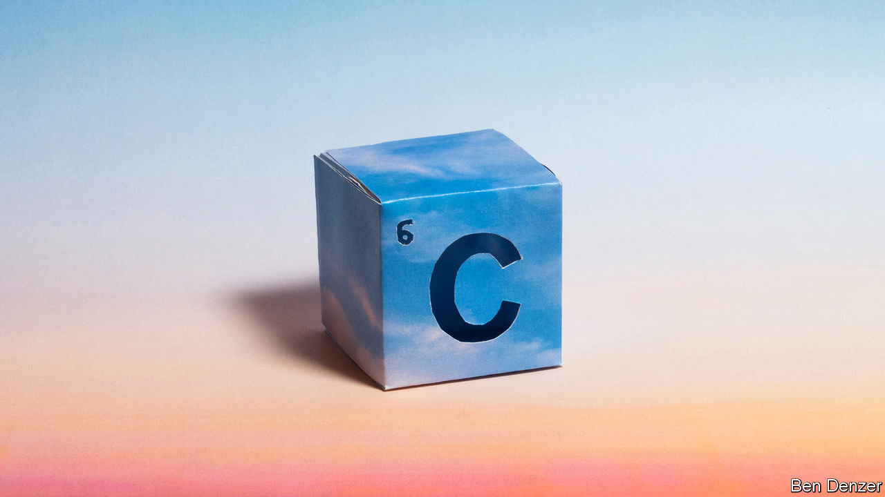

###### On the other hand...

# The many prices of carbon dioxide 

##### Not all tonnes are created equal 

 

> Nov 20th 2023 

Ask an economist what something scarce should cost and they will normally say whatever someone is willing to pay for it. They will go on to say that the best way to establish that willingness is through markets. There are various systems that price carbon dioxide that way. But they do not provide the same answers. And nor do they tally with what economists think might actually be the right answer. 

To most people the cost of emitting a tonne of carbon dioxide appears to be nothing. They have to pay for fuel, they have to pay for whatever burns it, but once it is an exhaust gas they can just let it go. In a few cases, they might even find someone to buy it—a fizzy-drink maker, say, or a DJ who wants dry ice.

But though the emissions may not cost the emitter anything, economists insist that they still have a value, and that it is a negative one. This is because the emitted carbon dioxide does harm to the environment, almost all of which is felt by people other than the emitter. To take into account those externalities means taking into account everything from the loss of seafront property and farm productivity to deaths caused by heatwaves (as well as those avoided in cold snaps).

This “social cost of carbon” is estimated through modelling. Those models must make assumptions, such as how much the effects of a future loss should be discounted and what to do about the uncertainty inherent to estimates of climate damage. Different assumptions yield wildly different costs. 

In many places the outputs of such models are used to guide policy. In America, for example, cost-benefit analyses which make use of the social cost of carbon feed into decisions about fuel standards. The government currently estimates the social cost at $51 for every tonne of carbon dioxide (or for an amount of some other greenhouse gas which provides the same warming). If the administration heeded the advice of its own Environmental Protection Agency, which approaches modelling in a different way, the cost would increase to $190. During Donald Trump’s administration, when only costs on other Americans were considered, it fell to $5. 

The social cost of carbon is notional, if sometimes consequential. The costs charged in carbon-pricing schemes are real. Such systems typically place a cap on emissions from a certain sector, and then distribute (often by auction) permits to emit that are equal to that cap. Firms then trade permits in a “compliance market”.

Economists like these market-based “cap and trade” schemes because they discover the firms most willing to make cuts. That spreads the burden in an efficient way and lowers the total cost of keeping emissions below the cap. But even when efficiently spread, the total cost is something which most of the governments experimenting with such schemes have wanted to keep low: the average price charged in the world’s emissions-trading systems is about $20. The IMF estimates that for Paris-compliant decarbonisation the price per tonne would have to reach $280 on all emissions by 2050. That, the fund drily notes, “might be politically unpalatable in many countries, despite carbon pricing’s effectiveness”.

A third way to establish a price is to find people willing to be paid not to emit, thus “offsetting” the emissions of those who do. This has various practical  and two fundamental flaws. One is that offsetting is voluntary; no one has to do it. The second is that offset emissions are still emissions. They still warm the planet. 

CDR avoids the second problem. If a tonne of carbon dioxide is removed from the atmosphere in one place at the same time as another is emitted somewhere else, the harm done is pretty much zero. 

Unfortunately, the costs of removal are currently a lot higher than the estimates of the social cost of carbon favoured by governments or the prices charged in cap-and-trade schemes; they outstrip offset prices over a hundred-fold. The idea of a market where the cost of emitting carbon dioxide is the price you have to pay to have it removed is very appealing. Actually creating one will be very hard.■

