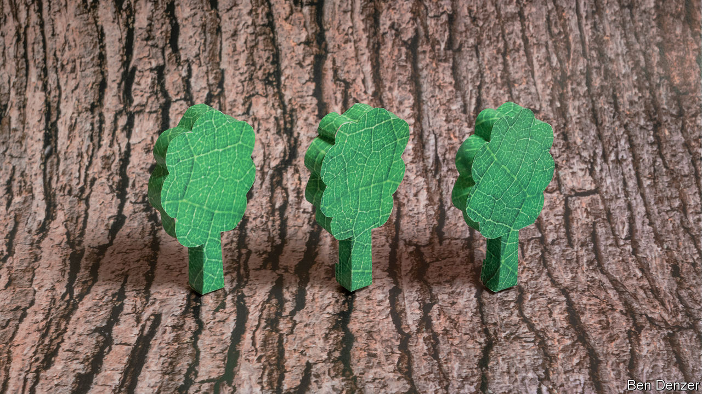
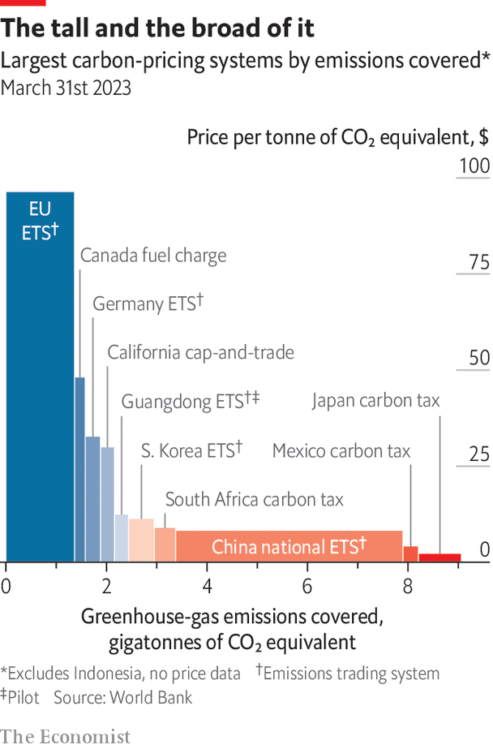

###### Thy axe shall harm it not

# Trees alone will not save the world 

##### But better markets and better monitoring will let them do more 

 

> Nov 20th 2023 

“Everything you see, as far as the eye can see, belongs to us,” says David Beleznay. “Us” is Mosaic, a forest-management company that looks after the upkeep and logging of much of Vancouver Island; Mr Beleznay is its director of climate and watersheds. “As far as the eye can see” takes in a long, deep valley whose forested flanks rise to the rocky top of Mount Arrowsmith. Towering evergreens—Douglas fir, cedar, hemlock—drape the island from its central peaks to the water’s rocky edge. 

This drapery is, though, a bit patchy in places. Directly behind Mr Beleznay’s parked pickup are some “polygons”, as the industry calls them, where the trees have been clear-cut, leaving behind jumbled soil, stumps and woody debris; tiny saplings poke through it higgledy-piggledy. Mosaic has an eye to water quality in forest streams, to maintaining biodiversity, to being a partner to the island’s first nations. But the forest it manages is also the basis of a timber business. 

When trees are cut down a lot of the carbon they have stored up over decades or even centuries of growth is returned to the atmosphere. In the 2010s, according to the Global Carbon Project, an academic consortium, deforestation was responsible for 5Gt-8Gt of carbon-dioxide emissions a year. The loss from a carefully felled and soon replanted polygon in a well-tended forest is less than when the same sort of area is slashed and burned. But it is all loss. 

Hence Mosaic’s new business. In 2022 it announced it would forgo tree-cutting on 40,000 hectares of mostly old-growth forest on Vancouver Island and Haida Gwaii, an archipelago to the north, for 25 years. Instead its BigCoast Forest Climate Initiative will sell “offset” credits based on the idea that the emissions it is not making can now be made by someone else. 

To sell such offsets a project like BigCoast has to follow a pre-existing methodology that has been agreed to define a particular type of offset. That it has done so has to be certified by companies who, themselves, have to be accredited so that another company can issue the relevant carbon credits. Buyers of those credits can then either sell them on exchanges or retire them; when they retire them, they claim that the emissions avoided or reduced elsewhere have served to offset emissions they themselves have made.

 


If you have ticked an “offset my carbon-dioxide emissions” box while booking a flight online, or bought a product that claims to have been certified climate neutral, you have participated in such a market. And you have probably not paid much of a premium in order to do so. Credits in some voluntary markets are currently trading at under $1 a tonne.

Compared with what permits cost in some cap-and-trade markets, let alone the hundreds of dollars per tonne that durable CDR costs, this seems incredibly low. That is in part because, even at their best, voluntary credits do not lead to emissions staying under a specific cap, and few remove anything from the atmosphere. They merely limit emissions someone else might have made. 

Organisations establishing standards for companies aiming at net zero, such as the Science Based Targets Initiative, do not allow offsets based on avoided emissions elsewhere to be counted as a reduction in a firm’s emissions. Though some compliance schemes allow such carbon offsets into their cap-and-trade systems, most do so only to a limited degree; Australia’s “Safeguard Mechanism” is a controversial exception. The European Emissions Trading System banned the use of offsets in 2013.

Within these limits the voluntary carbon market has a volume of about $2bn a year. The biggest sources of credits, according to a study published last January by Shell, an oil company, and the Boston Consulting Group, are projects in which renewables replace fossil fuels. As renewables get cheaper, it becomes ever harder for such projects to demonstrate that the reduction in emissions is not just something which would have happened anyway, a quality known as “additionality”. 

The second biggest source of offsets is avoided deforestation, a sector which has recently seen a very poor press as a result of independent analysis of some projects’ claims. A recent study by the Berkeley Carbon Trading Project, funded by Carbon Market Watch, an NGO, suggested widespread over-crediting. It cited unrealistically high estimates of the level of deforestation being avoided, unrealistically low estimates of the degree to which deforestation was being displaced to other places rather than stopped, and exaggerated assessments of the carbon stock in the areas involved. 

Woodman, let it stand—thy axe shall harm it not

Concerns about the quality of such offsets saw overall issuance drop in 2022; despite less supply, prices have continued falling. A number of companies that had previously been keen consumers of offsets have this year announced that they are quitting the market. In August Bloomberg, a news and data outfit, reported that Shell was scaling back its previously ambitious plans in the area.

One response to this is a new interest in credits certified not as offsets, but as removals. At the moment this segment of the voluntary sector is small—under 100m tonnes between 2015 and 2021, compared with 800m tonnes for offsets. But both project developers and customers expect it to grow quickly both in absolute terms and as a share of the market. At voluntary-market prices this new demand will not be met by the sort of novel and durable CDR technologies into which entrepreneurs are rushing. Instead the credits will mostly be based on restoring degraded forests, creating new forests, planting mangroves along coasts, improving soils and so on. Such schemes are often called “nature-based solutions”.

Mosaic is pursuing this avenue, too. The credits sold by its BigCoast project are mostly offsets produced by convincing a certifier that it really was planning to log the land now set aside. But some should be granted on the basis of the carbon removed from the atmosphere by the continued growth of those standing trees.

According to the “The State of Carbon Dioxide Removal”, published this summer by an international team of academics, the amount of carbon dioxide removed from the atmosphere and stored away by growing and expanding forests is roughly 2Gt a year. That is something like a thousand times the amount of CDR being delivered by other means, according to the report, and more than a hundred times the amount of forest-carbon removal currently generating credits. 

This does not mean a huge untapped source of carbon credits. What is being done on those hectares is already being done; the principle of additionality means new actions that would not be taken otherwise are needed for credits. But it does seem to suggest future potential. Novel methods of CDR need to be scaled up a thousand-fold to reach the gigatonne scale. Forests are already there. Alas, it is not that simple. 

Here shall the wild-bird sing

The 2Gt of carbon removal achieved by these trees takes up a great deal of land. The world’s 500m hectares of managed forest represents an India-and-a-half. Removals could undoubtedly be done more efficiently than they are at the moment. Even so, researchers looking at afforestation (adding new trees) and reforestation say it requires minimum of 80m hectares of forest to draw down 1Gt of carbon dioxide a year. That is 25 Vancouver Islands, or a little less than a France-and-a-half. 


That has to be land which is not already forested and not used for agriculture; its inhabitants have to be happy to have it turned into woodland. It has to have enough rainfall to support the trees. It should also be in a temperate or tropical climate; forests nearer to the poles darken the surface of the planet during winter, a warming effect which counters at least some of the cooling provided by sucking up carbon. The world does not have many, if any, country-sized tracts of such land going spare. 

Even if it did, there is another problem: the quality of the storage. Forests are more fragile than they look from the foot of a 50-metre Douglas fir. The Berkeley study of projects based on avoiding deforestation found they greatly underestimated the risks of trees being lost to nature anyway. And if forests are fragile now, things will only get worse with climate change. This summer fires swept across 18m hectares of Canada. As temperatures rise, the effects of drought get worse; so do insect infestations, which in some places are reaching biblical proportions. 

These arguments lead many people serious about CDR to see forests as a sideshow, at best. Bill Gates has invested in a number of CDR companies, including two already mentioned in this report, 44.01 and Carbon Engineering; he buys removals from Climeworks, too. When asked by a  journalist whether, instead, the problem might be solved by simply planting enough trees he dismissed the idea as “complete nonsense”. 

 “Are we the science people,” Mr Gates went on to ask, “or are we the idiots? Which one do we want to be?” It is not a surprising response from a man of Mr Gates’s qualities who has informed himself about the subject. It is, though, a little too dismissive. There are some good science people giving forest-carbon removals a new opportunity to show how best they can work. 

Chris Anderson, an ecologist from Stanford was one of the founders of Salo Sciences, a startup which developed machine-learning algorithms to turn pictures of forests into quantified estimates of the amount of carbon stored in them. Earlier this year Salo was acquired by Planet, a data provider based in San Francisco. With some 200 satellites in orbit, Planet is able to take a detailed picture of every part of the Earth’s surface every 24 hours. The combination of this constant flood of machine-readable data and algorithms like Salo’s is a ridiculously powerful one. 

In a meeting room 1,250km (780 miles) south of Mount Arrowsmith, Mr Anderson toggles back and forth between carbon maps of Vancouver Island. The patchwork of managed polygons is clearly visible on the screen. When he subtracts a past map from a present one some of the polygons turn red, with the precise hue revealing not just that carbon has been lost in a clearance, but also how much. He is looking at Vancouver Island because your correspondent has asked him to. He could display almost any tract of the Earth’s 4bn hectares (15m square miles) of forest in the same way. Next year Planet will start selling quarterly updates on carbon storage using this product for 25 cents a hectare. 

The mixture of granularity, global coverage and timeliness typifies the ways satellite-based measurement can improve planetary management. Satellite data are already widely used in the fight against deforestation; daily high-resolution observations scanned for changes by AI will take that to a new level in both precision and timeliness, protecting not just the climate but also biodiversity and the interests of indigenous people. 

Such systems cannot do everything. They can pick up point sources of methane and, increasingly, of carbon dioxide; they cannot yet measure the fluxes of greenhouse gases in and out of farmed or natural landscapes. Measuring the carbon content of soils is beyond them. And they do not in themselves create more land or make forests fire-resistant. But merging in-situ measurements and satellite observations with machine learning will make the flows and stocks of carbon across the planet visible and quantifiable in a way they never have been before. And that should spur action of many sorts.■

