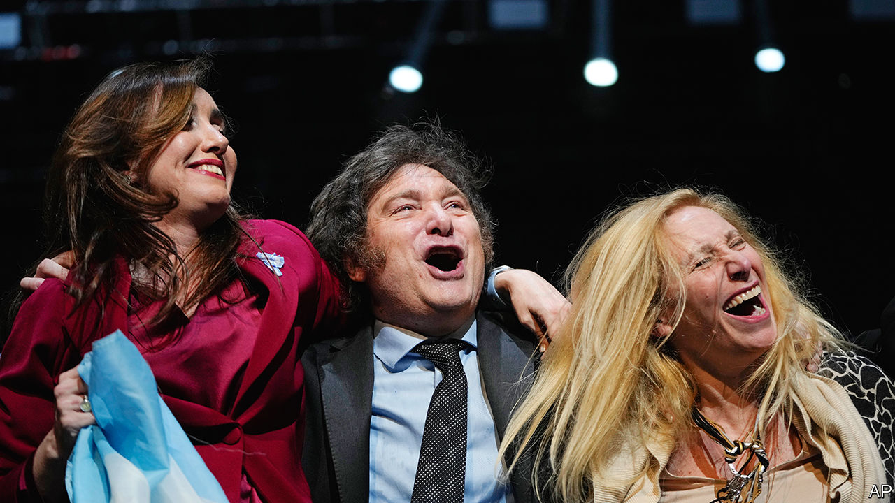
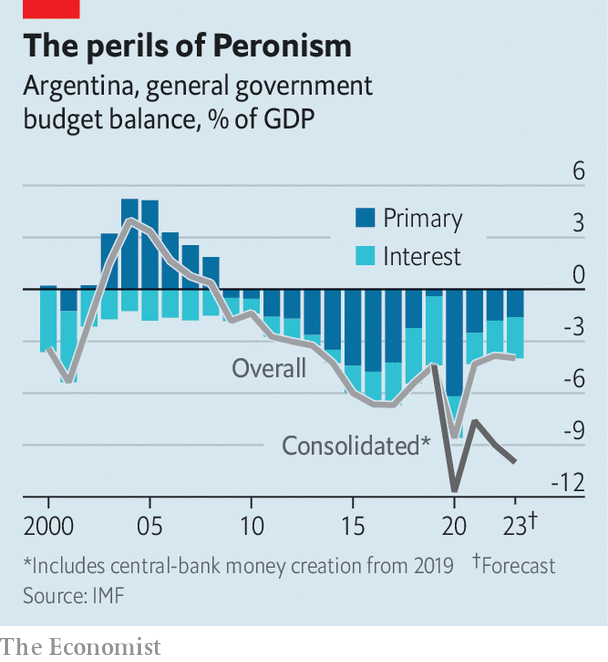

###### From cosplayer to president

# Javier Milei will be Argentina’s first libertarian president 

##### But how much can he actually do? 

 

> Nov 23rd 2023 

He has dabbled in tantric sex and cosplay and performed in a Rolling Stones tribute band. He has smashed a  shaped like the central bank on television and performed an opera about public spending, while dressed as a superhero. Now Javier Milei, a self-described “anarcho-capitalist”, will try his hand at running Argentina. In a presidential election on November 19th he took 56% of votes, compared with 44% for Sergio Massa, the current economy minister and candidate from the Peronist movement, which has governed Argentina for 16 of the past 20 years. Mr Milei, who has been a legislator only since 2021, created his coalition, Liberty Advances, two years ago. Yet it won in 21 of Argentina’s 24 provinces. 

Mr Milei’s notion that a privileged “caste” of politicians steals from ordinary folk struck a chord with many voters. Last December the current vice-president, Cristina Fernández de Kirchner, was convicted in a $1bn fraud case (she denies wrongdoing). In September, the mayor of a poor district resigned after an escort posted pictures of him on a luxury yacht. 

The Peronists tried to splurge their way to victory. In the weeks leading up to the poll, Mr Massa spent 1% of GDP on handouts to pensioners and the self-employed. Congress scrapped income taxes for 99% of workers. But even this was not enough to swing it in the Peronist’s favour. A pre-election survey showed that Mr Milei particularly appealed to men under 30, informal workers, and the self-employed. The number of registered self-employed people has swelled to 1.8m in two decades.

A large share of those who plumped for Mr Milei did so out of frustration with economic mismanagement. “I don’t like Milei,” says Fabio, a 55-year-old doctor. “But I want a change.” Annual inflation is above 140%. There are at least 15 different exchange rates and a host of complex capital, price, import and export controls, which make it impossible to invest. The country has defaulted so many times on its sovereign debt that it has no access to external financing except from multilateral lenders. It resorts to central-bank money-printing to cover its deficit. 

Since the current Peronist government assumed power in 2019, the money supply has rocketed. Argentina owes the IMF $44bn and the central bank’s net reserves are $10bn in the red (after deducting central-bank swap lines and other liabilities).

You can’t always get what you want

“Argentina’s situation is critical,” Mr Milei said in his victory speech. “There is no place for gradualism.” The first thing Mr Milei needs to do is cut spending, which has ballooned from 22% of GDP in 2003 to 38% today. Estimates of the fiscal deficit vary widely, but economists believe it is between 5% and 10% of GDP when the government’s accounting trickery is excluded and some central-bank liabilities are included (see chart). 

 


In order to reduce the deficit, Mr Milei could start by scrapping most subsidies on transport, water, gas and electricity, which cost around 2.5% of GDP each year. He could cut down the bloated pension system, which eats up almost 12% of GDP. This share is on par with Germany and Finland, despite those countries being significantly greyer and richer. Mr Milei has already signalled that he will try to privatise most of Argentina’s 33 state-owned companies, almost all of which are in deficit and cost the state over 1% of GDP a year. The public airline, for example, has 147 employees for every plane it flies. By contrast British Airways, which flies three times as many passengers a year, has 122 per plane.

Another problem for Mr Milei is the country’s bewildering range of exchange rates. The official one, of 365 pesos to the dollar, is overvalued and the central bank bleeds reserves to prop it up. This cheapens imports but hurts exports. To protect scarce dollars, the government imposes capital controls, prohibiting Argentines from buying more than $200 a month, even though the greenback is the currency most people save in. Capital controls have led to a massive black market, where one dollar currently fetches 1,000 pesos. To normalise the currency system, Mr Milei needs to devalue the official exchange rate, which will probably reach an equilibrium between the official rate and the black-market one. Only then could he lift capital controls, to avoid a run on the peso.

Alongside this, Mr Milei should promote growth and investment. This will require untangling the morass of red tape and taxes that currently burden business. According to the World Bank, the total tax and contribution rate as a share of profit for an average medium-size company in Argentina was 106% in 2019, compared with 40% in the OECD, a club of mostly rich countries. Private-sector employment has not grown in a decade, while the share of public workers has risen from around 15% in 2003 to over 20% today, says Rafael Rofman, an employment specialist. Since the pandemic almost seven out of ten new jobs created were in the informal market. Because of a host of complicated import and export restrictions, it takes businesses on average 166 hours to fill in customs forms to import goods, compared with three hours on average in the OECD. 

Mr Milei may have some luck. This year Argentina was hit by a blistering drought, which reduced exports of soyabeans, wheat and maize from $39bn in 2022 to $23bn. Next year exports could be up to $40bn. And recent investments in a huge shale oil and gas field will allow Argentina to reduce energy imports. It could save between $3bn and $4bn in energy imports in 2024, thinks Andrés Borenstein, an economic consultant.

But this will not be enough to turn Argentina around. In order to pass difficult reforms, Mr Milei will need the support of Congress. His coalition currently has only 10% of seats in the Senate and 15% of seats in the lower house. He will have to negotiate with Together for Change, a centre-right coalition, and with moderate Peronists. Lifting subsidies and devaluing the peso will initially increase inflation. Belt-tightening could prompt protests. “He needs to start to do this even if it is extremely painful in the short term,” says Alberto Ramos of Goldman Sachs, a bank. Argentines voted for change. Will they accept the consequences of it? ■

