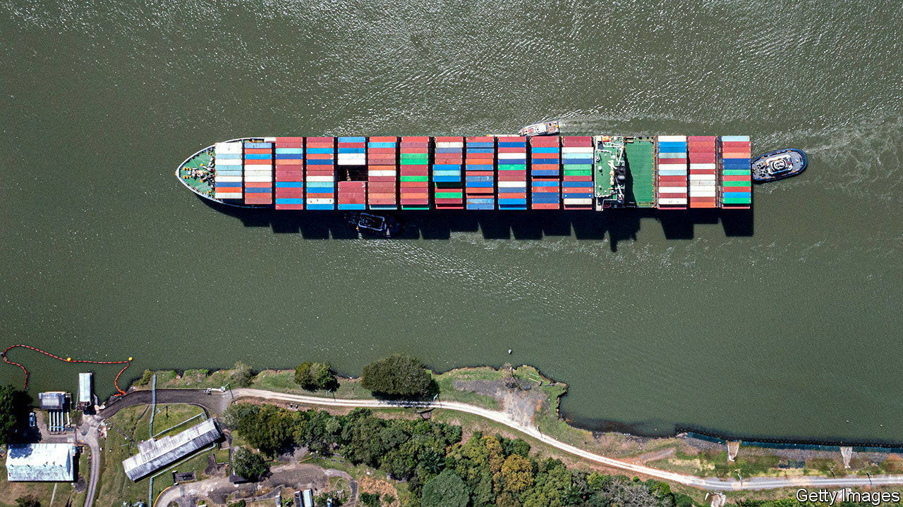
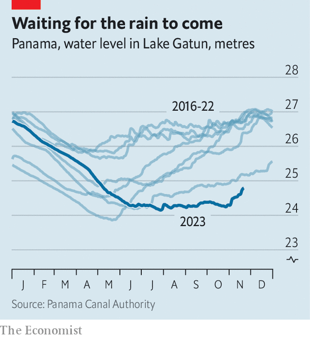
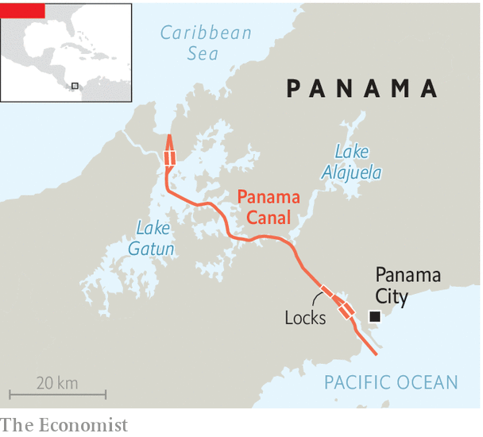

###### Cry me a river

# Severe drought is constraining the Panama Canal 

##### Costs for ships to go through it are spiralling. Consumers will feel the pinch 

 

> Nov 23rd 2023 

The Panama Canal provides a short cut between the Atlantic and Pacific oceans for 6% of the world’s maritime commerce. At its maximum capacity between 38 and 40 ships can pass through the canal each day. But over the past few months far fewer ships have made the voyage. The Panama Canal Authority (ACP), which allocates reservations, has slashed this number to 24. On December 1st it will go down to 22, and from February onwards only 18 ships will be able to cross each day. 

Many of these slots are available to book well in advance at a fixed price, but a small number of last-minute options are held back and sold to the highest bidder. From November 1st, any carrier hoping to secure a slot within the next week has had to use the auction system.

Scaling back on traffic and driving up auction earnings is not a deliberate money-spinner by the ACP. Instead, it has been forced into action following a prolonged bout of unusually dry weather this year. Rainwater is essential to the functioning of the canal: it is situated 26 metres (85ft) above sea level and it needs fresh water to operate the series of locks that lift ships so that they can enter and leave it. Each transit uses on average 200m litres of water, equivalent to the contents of 80 Olympic-size swimming pools. 

 


Most rain falls during a wet season that runs from mid-May to mid-December, caused by a weather system known as the Intertropical Convergence Zone (ITCZ) moving across Panama. This rainfall normally refills several man-made reservoirs, the largest of which is Lake Gatun, which in turn feed the canal locks. But the ITCZ has been stuck south of Panama. Water levels at Gatun usually rise by 1-3m during the wet season, but this year they have flatlined (see chart). October was the driest one since 1950. 

In addition, once water levels fall below a certain point, measures are needed to stop huge Neopanamax container vessels (which can carry 120,000 tonnes or 14,000 containers) from running aground. As well as curbing daily transits, the ACP has also had to reduce the minimum distance from the bottom of a ship’s hull to the waterline. These ships have to reduce their loads by up to 40% so that they sit higher in the water. Restrictions for smaller vessels also look likely.

 


That all spells trouble for trade routes reliant on the Panama Canal, particularly between the east coast of the United States and East Asia. As transit numbers fall, auction prices will increase. On November 8th, Japan’s Eneos Group paid nearly $4m, in addition to the usual transit fees of around $400,000, to expedite passage for one of its liquefied petroleum gas carriers. That was a record fee. Some carriers may consider rerouting through the Suez Canal or around Cape Horn. Others may opt to unload cargo at one end of the canal, and transport it by land across Panama, before reloading at the other end. But such options are potentially far more costly.

There is no quick fix. The canal authorities are rolling out measures to increase efficiency. Lake Gatun also provides drinking water for the country’s big cities, so the government is looking at ways of cutting public consumption, which is thought to be the highest per person in Latin America. But such efforts will have little impact. 

The ACP is considering the more drastic option of constructing a new reservoir. But this would require building a new dam and flooding land in a biodiverse area. Seething discontent about a massive copper mine in Panama has spilled onto the streets in recent months; one of the main public gripes is the mine’s ecological impact, making a new dam unlikely. In the meantime, higher transit costs may become the new normal. These costs, in turn, are likely to be passed on to consumers. Damn! ■

